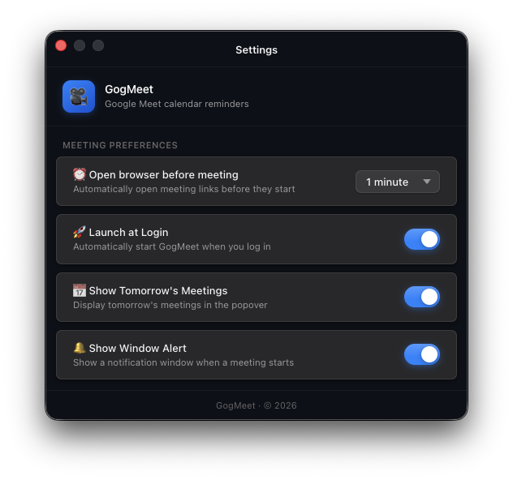

# GogMeet

It's a macOS tray app for Google Meet calendar reminders. Fetches events from macOS Calendar via EventKit and auto-opens meetings in your browser 1 minute before they start.

## Features

- **Tray-native** — Lives in the menu bar, no Dock icon
- **Calendar integration** — Reads Google Meet events from macOS Calendar via Swift EventKit
- **Auto-launch** — Opens meeting URLs automatically (configurable 1-5 minutes before start)
- **Launch at Login** — Optionally start GogMeet automatically when you log in to macOS
- **Settings UI** — Configure auto-open timing, login preferences, and display options via native macOS settings window
- **Popover UI** — Click the tray icon to see upcoming meetings
- **Tomorrow's Meetings** — Toggle to show or hide tomorrow's meetings in the popover

## Screenshots



_Configure how many minutes before a meeting to auto-open the browser (1-5 minutes)_

## Requirements

- macOS (Apple Silicon)
- Bun 1.3.10+ or Node.js 24.14.0+

## Development

```bash
bun install
bun run dev          # Start dev server + Electron
bun run build        # Build all processes
bun run test         # Run test suite
bun run typecheck    # TypeScript check
```

## Build & Installation

### Build DMG

```bash
# Build DMG with environment suffix
./build-macOS-dmg.sh --environment stable

# Build DMG without suffix (default)
./build-macOS-dmg.sh

# Show help
./build-macOS-dmg.sh --help
```

The script will:

1. Clean the `dist/` directory
2. Build all TypeScript sources (main, preload, renderer)
3. Package the app into a DMG for macOS arm64
4. Sign the app (Developer ID if available, otherwise ad-hoc)
5. Append environment suffix to filename (if `--environment` provided)

Output examples:

- With `--environment stable`: `dist/GogMeet-1.3.6-arm64-stable.dmg`
- Without flag: `dist/GogMeet-1.3.6-arm64.dmg`

### Install to Applications

1. Open the DMG file from `dist/`
2. Drag **GogMeet.app** to the **Applications** folder
3. Eject the DMG

### Troubleshooting Security Warnings

If macOS blocks the app with "cannot be opened because it is from an unidentified developer":

**Option 1: Remove quarantine (recommended for ad-hoc signed builds)**

```bash
sudo xattr -rd com.apple.quarantine "/Applications/GogMeet.app"
```

**Option 2: System Settings**

1. Open **System Settings** → **Privacy & Security**
2. Scroll down to find the security warning
3. Click **Open Anyway**
4. Confirm by clicking **Open** in the dialog

**Option 3: Right-click open**

1. Right-click (or Control-click) on **GogMeet.app**
2. Select **Open** from the context menu
3. Click **Open** in the confirmation dialog

### App Won't Start / Crashes on Launch

If the app crashes or won't start:

1. **Check Console logs:**

   ```bash
   log stream --predicate 'process == "GogMeet"' --level debug
   ```

2. **Verify architecture:** Ensure you're on Apple Silicon (arm64)

   ```bash
   uname -m  # should output "arm64"
   ```

3. **Re-sign the app bundle:**

   ```bash
   codesign --force --deep --sign - "/Applications/GogMeet.app"
   ```

4. **Check Calendar permissions:** On first launch, macOS will prompt for Calendar access. Grant permission for the app to function.

5. **Remove and reinstall:**
   ```bash
   rm -rf "/Applications/GogMeet.app"
   # Reinstall from DMG
   ```

## Tech Stack

| Layer    | Tech            |
| -------- | --------------- |
| Runtime  | Electron 41     |
| Language | TypeScript 5.9  |
| Build    | Rslib + Rsbuild |
| Calendar | Swift EventKit  |
| Test     | Vitest 4        |

## Contact

If you have any questions or encounter issues, feel free to reach out to [kennydizi@ocworkforces.com](mailto:kennydizi@ocworkforces.com)


## License

MIT
