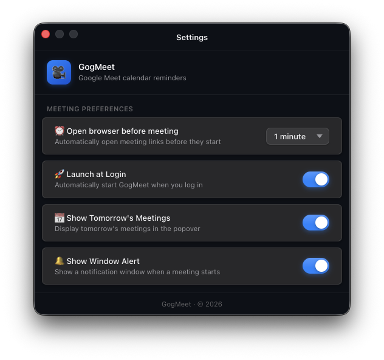

# GogMeet

GogMeet is a desktop tray app for calendar meeting reminders. It lists upcoming meetings, opens join links before they start, and can show a focused alert when a meeting is close.

| Platform | Calendar source | Status |
| --- | --- | --- |
| **macOS** | System Calendar via EventKit (Swift helper) — all calendars on the machine | Supported |
| **Windows** | **Google Calendar only** (OAuth) — not full EventKit multi-account parity | Supported (MVP) |

Outlook / Microsoft 365 on Windows is planned for a later Graph-based release. See [docs/windows-dogfood.md](docs/windows-dogfood.md) for Windows setup.

## Features

- Runs from the **menu bar** (macOS) or **notification area** (Windows) without a primary taskbar window during normal use.
- Surfaces today's and tomorrow's meetings (skipping cancelled and declined where the provider supports it).
- Finds Google Meet, Zoom, and Calendly links in event fields/notes.
- Opens only allowlisted HTTPS meeting hosts. Google Meet gets `authuser=<email>` and Zoom gets `uname=<email>` when an account email is available.
- Opens browser links 1 to 5 minutes before non-all-day meetings.
- Optional secure alert window shortly before a meeting; dismissing it cancels that meeting's pending browser auto-open.
- Tray context menu for meetings, settings, and app info.
- Countdown text beside the tray icon on macOS; length-capped tooltip countdown on Windows.
- Login item / launch-at-login support.
- Join the next meeting with a URL via `Cmd+Shift+M` (macOS) or `Ctrl+Shift+M` (Windows).
- Packaged installs check GitHub Releases for updates (`electron-updater`); **portable Windows builds do not auto-update**.

## Screenshots



_Settings for auto-open timing, launch at login, tomorrow's meetings, and alert behavior._

## Download

Grab the latest packaged build from the [GitHub Releases page](https://github.com/OCWorkforces/GogMeet/releases).

| Asset | Platform |
| --- | --- |
| `GogMeet-*-arm64.dmg` / `.zip` | macOS Apple Silicon |
| `GogMeet-*-x64.dmg` / `.zip` | macOS Intel |
| `GogMeet-*-x64.exe` | Windows installer (NSIS, x64) |
| `GogMeet-*-arm64.exe` | Windows installer (NSIS, arm64) |
| `GogMeet-*-{arch}-portable.exe` | Windows portable (no auto-update) |

## Requirements

### Running the app

**macOS**

- macOS 11.0 or newer.
- Calendar access permission for GogMeet.
- A Calendar account with Google Meet, Zoom, or Calendly URLs.

**Windows**

- Windows 10 (1809+) or Windows 11 (x64 or arm64).
- A **Google** account with Calendar access (connect from the tray menu or Settings).
- Meetings with Google Meet, Zoom, or Calendly URLs in Google Calendar.
- Official builds need a Google OAuth Desktop client baked in via `GOOGLE_OAUTH_CLIENT_ID` at package time.

### Developing or packaging

- **macOS packaging:** Xcode Command Line Tools (`swiftc`, `codesign`, `iconutil`).
- **Windows packaging:** Windows host (or CI `windows-latest`); arm64 NSIS can be cross-built on x64.
- Bun `>=1.3.0` (`packageManager: bun@1.3.14`) — primary runtime for dev, build, test, lint, and packaging.
- Node.js host runtime: `>=20.0.0` floor; recommended and CI-validated host is **Node 26** (see `.nvmrc`).
- Electron embeds its own Node for the packaged app; do not conflate it with host Node 26.

## Development

Install dependencies:

```bash
bun install
```

Common commands:

```bash
bun run dev              # Watch main/preload + renderer dev server + Electron
bun run build            # Build main, preload, and renderer
bun run typecheck        # TypeScript project references
bun run test             # Vitest workspace
bun run lint             # ESLint over src/
bun run format:check     # Prettier check
bun run clean            # Remove lib/ and dist/
```

### Package

```bash
# macOS (DMG + ZIP, arm64 + x64)
bun run package:mac

# Windows — separate arches (recommended for official artifacts)
bun run package:win:x64
bun run package:win:arm64
bun run merge:windows-latest-yml   # after both arches: multi-arch latest.yml
bun run verify:windows-release     # inventory (+ REQUIRE_UPDATER_YML=1 for feed check)
```

Set `GOOGLE_OAUTH_CLIENT_ID` when packaging Windows so Connect Google Calendar works in the shipped app.

### Windows dogfood from source

```powershell
$env:GOOGLE_OAUTH_CLIENT_ID = "….apps.googleusercontent.com"
bun run dev
# Tray → Connect Google Calendar…
```

Full guide: [docs/windows-dogfood.md](docs/windows-dogfood.md).

## Architecture

GogMeet keeps Electron's main, preload, renderer, and shared code separate:

| Area     | Source                 | Output                  | Purpose                                                                                     |
| -------- | ---------------------- | ----------------------- | ------------------------------------------------------------------------------------------- |
| Main     | `src/main/index.ts`    | `lib/main/index.cjs`    | Lifecycle, tray, scheduler, windows, IPC, calendar providers (EventKit / Google)          |
| Preload  | `src/preload/index.ts` | `lib/preload/index.cjs` | Sandboxed `window.api` context bridge                                                       |
| Renderer | `src/renderer/`        | `lib/renderer/`         | Vanilla TypeScript UI for popover, settings, and alert pages                                |
| Shared   | `src/shared/`          | (compiled into others)  | IPC contracts, brands, pure utilities                                                       |

Calendar access is abstracted behind a **CalendarProvider** factory (`src/main/calendar/`): Darwin uses EventKit; Windows uses Google Calendar OAuth + API.

## Security

- Renderers are sandboxed with context isolation and no Node integration.
- Meeting URL egress is allowlist-validated in main (and mirrored carefully in preload).
- Google OAuth tokens and offline calendar cache on Windows use OS `safeStorage` encryption when available.

## License

See [LICENSE](LICENSE).
