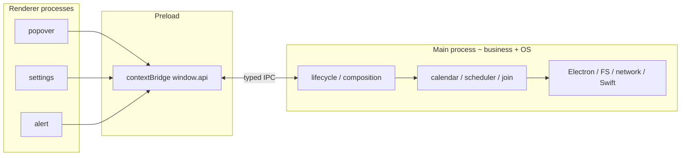
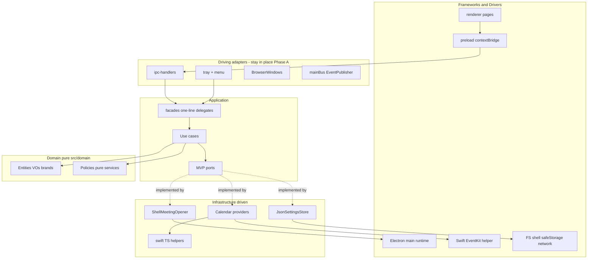
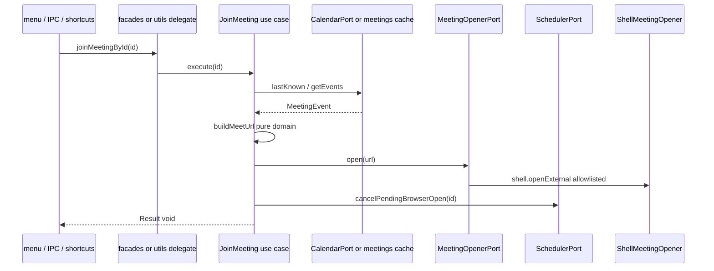
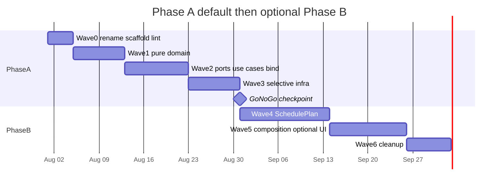
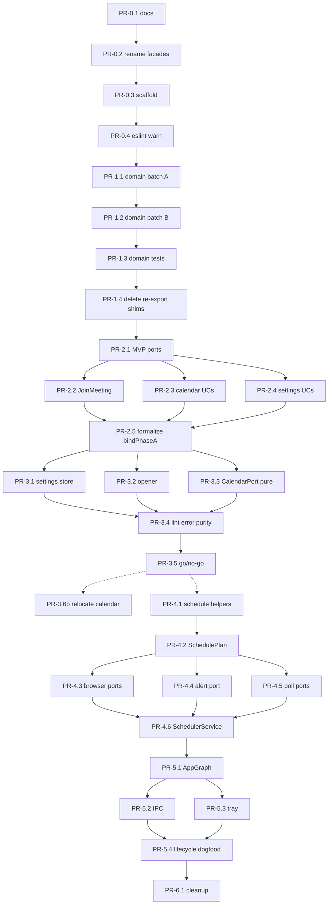

# GogMeet Clean Architecture Multi-Wave Refactor Plan

| Field | Value |
| --- | --- |
| **Title** | GogMeet Clean Architecture Multi-Wave Refactor Plan |
| **Author** | TBD (engineering) |
| **Date** | 2026-07-27 |
| **Status** | Accepted (revision 4 — zero leftover re-exports / deprecations) |
| **App version at analysis** | 1.16.4 |
| **Branch context** | architecture plan is branch-agnostic |
| **Workspace** | `/Users/mac/Documents/techx/GogMeet` |
| **Complementary docs** | `docs/enhancement-development-plan.md` (feature work), `docs/windows-platform-support-design.md`, root `AGENTS.md`, `.sentrux/rules.toml` |
| **Default delivery** | **Phase A (MVP)** — Waves 0–2 + selective Wave 3 |
| **Optional delivery** | **Phase B** — Waves 4–6 + full presentation relocation (go/no-go after Wave 2) |

---

## Overview

GogMeet is a ~9.8k LOC Electron tray app (main + preload + renderer + Swift EventKit helper) that already has several **port-shaped seams**: `CalendarProvider` (`src/main/calendar/provider.ts`), a calendar facade (`src/main/facades/calendar.ts` — renamed from `main/domain` in Wave 0), a scheduler facade (`src/main/scheduler/facade.ts`), branded types, typed IPC maps, and pure shared utilities. Those seams are incomplete: the folder named `domain/` imports Electron/`node:fs`, Google OAuth modules, and Swift sidecar helpers; the scheduler mixes pure timing policy with `BrowserWindow`, `Notification`, and `typedSend`; join/open URL logic lives next to `shell.openExternal`; and bootstrap wires free-function singletons without a composition root.

This document is a **multi-wave structural migration plan** to Clean Architecture (dependency rule, ports & adapters, composition root) adapted to Electron’s multi-process model. It deliberately **preserves product behavior and security invariants** (sandboxed windows, typed IPC, meeting-URL allowlisting at egress, join-via-`joinMeetingById`, no auto-OAuth on Windows, Swift isolation). It is complementary to `docs/enhancement-development-plan.md` and does not replace it.

### Default deliverable: Phase A (MVP)

**Phase A is the committed default.** It stops when pure domain + high-value use cases + selective infrastructure purification are done and unit-testable without Electron mocks:

| Phase A includes | Phase A excludes (Phase B / optional) |
| --- | --- |
| Wave 0: ADR, rename impure facades folder, scaffold, eslint boundaries (warn) | Full physical move of tray/menu/windows/ipc into `presentation/` |
| Wave 1: pure `src/domain/` extract | Full singleton elimination across tray/bus |
| Wave 2: capped ports + use cases with **single implementation body** (facades = one-line delegates) | LoggerPort, OsInfoPort, OfflineEventCachePort, AutoLaunchPort, PowerPort as first-class ports |
| Selective Wave 3: JsonSettingsStore, ShellMeetingOpener, CalendarPort purification + watcher Swift removal, thin binder/composition seed | Full calendar/oauth folder relocation (can stay under `main/calendar/` with port adapters) |
| **Delete all Phase A temporary re-exports / deprecated shims** (same-wave or end-of-Phase-A gate) | Permanent dual export paths |
| Go/no-go checkpoint | Wave 4 scheduler `SchedulePlan` split |
| | Wave 5 full composition root + presentation DI |
| | Wave 6 remaining Phase B shim deletion + hard lint + optional test-tree reorg |

**Phase A target outcome**

- Pure **`src/domain/`** testable without Electron mocks.
- **MVP ports**: `CalendarPort`, `SettingsStorePort`, `MeetingOpenerPort`, `SchedulerPort` (narrow), `ClockPort`, `EventPublisherPort`.
- **Use cases**: `JoinMeeting`, `GetMeetings`, permission/disconnect, load/update settings — free functions are one-line delegates with **module-level default bind** (no dual path; no throw-on-unbound).
- Settings FS and meeting open live behind ports; calendar facade no longer peeks Google tokens or imports Swift.
- **eslint-plugin-boundaries** in CI (`bun run lint`); purity edges error after selective Wave 3.
- **Zero leftover re-export / `@deprecated` shim modules** introduced by the refactor — every temporary path is deleted before Phase A go/no-go (see **Zero leftover re-exports policy**).

**Phase B target outcome** (only after go/no-go)

- Scheduler pure `planSchedule` / `interpret` split.
- Full composition root ownership of graph; optional presentation folder moves.
- Remaining ports when a Wave actually needs them; **delete remaining shims/facade free-fn paths**; hard boundaries.

---

## Background & Motivation

### Current process topology (preserved)

Electron forces three runtime processes. Clean Architecture must **respect process boundaries**, not fight them:



Almost all business logic lives in **main**. Preload is a security membrane. Renderers are presentation. Cross-process contracts already live in `src/shared/` (must stay free of Electron/Node/DOM).

### Verified coupling / Clean Architecture violations

| Area | Violation | Evidence (paths / symbols) |
| --- | --- | --- |
| `domain/settings.ts` | “Domain” imports Electron `app` + Node FS | `app.getPath("userData")`, `readFile`/`writeFile` |
| `domain/calendar.ts` | Facade imports factory + Google OAuth token modules | `getActiveCalendarProvider`, `loadGoogleTokens`, `isGoogleOAuthConfigured`, `isGoogleOAuthInFlight` |
| `domain/calendar-watcher.ts` | Imports factory + Swift sidecar | `getActiveCalendarProvider`, `reviveWatchSidecar` from `swift/calendar-watch-sidecar.ts` |
| `scheduler/*` | Application orchestration mixed with Electron UI | `poll.ts` → `typedSend` + `BrowserWindow`; `browser-timer.ts` → `Notification`; `alert-timer.ts` → `showAlert`; `state-runtime.ts` holds `BrowserWindow`; **facade.ts** owns separate module-level coalesce state (`lifecycleGeneration`, `inFlightPoll`, …) outside `state/*` |
| `utils/meet-url.ts` | Domain URL building mixed with egress I/O | `buildMeetUrl` + `openMeetingUrl` (`shell.openExternal`) in one module |
| `utils/join-meeting.ts` | Use case imports concrete facades | `getCalendarEventsResult`, `cancelPendingBrowserOpen`, `getLastKnownEvents` |
| `calendar/factory.ts` | Global singleton + Electron packaging | `app.isPackaged`, module-level `cached` |
| `calendar/auth/*`, `offline-cache.ts` | Infra (safeStorage + FS) colocated under calendar | `safeStorage.encryptString`, `userData` paths |
| `events.ts` `mainBus` | Implicit global bus | `TypedMainEventBus` singleton; tray/scheduler/power/calendar couple via event names |
| Module-level mutable state | Hidden singletons | `settingsCache`, `uiState`, scheduler `state`, tray, provider cache |
| No DI composition root | Free-function wiring | `initializeApp()` in `lifecycle.ts` calls facades directly |
| `src/shared` dual role | Entities + IPC DTOs + XSS util mixed | `escape-html.ts` next to `MeetingEvent` |
| Renderer | Direct `window.api` calls | Expected for thin UI; Phase B optional tidy only |

### What is already port-shaped (preserve and deepen)

| Asset | Path | Role today |
| --- | --- | --- |
| `CalendarProvider` | `src/main/calendar/provider.ts` | Port-like; evolve to `CalendarPort` (+ `reviveWatch?`, `getAccountLabel?`) |
| Calendar facade | `src/main/domain/calendar.ts` → **`src/main/facades/calendar.ts`** | Sole public calendar surface for scheduler/IPC/tray (until use cases absorb) |
| Scheduler facade | `src/main/scheduler/facade.ts` | Sole external scheduler entry; partial DI via callbacks |
| Brands / results | `src/shared/brand.ts`, `result.ts`, `calendar-result.ts` | Trust-boundary types → pure domain |
| Typed IPC | `src/shared/ipc-channels.ts`, `ipc-handlers/shared.ts` | `typedHandle` / `typedSend` / `validateSender` — **only** IPC path |
| Pure utils | pick-join-target, time, quiet hours, event-signature, allowlist, clean-description, url-extract | Domain candidates |
| Join hub | `utils/join-meeting.ts` | Single join path (behavior must stay) |
| `.sentrux/rules.toml` | Local architecture denylist | **Not CI today** — reconcile with eslint; do not treat as CI foundation |

### Pain points motivating the refactor

1. **Hard-to-unit-test policy**: settings parse, buildMeetUrl, join target, quiet hours, allowlist require Electron mocks even when pure.
2. **False “domain”**: agents treat `main/domain/` as pure; it is not.
3. **Hidden globals** and facade leakage (watcher → Swift; calendar → OAuth tokens).
4. **Future platforms**: `microsoft-graph` already reserved on `CalendarProviderId`.

### LOC snapshot (approx, src only)

| Area | LOC |
| --- | --- |
| scheduler | ~1681 |
| calendar | ~1487 |
| swift (TS helpers) | ~1116 |
| renderer | ~1079 |
| shared | ~824 |
| utils | ~556 |
| domain (impure facades today) | ~485 |
| windows | ~431 |
| ipc-handlers | ~371 |
| system | ~365 |
| menu | ~309 |
| app | ~189 |
| preload | ~127 |
| tray + events + index + `googlemeet-events.swift` | ~722 |
| **Total src** | **~9758** |
| Test files (`*.test.ts`) | **84** (additional helper/setup `.ts` under `tests/` not counted) |

This scale argues for **Phase A first**, not enterprise ceremony across 15 ports and full presentation relocation.

---

## Goals & Non-Goals

### Goals (Phase A)

1. Enforce the **dependency rule** for pure domain: zero Electron / Node I/O / Swift process dependencies.
2. Extract **MVP ports** only: Calendar, SettingsStore, MeetingOpener, Scheduler (narrow), Clock, EventPublisher.
3. Introduce **use cases with single implementation body**; free-function facades become one-line delegates with **module-level default bind** in the same PR (PR-2.5 formalizes composition only).
4. Selective infrastructure: settings FS store, meeting shell opener, CalendarPort purification (no token/Swift peeks from facades).
5. **Enforce boundaries in CI via eslint** (`bun run lint` already on PR matrix); sentrux is secondary/local unless a CI job is added later.
6. Unit-test pure cores **without Electron mocks**.
7. Keep packaging, Swift protocol, OAuth PKCE, IPC channel names, and **`src/main/googlemeet-events.swift` path** stable.
8. **Remove all temporary re-exports, deprecated aliases, and dual export paths** created during the migration — **no permanent shim layer**. Canonical import only (see Zero leftover re-exports policy).

### Goals (Phase B — optional after go/no-go)

9. Scheduler pure `planSchedule` / `interpret` split with golden tests each PR.
10. Composition root owns graph; optional presentation folder moves.
11. Additional ports only when a wave needs them; **delete any remaining Phase B temporary shims**; hard lint all edges.
12. Optionally retire thin free-function facades once all call sites take `AppGraph` / use cases directly (no `@deprecated` stubs left behind).

### Non-Goals

- Feature work — see enhancement plan.
- Rewriting Swift EventKit protocol.
- DI container (Inversify, etc.).
- Full DDD aggregates, event sourcing, CQRS, repos-for-everything.
- React/Vue rewrite of renderers.
- Changing electron-builder artifact layout or sandbox model.
- Unifying `CalendarResult` with generic `Result`.
- Claiming EventKit multi-source parity on Windows Google MVP.
- **Moving `googlemeet-events.swift`** as part of CA (path stays).
- Collapsing `APP_OPEN_EXTERNAL` into `APP_JOIN_MEETING` (product decision, not CA).
- **Keeping forever re-export barrels “for compatibility”** after callers are updated — forbidden.

---

## Proposed Design

### Mapping Clean Architecture onto Electron

**Decision: hybrid layout — process shells stay; Clean Architecture lives inside main + pure `src/domain`.**

Rationale:

1. Main, preload, and renderer are **three different bundles**.
2. Frameworks & Drivers = Electron main entry + preload + BrowserWindows + Swift binary + OS APIs.
3. Driving adapters (IPC, tray, menu, shortcuts) call application use cases (in-place or under `presentation/` in Phase B).
4. Driven adapters implement ports (settings store, opener, calendar providers).
5. Preload/renderer stay thin; no application layer there.



### Target package structure

#### Phase A (MVP) — minimal new folders

```text
src/
├── domain/                          # NEW pure core (Electron-free)
│   ├── entities/                    # brands, MeetingEvent, CalendarResult, settings types…
│   ├── policies/                    # allowlist, quiet-hours
│   └── services/                    # buildMeetUrl, pickJoinTarget, settings-parse,
│                                    # cleanDescription, extractMeetingUrl, detectPlatform
│
├── shared/                          # Cross-process: IPC maps, alert/app-state DTOs only
│                                    # (imports domain types — does NOT re-export them)
│
├── main/
│   ├── facades/                     # RENAMED from main/domain/ (Wave 0)
│   │   ├── calendar.ts              # one-line delegates → use cases (from Wave 2)
│   │   ├── calendar-watcher.ts
│   │   ├── calendar-status.ts
│   │   └── settings.ts              # delegates → SettingsStorePort / use cases
│   ├── application/                 # NEW
│   │   ├── ports/                   # MVP ports only (Phase A)
│   │   └── use-cases/
│   ├── infrastructure/              # NEW (selective)
│   │   ├── settings/json-settings-store.ts
│   │   └── electron/shell-meeting-opener.ts
│   ├── calendar/                    # STAYS in place Phase A (implements CalendarPort)
│   ├── swift/                       # STAYS (TS helpers only)
│   ├── googlemeet-events.swift      # PATH STABLE forever for CA
│   ├── scheduler/                   # facade stays; Phase B splits core
│   ├── composition/                 # thin binder in Phase A; full graph Phase B
│   ├── ipc-handlers/                # stays (shared.ts = only typed IPC path)
│   ├── tray.ts, menu/, windows/, system/, utils/, app/, index.ts
│
├── preload/
├── renderer/
└── assets/
```

#### Phase B (optional) additions

```text
src/main/
├── infrastructure/calendar/   # optional relocate providers/auth
├── infrastructure/swift/      # optional relocate TS helpers ONLY (not .swift source)
├── presentation/              # optional relocate ipc/tray/menu/windows
├── scheduler/core/            # planSchedule pure
├── scheduler/adapters/        # interpret side effects
└── composition/root.ts        # full AppGraph
```

**Naming decision (locked):** pure layer is **`src/domain/`**. Impure former `src/main/domain/` is renamed to **`src/main/facades/`** in Wave 0 **before** pure domain lands — never a long-lived dual-“domain” collision. Prefer this over `src/core/`.

**Why not collapse `src/shared` into `src/domain`?**  
Preload and renderer must import pure types + IPC contracts without main-only ports. **Entities live only in `src/domain/`.** IPC maps (`ipc-channels.ts`, alert/app-state DTOs) stay in `src/shared/` and **import domain types** — they do **not** re-export domain symbols for “compat.” Callers (main, preload, renderer, tests) import domain entities from `src/domain/...` and IPC contracts from `src/shared/...`.

**Import direction (allowed edges):**

```text
domain          ← leaf only (canonical home for entities / pure policy)
shared          ← domain (IPC maps only; no domain re-export barrels)
application     ← domain (+ shared only for IPC types if needed)
facades         ← application (thin intentional main API — not re-export shims)
infrastructure  ← application/ports + domain
ipc/tray/menu   ← facades | application  (Phase A in-place)
composition     ← wires all main layers
preload/renderer← domain + shared only (direct paths; no shim modules)
```

### Zero leftover re-exports policy (locked)

**Hard rule:** the CA refactor must not leave a permanent layer of deprecated or re-export-only modules. Temporary stranglers are tools, not architecture.

| Category | Definition | End state |
| --- | --- | --- |
| **A. Temporary re-export / shim** | File whose only job is `export … from "new/path"` or `@deprecated` alias after a move | **Must die** — delete file after all imports retargeted |
| **B. Dual full bodies** | Old function body + new use case both implement the same behavior | **Forbidden** beyond a single PR |
| **C. Intentional thin facade** | Documented main-process free function that is one-line `useCase.execute` (e.g. `facades/calendar.ts`, `joinMeetingById`) | **Allowed temporarily** as Phase A public surface for tray/IPC/hotkey; **delete in Phase B Wave 6** if AppGraph owns all call sites — never leave as `@deprecated` forever without a deletion PR |
| **D. Canonical module** | Real home of types/logic (`src/domain/entities/…`, use-case file, JsonSettingsStore) | **Keep** — only implementation |

**Rules**

1. **One canonical home per symbol.** No long-lived dual import paths (`shared/brand` *and* `domain/entities/brand` both export `EventId`).
2. **Prefer update-imports-in-same-PR** over re-exports. For batched Wave 1 moves, a re-export file may land **only if** a **same-wave deletion PR** removes it after call-site migration (see PR-1.4).
3. **Max lifetime of a temporary re-export = one wave** (or the next PR in that wave). Never “ship and leave for later / forever.”
4. **No `@deprecated` markers without a linked deletion PR** in the plan (title + target wave). Deprecated-without-deadline is rejected in review.
5. **No compatibility barrels** (`index.ts` that only re-export) — project already prefers no barrels; CA must not introduce them as a migration crutch that sticks.
6. **Type-only re-exports** count as shims too — delete them the same way as runtime re-exports.
7. **Acceptance command** for any wave that introduced shims: `rg "export \\* from|export \\{[^}]+\\} from" src --glob '*.ts'` on known shim paths returns **zero** (or only intentional non-shim patterns reviewed by hand); plus explicit file-delete checklist green.
8. **Phase A go/no-go (PR-3.5) fails** if any temporary re-export from Waves 0–3 still exists.

**What is *not* a “re-export shim”**

- `src/shared/ipc-channels.ts` importing `MeetingEvent` from domain for map typing — normal dependency, not re-exporting domain.
- A facade function that **calls** a use case (thin application surface) — until Wave 6 retires it, it is intentional API, not a path alias.
- Renames with `git mv` + import updates in one PR (no intermediate file).

### Dependency rule sequence diagram (join path after Phase A)



### Composition root sketch

**Phase A:** each use-case PR default-binds at module level (production-safe). PR-2.5 **`bindPhaseA`** consolidates construction and is called first in `initializeApp` (before IPC). No full singleton elimination.

**Phase B:** full `AppGraph`.

```typescript
// Phase A thin binder (composition/bind-phase-a.ts) — pure wiring, no network/OAuth
export function bindPhaseA(): PhaseABindings {
  const clock: ClockPort = { now: () => Date.now() };
  const settings = createJsonSettingsStore(/* path from app.getPath at call site only */);
  const opener = createShellMeetingOpener();
  const calendar = createCalendarPortFromFactory(); // wraps getActiveCalendarProvider
  const scheduler: SchedulerPort = {
    getLastKnownEvents,
    cancelPendingBrowserOpen,
    forcePoll,
    // …
  };
  const events = createMainBusPublisher(mainBus);
  const joinMeeting = createJoinMeeting({ calendar, opener, scheduler, clock });
  // free functions become: export const joinMeetingById = (id) => joinMeeting.execute(id);
  return { joinMeeting, settings, calendar, opener, events, /* … */ };
}
```

```typescript
// Phase B AppGraph (sketch) — no PollAndSchedule orphan; scheduler is SchedulerService
export interface AppGraph {
  readonly calendar: CalendarPort;
  readonly settings: SettingsStorePort;
  readonly meetingOpener: MeetingOpenerPort;
  readonly events: EventPublisherPort;
  readonly clock: ClockPort;
  readonly useCases: {
    readonly getMeetings: GetMeetings;
    readonly joinMeeting: JoinMeeting;
    readonly loadSettings: LoadSettings;
    readonly updateSettings: UpdateSettings;
    readonly requestCalendarAccess: RequestCalendarAccess;
    readonly disconnectCalendar: DisconnectCalendar;
  };
  readonly scheduler: SchedulerPort; // facade-compatible SchedulerService
}
```

**Construction vs start (critical):**

- `createAppGraph` / `bindPhaseA` is **pure wiring**: no network, no OAuth dialog, no eager FS writes. Lazy factories allowed.
- **Start sequence** remains identical to `lifecycle.ts` / `src/main/AGENTS.md`:
  1. Warmup calendar provider (async, non-blocking)
  2. Register IPC
  3. Load settings + calendar permission (Darwin auto-request only)
  4. Setup tray
  5. Scheduler callbacks / window
  6. Start scheduler → start watcher
  7. Power, shortcuts, notifications, auto-launch
  8. Auto-updater last

IPC still registers **before** settings load; graph construction does not change that order.

### Security invariants preserved (non-negotiable)

| Invariant | How CA migration preserves it |
| --- | --- |
| Sandboxed BrowserWindows, contextIsolation, no Node in renderer | Untouched window chrome / preload |
| Typed IPC + sender validation | `ipc-handlers/shared.ts` remains the **only** `typedHandle`/`typedSend`/`validateSender` path |
| Allowlist only at meeting egress | `MeetingOpenerPort` is the only meeting `shell.openExternal`; non-meeting openers stay separate |
| All **joins** → `joinMeetingById` / `JoinMeeting` | cancel pending auto-open after successful open |
| `APP_OPEN_EXTERNAL` ≠ join | Opens allowlisted URL **without** `cancelPendingBrowserOpen` — **preserve** until product change |
| Windows never auto-OAuth | Darwin-only policy + lifecycle gate |
| Swift only from Darwin provider + swift/** | Lint + import rules; facades/application never import swift |
| Branded values at trust boundaries | Domain validators at IPC/parser/opener |
| No raw `ipcMain.handle` | Presentation typed wrappers only |

### Egress inventory (meeting vs non-meeting)

| Call site today | Purpose | Post-refactor owner | Port? |
| --- | --- | --- | --- |
| `utils/meet-url.ts` `openMeetingUrl` | Meeting join / auto-open | `ShellMeetingOpener` implementing `MeetingOpenerPort` | **Yes** (meeting only) |
| `utils/join-meeting.ts` | Resolve event + open + suppress auto-open | `JoinMeeting` use case → MeetingOpenerPort + SchedulerPort | Use case |
| IPC `APP_JOIN_MEETING` | Manual join from renderer/alert | → JoinMeeting | — |
| IPC `APP_OPEN_EXTERNAL` | Allowlisted URL open **without** mark-opened | → MeetingOpenerPort only (no SchedulerPort cancel) | Meeting opener; **do not** route through JoinMeeting |
| Scheduler `browser-timer.ts` | Auto-open | → MeetingOpenerPort (+ notification in Phase B) | Meeting opener |
| `utils/system-settings.ts` | Open OS settings URLs | Keep dedicated helper (exact/documented allowlist) | **No** — not MeetingOpenerPort |
| `windows/about-window.ts` | Repo URL (exact match `package.json` repository) | Stay in About window module | **No** |
| `system/notification.ts` | Permission deep link + fallback | Stay in notification module | **No** |
| `calendar/auth/google-oauth.ts` | OAuth authorize URL | Stay in OAuth adapter | **No** |

**Rule:** never funnel non-meeting `openExternal` through `MeetingOpenerPort` (allowlist would reject or incorrectly accept). Never “fix” `APP_OPEN_EXTERNAL` by adding cancel-pending unless product explicitly unifies channels.

---

## Layer-by-layer inventory

Legend: **stays** | **moves** | **splits** | **dies** | **Phase A** | **Phase B**

### `src/shared/` (cross-process)

| Module | Action | Notes |
| --- | --- | --- |
| `brand.ts`, `meeting-event.ts`, `calendar-result.ts`, `calendar-ui-state.ts`, `result.ts`, `errors.ts`, `type-guards.ts`, `parse-json.ts` | **moves** Phase A W1 then **dies at old path** | → `src/domain/`; **update all imports**; temporary re-export **only** until PR-1.4 deletes old files |
| `settings.ts` | **splits** then old pure surface **dies** | Pure defaults/clamp/quiet-hours → domain; IPC-facing settings types may remain if still needed for channels — **no** `export * from domain` |
| `event-signature.ts`, `meet-url-allowlist.ts`, `utils/pick-join-target.ts`, `utils/time.ts` | **moves** then **dies at old path** | domain; PR-1.4 deletes shims |
| `utils/escape-html.ts` | **stays** | presentation util, not domain |
| `ipc-channels.ts`, `alert.ts`, `app-state.ts` | **stays** | IPC/renderer contracts; import domain types, do not re-export them |

### `src/main/domain/` → rename `src/main/facades/` (Wave 0)

| Module | Action | Notes |
| --- | --- | --- |
| `settings.ts` | **splits** Phase A | Pure parse → domain; FS → `JsonSettingsStore`; facade delegates |
| `calendar.ts` | **splits** Phase A | Orchestration → use cases; no OAuth token import; publishes via EventPublisherPort |
| `calendar-watcher.ts` | **moves** logic Phase A | Uses `CalendarPort` only — **no** `reviveWatchSidecar` import |
| `calendar-status.ts` | **stays** pure-ish | Can live under facades or application; already no Electron |

### `src/main/calendar/`

| Module | Action | Notes |
| --- | --- | --- |
| `provider.ts` | **moves** interface Phase A | → `application/ports/calendar-port.ts`; temporary `export type CalendarProvider = CalendarPort` **must die** in same wave (update implementers + tests; delete alias file) |
| `factory.ts`, `providers/*`, `auth/*`, `offline-cache.ts` | **stays** Phase A; optional **moves** Phase B | Implement CalendarPort in place first |
| `url-extract.ts`, `clean-description.ts` | **moves** Phase A W1 then **dies at old path** | pure domain; no permanent re-export from `calendar/` |

### `src/main/scheduler/`

| Module | Action | Notes |
| --- | --- | --- |
| `facade.ts` | **stays** Phase A; **splits** Phase B | External API; owns coalesce/generation state → SchedulerService |
| `poll.ts`, `index.ts` (`scheduleEvents`), timers | **stays** Phase A; **splits** Phase B | Critical path: pure `planSchedule` then `interpret` |
| `state/*` | **stays** | Phase B: remove `BrowserWindow` type |

### `src/main/utils/`

| Module | Action | Notes |
| --- | --- | --- |
| `meet-url.ts` | **splits** Phase A then **dies or shrinks** | `buildMeetUrl` → domain only; open → ShellMeetingOpener only; **delete** any file that only re-exports both |
| `join-meeting.ts` | **use-case home** Phase A W2; free-fn path **dies** Phase B W6 | Algorithm in use case; optional thin free fn until AppGraph; **no** permanent dual path |
| `url-validation.ts`, `platform.ts` | **moves** Phase A W1 then **dies at old path** | domain; PR-1.4 deletes old modules |
| `system-settings.ts` | **stays** | non-meeting egress |
| `browser-window.ts`, `window-chrome.ts`, `log.ts`, `packageInfo.ts` | **stays** Phase A | optional Phase B infra/presentation |

### `src/main/swift/` + Swift source

| Module | Action | Notes |
| --- | --- | --- |
| `swift/*.ts` | **stays** Phase A; optional **moves** Phase B to `infrastructure/swift/` | Only Darwin provider imports |
| **`src/main/googlemeet-events.swift`** | **stays path forever for CA** | Hardcoded in `binary-cache.ts` `resolveSwiftSourcePath`, `electron-builder.yml` `asarUnpack`, release verifier — **do not move** |

### `src/main/ipc-handlers/`

| Module | Action | Notes |
| --- | --- | --- |
| `shared.ts` | **stays** | **Only** typed IPC path: `typedHandle`, `typedSend`, `validateSender` |
| `calendar.ts`, `app.ts`, `settings.ts`, … | **stays** Phase A | Call facades/use cases; optional Phase B `presentation/ipc/` |

### `src/main/system/`, tray, menu, windows, events

| Module | Action | Notes |
| --- | --- | --- |
| tray, menu, windows, shortcuts | **stays** Phase A | Phase B optional presentation move |
| `events.ts` / `mainBus` | **stays** Phase A | Wrap as EventPublisherPort; event names below |
| power, notification, auto-launch, auto-updater | **stays** Phase A | Ports only if Phase B needs them |

### `EventPublisherPort` event catalog (matches `MainEvents` today)

| Event name | Payload | Publishers today | Subscribers today |
| --- | --- | --- | --- |
| `meeting-list-updated` | `MeetingEvent[]` | `scheduler/poll.ts` | `tray.ts` |
| `calendar-status-updated` | `CalendarUiState` | `domain/calendar.ts` (facade) | `tray.ts` |
| `power-state-changed` | `{ onAC: boolean }` | `system/power.ts` | (listeners as wired) |

Port methods should mirror these names (e.g. `publishMeetingList`, `publishCalendarStatus`, `publishPowerState`, plus `on`/`off` or subscribe helpers).

### Tests

| Area | Action |
| --- | --- |
| Pure logic | **new** `tests/domain/` Phase A (and `tests/application/` for use cases) |
| Main integration | **stay** `tests/main/**` with Electron mocks |
| Full tree reorg | **Phase B** Wave 6 optional |

---

## Multi-wave migration strategy

Principles:

1. **Phase A is default**; Phase B requires go/no-go after Wave 2.
2. **Shippable PRs** — behavior unchanged.
3. **Single implementation body** — free functions become one-line delegates with **default module bind** in the same PR as the use case (no dual path; every PR production-green).
4. **Pure first**, then ports, then selective infra.
5. **eslint is CI hard gate**; sentrux secondary.
6. **Tests move with code**.



| Scope | Indicative effort |
| --- | --- |
| **Phase A only** | **~3–5 weeks** focused / ~5–7 weeks part-time |
| Phase B full | additional **~4–7 weeks** (Wave 4 alone re-estimated **10–15 days**) |

### Go / no-go after Wave 2 (and after selective Wave 3)

**Checkpoint criteria (all should be true to claim Phase A success):**

1. `src/domain/**` has zero Electron/`node:fs`/`child_process` imports; domain vitest project green without `tests/setup.main.ts`.
2. Count of use-case unit tests runnable with fakes only (target: JoinMeeting, settings parse/update, GetMeetings happy/error paths).
3. Illegal import count: facades do not import `swift/*` or `calendar/auth/*` after Wave 3 selective work.
4. Product dogfood smoke: join hotkey, tray join, auto-open still correct on one mac + one win build (or CI matrix).
5. **Zero leftover re-exports:** temporary re-export inventory table is empty; PR-1.4 done; no `@deprecated` shim modules from Waves 0–3; no dual symbol homes for domain entities.
6. Team ROI judgment: if pure domain + JoinMeeting + settings already unlock most testability, **stop or defer Phase B**.

**Only then** commit calendar full relocate / Wave 4–6.

---

### Wave 0 — ADR, rename facades, scaffolding, soft boundaries

**Goals**

- Land plan as project doc when approved.
- **Rename `src/main/domain/` → `src/main/facades/`** and update AGENTS.md / imports / tests **before** pure `src/domain/` exists.
- Scaffold `src/domain/`, `application/{ports,use-cases}/`, `infrastructure/`, `composition/`.
- Install eslint-plugin-boundaries in **warn** mode with concrete elements (snippet below).
- Sentrux reconciliation table (rewrite stale rules).

**Out-of-scope:** behavior changes; production module logic moves (except rename path).

**Concrete PRs**

| PR | Title | Files | Deps |
| --- | --- | --- | --- |
| 0.1 | docs: CA multi-wave plan + ADR (Phase A default) | `docs/clean-architecture-refactor-plan.md`, ADR | — |
| 0.2 | refactor: rename `main/domain` → `main/facades` + AGENTS | all imports, AGENTS.md, tests | 0.1 |
| 0.3 | chore: scaffold domain/application/infrastructure/composition | empty + layer AGENTS | 0.2 |
| 0.4 | chore: eslint-plugin-boundaries warn + sentrux notes | `eslint.config.js`, `package.json`, optional `.sentrux` doc comment | 0.3 |

**Acceptance:** typecheck/test/lint green; no runtime path named `main/domain`; agents docs say facades.

**Effort:** S — **2–4 days**

---

### Wave 1 — Extract pure domain

**Goals:** pure `src/domain/`; **callers import canonical domain paths**; vitest domain project; **delete temporary re-exports before wave exit**.

**In-scope modules:** brands, MeetingEvent, CalendarResult, settings types/quiet hours, allowlist, validateMeetUrl, detectPlatform, buildMeetUrl, pickJoinTarget, event-signature, time, cleanDescription, extractMeetingUrl, settings parse/merge/clamp pure.

**Out-of-scope:** FS store; OAuth; scheduler Electron; DI; permanent shared/utils re-export barrels.

**Migration preference (locked)**

1. **Preferred:** `git mv` / new domain file + **update all imports in the same PR** (or same PR pair with no intermediate merge of re-export-only trees).
2. **Allowed if batch is too large:** leave a **temporary** re-export at the old path for at most the rest of Wave 1.
3. **Required:** **PR-1.4** deletes every temporary re-export and empty old modules. Wave 1 is not done until PR-1.4 merges.

**Concrete PRs (batched for realism)**

| PR | Title | Files | Deps |
| --- | --- | --- | --- |
| 1.1 | domain: entities + allowlist + validate + detectPlatform + buildMeetUrl | domain/*; **update imports** (temp re-export OK only if listed for 1.4) | Wave 0 |
| 1.2 | domain: pickJoinTarget, event-signature, time, quiet hours, cleanDescription, url-extract, settings-parse | domain services; same import rule | 1.1 |
| 1.3 | test: vitest domain project + coverage thresholds | vitest.workspace.ts, tests/domain/**, process tsconfigs include `../domain` | 1.1–1.2 |
| **1.4** | **chore: delete Wave 1 temporary re-exports / old paths** | delete old `shared/brand.ts` etc. if emptied; remove `export … from domain` shims; fix any remaining imports | 1.1–1.3 |

**PR-1.4 deletion checklist (must all be true)**

- [ ] No `src/shared/**` file that only re-exports domain symbols
- [ ] No `src/main/utils/url-validation.ts` / `platform.ts` / pure meet-url pieces that only re-export domain
- [ ] No `src/main/calendar/url-extract.ts` / `clean-description.ts` that only re-export domain
- [ ] Preload, renderer, main, tests import `src/domain/...` for entities/policy
- [ ] `ipc-channels.ts` imports domain types for maps — does **not** re-export them
- [ ] `rg` for `export \\* from` / pure re-export files on listed paths is clean
- [ ] AGENTS.md CODE MAP points only at canonical paths

**Acceptance**

- `src/domain/**` pure.
- Domain tests cover allowlist, buildMeetUrl, pickJoinTarget, settings parse, quiet hours without Electron.
- Process tsconfigs / root include domain (see Tooling checklist).
- **Zero temporary re-exports from Wave 1 remain** (PR-1.4 done).
- Commands: `bun run typecheck`, `test`, `lint`.

**Effort:** M — **5–8 days** (includes import retarget + shim deletion)

---

### Wave 2 — MVP ports + use cases (single body, green merges)

**Goals**

- Define **MVP ports only** under `application/ports/`.
- Implement use cases with a **single implementation body** per free function.
- Every PR remains **production-green** when merged alone (no throw-on-unbound, no missing lifecycle bind).
- PR-2.5 **formalizes** composition wiring; it is **not** the first production bind.

**In-scope use cases**

| Use case | Replaces | Ports |
| --- | --- | --- |
| `JoinMeeting` | `joinMeetingById` | MeetingOpener, SchedulerPort (cancel/lastKnown), calendar events access, Clock |
| `GetMeetings` | `getCalendarEventsResult` | CalendarPort, EventPublisherPort; **account/OAuth peeks may still live in adapter until PR-3.3** |
| `RequestCalendarAccess` / permission status | facade permission APIs | CalendarPort, EventPublisher |
| `DisconnectCalendar` | `disconnectCalendar` | CalendarPort |
| `LoadSettings` / `UpdateSettings` | load/update | SettingsStorePort (may wrap current FS until PR-3.1) |
| `GetCalendarUiState` | sync snapshot | in-memory store on facade/use-case |

**Not in Wave 2:** `PollAndSchedule` as a named use case (scheduler stays facade until Phase B). Full OAuth/token purification (→ PR-3.3). Thin permission wrappers are OK — value is JoinMeeting + settings + GetMeetings orchestration extract.

#### Green-PR bind strategy (locked — preferred)

**Problem forbidden:** shipping `if (_impl === null) throw …` in PR-2.2/2.3/2.4 while `bindPhaseA` only lands in PR-2.5. That breaks tray/hotkey/IPC after intermediate merges (`registerIpcHandlers` runs early in `initializeApp`).

**Required strategy — module-level default bind in each use-case PR:**

1. **PR introduces use case** as the sole algorithm body (`createJoinMeeting(deps)`, etc.).
2. **Same PR** constructs a **default instance** at module load (or first call) using **concrete adapters over existing free-function deps** (current `getLastKnownEvents`, current opener, factory calendar, etc.).
3. Free function becomes a **one-line delegate** to that default instance — production works with zero lifecycle changes.
4. Export `bindX(impl)` (or rebind) for tests and for later composition override.
5. **PR-2.5** only **moves** default construction into `composition/bind-phase-a.ts`, calls it as the **first line** of `initializeApp` (before IPC), and optionally rebinds modules — **residual formalization**, not first production bind.

```typescript
// application/use-cases/join-meeting.ts — sole algorithm body
export function createJoinMeeting(deps: JoinDeps): JoinMeeting {
  return { async execute(id) { /* same logic as today's join-meeting.ts */ } };
}

// utils/join-meeting.ts — SAME PR as JoinMeeting (PR-2.2)
// Default bind uses concrete adapters over CURRENT production deps — app works without lifecycle bind.
const defaultJoin = createJoinMeeting({
  getLastKnown: () => getLastKnownEvents(),
  fetchCalendar: () => getCalendarEventsResult(), // or CalendarPort wrapper
  opener: { open: openMeetingUrl },               // until PR-3.2 ShellMeetingOpener
  cancelPending: (id) => cancelPendingBrowserOpen(id),
  clock: { now: () => Date.now() },
});

let _impl: JoinMeeting = defaultJoin;

/** Test / composition override — optional. Default already production-safe. */
export function bindJoinMeeting(impl: JoinMeeting): void {
  _impl = impl;
}

export async function joinMeetingById(id: EventId): Promise<Result<void, string>> {
  return _impl.execute(id); // never throws for unbound — always has defaultJoin
}
```

**Rules**

| Rule | Detail |
| --- | --- |
| No throw-on-unbound | Free functions always have a module-level default implementation |
| Single algorithm body | Logic lives only in `createX`; free function is one-line `execute` |
| Green intermediate merges | PR-2.2 alone must pass join tests + runtime join paths |
| PR-2.5 residual | Extract defaults into `bindPhaseA()`; lifecycle first-line call before IPC; tests may use `bindX(fakes)` |
| Test updates | `tests/main/join-meeting.test.ts` either imports use case with fakes or calls `bindJoinMeeting` in setup — update **in PR-2.2** |
| No dual path files | Do not keep a second `join-meeting.ts` that re-exports the use case under a “compat” name; one free-fn path max until Wave 6 deletes it |
| Alias types die | If `CalendarProvider` is renamed to `CalendarPort`, update implementers and **delete** `export type CalendarProvider = CalendarPort` in the same wave |

**Rejected strategies (document for clarity)**

- Throw-on-unbound until PR-2.5 (breaks production between PRs).
- Dual full bodies (legacy + use case) for weeks (drift). Brief dual body only acceptable if a single PR switches (strategy 3) — we prefer default bind instead.
- Permanent `@deprecated export * from "./use-cases/join-meeting"` files.

**Concrete PRs**

| PR | Title | Files | Deps |
| --- | --- | --- | --- |
| 2.1 | application: MVP port interfaces | ports: Calendar, SettingsStore, MeetingOpener, Scheduler (narrow), Clock, EventPublisher | Wave 1 |
| 2.2 | application: JoinMeeting + SchedulerPort + default-bound joinMeetingById | use-case, utils/join-meeting, join tests | 2.1, W1 buildMeetUrl |
| 2.3 | application: GetMeetings + permission + disconnect with default-bound facades | use-cases, facades/calendar.ts | 2.1 |
| 2.4 | application: Load/Update settings with default-bound facades | use-cases; temporary FS adapter OK | 2.1, W1 settings-parse |
| 2.5 | composition: formalize bindPhaseA + lifecycle first-line call | composition/bind-phase-a.ts, lifecycle.ts | 2.2–2.4 |

**PR-2.3 acceptance (honest — OAuth not yet pure)**

- Use-case orchestration extracted; free functions / facade exports delegate to default-bound use cases.
- **Token/OAuth peeks (`loadGoogleTokens`, `isGoogleOAuthConfigured`, `isGoogleOAuthInFlight`) may remain** in the calendar facade adapter or GetMeetings deps until **PR-3.3** adds `CalendarPort.getAccountLabel?` / in-flight status.
- Do **not** require zero `calendar/auth/*` imports at PR-2.3 merge.

**Acceptance (Wave 2 overall)**

- Single algorithm body per use case; free functions are one-line delegates with **default module bind**.
- Each of PR-2.2/2.3/2.4 is mergeable alone without lifecycle changes.
- Use case unit tests with fakes (via `createX` or `bindX`).
- Successful join always cancels pending browser open.
- `bun run typecheck && test && lint` green per PR.

**Risks:** default adapters still couple to concrete modules until Wave 3 ports land (acceptable; structure first). Mitigate: keep adapters thin wrappers.

**Effort:** M–L — **6–9 days**

---

### Wave 3 — Selective infrastructure (Phase A) + optional full relocate (Phase B)

#### Phase A (default) — selective

| Adapter | Implements | Source |
| --- | --- | --- |
| `JsonSettingsStore` | SettingsStorePort | FS parts of facades/settings.ts |
| `ShellMeetingOpener` | MeetingOpenerPort | openMeetingUrl |
| CalendarPort adapters | CalendarPort | wrap factory providers **in place** under `calendar/` |
| CalendarPort.reviveWatch | optional method | Darwin provider calls sidecar; watcher uses port only |
| CalendarPort.getAccountLabel | optional | Google token store; Darwin may return null / EventKit email |

**Remove only in PR-3.3 (not PR-2.3):** facade imports of `loadGoogleTokens`, `isGoogleOAuthInFlight`, `isGoogleOAuthConfigured` (replace with `CalendarPort.getAccountLabel?` / permission in-flight on port), and `reviveWatchSidecar` (replace with `CalendarPort.reviveWatch?`). PR-2.3 may still peek OAuth modules.

**Do not (Phase A):** move `swift/` tree; change `googlemeet-events.swift` path; full presentation relocate; introduce Logger/OsInfo/OfflineCache ports.

**Concrete PRs (Phase A)**

| PR | Title | Files | Deps |
| --- | --- | --- | --- |
| 3.1 | infra: JsonSettingsStore | infrastructure/settings/*, facades/settings delegates | Wave 2 |
| 3.2 | infra: ShellMeetingOpener | infrastructure/electron/shell-meeting-opener.ts | W1–2 |
| 3.3 | application: CalendarPort purification + watcher without swift | provider.ts extensions (`getAccountLabel?`, `reviveWatch?`), facades/calendar* drop `calendar/auth/*` + swift imports, darwin provider | 2.1 |
| 3.4 | chore: domain/application purity lint **error** | eslint boundaries | 3.1–3.3 |

**Phase A Wave 3 acceptance**

- `src/domain/**` and `src/main/application/**` do not import `electron` (Clock/SystemClock may live in infrastructure; application uses port only).
- **After PR-3.3:** facades do not import `swift/*` or `calendar/auth/*` (zero token-store / OAuth peeks). PR-2.3 alone does not claim this.
- Dogfood: settings persist; Connect Google (Windows); EventKit + watch revive (mac).
- Swift path untouched.

#### Phase B (optional) Wave 3 continuation

| PR | Title | Notes |
| --- | --- | --- |
| 3.5b | relocate calendar providers/auth under infrastructure/calendar | only if go/no-go yes |
| 3.6b | relocate swift TS helpers to infrastructure/swift | **never move .swift source** |

**Effort Phase A Wave 3:** M — **5–8 days**

---

### Wave 4 — Scheduler pure core (Phase B only)

**Goals:** peel pure decision making from side effects **without** breaking suppression/coalesce/generation semantics.

#### Ownership of machine state

`SchedulerService` (today’s `facade.ts` + module locals) **owns**:

- `lifecycleGeneration`, `lastPollCompletedAt`, `pendingForcePollTimer`, `inFlightPoll`, `queuedPollRequested`
- public API: `start` / `stop` / `restart` / `forcePoll` / `cancelPendingBrowserOpen` / `getLastKnownEvents` / window & tray callbacks
- timer maps / firedEvents remain in `state/*` but are only mutated by service + interpret layer

**Critical path is pure extraction of `scheduleEvents`**, not merely wrapping `setTimeout` in TimerPort.

#### Pure API sketch

```typescript
// scheduler/core/plan-schedule.ts — pure, no Electron, no I/O
export type ScheduleAction =
  // Arm / cancel timers (primary path)
  | { type: "arm-browser"; eventId: EventId; openAtMs: number; startMs: number; endMs: number; notify: boolean }
  | { type: "arm-alert"; eventId: EventId; fireAtMs: number; openAtMs: number; endMs: number }
  | { type: "arm-title"; eventId: EventId; startMs: number }
  | { type: "start-in-meeting"; eventId: EventId; endMs: number }
  | { type: "cancel-browser"; eventId: EventId }
  | { type: "cancel-alert"; eventId: EventId }
  | { type: "cancel-title"; eventId: EventId }
  | { type: "mark-fired"; eventId: EventId; untilMs: number }
  | { type: "noop-skip"; eventId: EventId; reason: string }
  // Reschedule / bookkeeping (required — matches scheduler/index.ts)
  | { type: "clear-fired"; eventId: EventId }           // start-time change: allow re-fire
  | { type: "clear-alert-fired"; eventId: EventId }
  | { type: "clear-in-meeting"; eventId: EventId }
  | { type: "update-title-only"; eventId: EventId; title: string; remainingMs: number }
  | { type: "update-snapshot"; eventId: EventId; snapshot: ScheduledEventSnapshot }
  | { type: "prune-absent"; retainIds: ReadonlySet<EventId> }; // cancelStaleEntries after loop

export interface SchedulePlan {
  readonly actions: readonly ScheduleAction[];
  readonly activeIds: ReadonlySet<EventId>;
  /** Optional pure hint for late-join grace derived from settings (interpret applies). */
  readonly lateJoinGraceMs?: number;
}

export interface ScheduleSnapshot {
  readonly firedEvents: ReadonlyMap<EventId, number>;
  readonly alertFiredEvents: ReadonlyMap<EventId, number>;
  readonly cancelledEvents: ReadonlySet<EventId>; // title-only bookkeeping — NOT auto-open suppression
  readonly pendingBrowserIds: ReadonlySet<EventId>;
  readonly scheduledEventData: ReadonlyMap<EventId, ScheduledEventSnapshot>; // detect time/title/url change
}

export function planSchedule(
  events: readonly MeetingEvent[],
  settings: AppSettings,
  nowMs: number,
  snapshot: ScheduleSnapshot,
): SchedulePlan {
  // pure translation of today's scheduleEvents / handleInProgressEvent / late-join / quiet hours
  // quiet hours: suppress arm-alert + notify; still arm-browser when autoOpenEnabled
  // start-time change: emit clear-fired + clear-alert-fired + clear-in-meeting + cancel-* + re-arm
  // title-only: emit update-title-only (no timer re-arm) when event owns tray title
  // after per-event loop: prune-absent for ids not in activeIds
  return { actions: [...], activeIds: new Set(...), lateJoinGraceMs: ... };
}

// scheduler/adapters/interpret-schedule.ts — impure
export function interpretSchedulePlan(
  plan: SchedulePlan,
  ports: {
    timer: TimerPort;
    opener: MeetingOpenerPort;
    notification: NotificationPort;
    alert: AlertPresenterPort;
    trayTitle: TrayTitlePort;
    state: /* mutators for maps */;
  },
): void {
  if (plan.lateJoinGraceMs !== undefined) {
    // setLateJoinGraceFromSettings equivalent — impure shell may also keep this outside plan
  }
  for (const action of plan.actions) {
    switch (action.type) { /* arm/cancel/clear/prune using ports */ }
  }
}
```

#### What stays outside pure `planSchedule` (impure shell / not fully in ADT)

These exist in today’s `scheduler/index.ts` + facade and must not be lost when implementing PR-4.2. Either model them as actions above **or** keep them in an impure shell that wraps `plan`+`interpret` — but document the choice in the PR:

| Behavior today | Modeling |
| --- | --- |
| Start-time change: cancel timers, `clearInMeetingState`, delete snapshot, **clear** `firedEvents`/`alertFiredEvents` (allow re-fire) | Prefer ADT: `clear-fired`, `clear-alert-fired`, `clear-in-meeting`, cancel-*, re-arm |
| Title-only change: tray title update without re-arm | ADT: `update-title-only` |
| `setLateJoinGraceFromSettings` each poll | `SchedulePlan.lateJoinGraceMs` or impure shell before plan |
| Poll-epoch / `shouldAbort` / `lifecycleGeneration` for in-flight callbacks | **Remains impure** on SchedulerService / timer callbacks — not inside pure plan |
| `cancelStaleEntries` / prune removed event ids after loop | ADT: `prune-absent` **or** impure shell after interpret using `activeIds` |
| Restart preserves `firedEvents` suppression | Service-level `stop`/`start` options — **not** planSchedule; golden: `scheduler-restart-preserves-suppression` |
| Force-poll coalesce / `inFlightPoll` | Facade/SchedulerService only |

**PR-4.2 must preserve start-time-change re-fire** (clear fired on time change) and title-only update behavior covered by existing scheduler tests. An implementer must not treat the original arm/cancel-only ADT as complete.

**Ports introduced in Wave 4 only (not Phase A):** `TimerPort`, `NotificationPort`, `AlertPresenterPort`, `EventsPushPort` (for poll → renderer), optional `TrayTitlePort`.

**Poll path Phase B:** fetch via CalendarPort / GetMeetings → record status → `planSchedule` → `interpret` → EventPublisher + EventsPush.

#### Ordered extraction + golden tests each PR

Golden tests that **must stay green after every Wave 4 PR**:

- `scheduler-restart-preserves-suppression`
- `scheduler-facade-force-poll` / coalesce
- `scheduler-auto-open-deadline`
- late-join tests
- `scheduler-facade-cancel-browser-open`
- browser-timer / alert-timer suites
- any existing tests covering **start-time reschedule / re-fire** and **title-only** updates (if named differently, add coverage in PR-4.2 if missing)

| PR | Title | Golden gate |
| --- | --- | --- |
| 4.1 | Extract pure helpers used by scheduleEvents (open-before ms, max-ahead, quiet notify flag) without changing control flow | full scheduler suite |
| 4.2 | Introduce `planSchedule` returning full `SchedulePlan` (incl. clear-fired / title-only / prune); `scheduleEvents` calls plan then **existing** arm/reschedule paths | full suite + pure unit tests; **must keep start-time re-fire + title-only** |
| 4.3 | Move browser arm side effects behind opener + notification ports | suite |
| 4.4 | Move alert arm behind AlertPresenterPort | suite |
| 4.5 | Poll: EventPublisher + EventsPush ports; no BrowserWindow in poll.ts | suite |
| 4.6 | Collocate facade coalesce into SchedulerService; drop BrowserWindow from state types | suite |

**Effort:** L — **10–15 days** (re-estimated upward; pure scheduleEvents is the hard part)

---

### Wave 5 — Composition root + optional presentation (Phase B)

**Goals:** full `createAppGraph`; lifecycle only sequences start/stop; IPC/tray/shortcuts take graph; optional folder moves of presentation.

**Do not require** physical `presentation/` move for success — wiring graph is the value; folder rename is cosmetic.

**Concrete PRs**

| PR | Title | Deps |
| --- | --- | --- |
| 5.1 | composition: createAppGraph | Phase B after Wave 4 or slim after Phase A if desired |
| 5.2 | IPC handlers close over graph | 5.1 |
| 5.3 | tray/menu/shortcuts use graph | 5.1 |
| 5.4 | lifecycle bootstrap via composition only + **dogfood checklist** | 5.1–5.3 |
| 5.5 | createTestAppGraph for tests | 5.1 |

**Dogfood acceptance (PR-5.4):**

- [ ] mac: EventKit grant, tray meetings, watch → forcePoll, resume revive
- [ ] win: Connect Google from tray/Settings only (no lifecycle auto-OAuth), disconnect, offline cache behavior
- [ ] Join hotkey + menu + alert join all mark opened (no double auto-open)
- [ ] Settings persist across restart; auto-launch sync
- [ ] Packaged non-portable auto-updater init still no-ops correctly when unpackaged

**Effort:** L — **7–12 days**

---

### Wave 6 — Cleanup (Phase B; **shim deletion is mandatory if Phase B runs**)

**Goals:** zero remaining temporary shims from Phase B; optionally retire Phase A thin free-function facades once AppGraph owns call sites; AGENTS rewrite; eslint all edges error; optional test-tree reorg.

**This wave is not “optional cleanup if we feel like it.”** If Phase B is accepted at go/no-go, **PR-6.1 is required** before declaring Phase B done. If Phase B is **skipped**, Phase A still already required PR-1.4 + end-of-Phase-A shim audit (PR-3.5).

#### PR-6.1 — delete leftover re-exports / deprecated / dual paths (required)

| Delete class | Examples | Verification |
| --- | --- | --- |
| Temporary re-export files | any `export * from "…"` or `export { X } from "…"` modules left from Wave 4–5 moves | File gone; no importers |
| `@deprecated` aliases | old port names, old folder re-exports | Marker + file gone |
| Thin free-fn facades (if AppGraph complete) | `utils/join-meeting.ts` free export, redundant `facades/*` one-liners **only if** all IPC/tray/shortcuts import from graph | Call sites use `appGraph.useCases.*` or composition; **delete** old free-fn modules |
| Empty directories / orphan AGENTS | stale `main/domain` refs | CODE MAP clean |
| Dual test helpers | tests importing both old and new paths | single path |

**PR-6.1 acceptance checklist**

- [ ] Repo-wide search: no `export * from` re-export-only modules under `src/` introduced by CA
- [ ] No `@deprecated` in `src/` without an open follow-up issue (prefer **zero** `@deprecated`)
- [ ] No dual symbol homes (e.g. `MeetingEvent` defined or re-exported in two packages)
- [ ] `joinMeetingById` / facade free functions either still intentional **or** deleted — not both graph + free fn forever
- [ ] `bun run typecheck && test && lint` green
- [ ] AGENTS.md / sentrux paths match surviving modules only

**Remaining Wave 6 PRs**

| PR | Title | Notes |
| --- | --- | --- |
| 6.1 | delete legacy shims / dual paths | **Required** if Phase B runs |
| 6.2 | AGENTS CODE MAP rewrite | After 6.1 |
| 6.3 | eslint all edges error + sentrux rewrite | After 6.1 |
| 6.4 | optional test tree reorg | Optional |
| 6.5 | optional renderer tidy | Optional |

**Effort:** M — **3–6 days** (6.1 is non-negotiable; 6.4–6.5 optional)

---

### Temporary re-export inventory (living checklist)

Maintain this table in the PR that introduces a shim; close rows when the delete PR merges. **Empty table required at Phase A go/no-go and Phase B complete.**

| Temp path | Canonical home | Introduced in | Deleted in | Status |
| --- | --- | --- | --- | --- |
| *(none at plan accept)* | — | — | — | — |
| e.g. `src/shared/brand.ts` re-export | `src/domain/entities/brand.ts` | PR-1.1 | PR-1.4 | planned |
| e.g. `export type CalendarProvider = CalendarPort` | `application/ports/calendar-port.ts` | PR-2.1 | PR-2.1 or PR-3.3 | planned |
| e.g. `utils/join-meeting.ts` free fn | `application/use-cases/join-meeting.ts` via AppGraph | PR-2.2 | PR-6.1 (if Phase B) | Phase A: intentional thin API |

---

## Ports catalog

### Phase A (MVP) — introduce these only

| Port | Methods (indicative) | First implementer | Consumers |
| --- | --- | --- | --- |
| `CalendarPort` | existing provider + `reviveWatch?`, `getAccountLabel?` | Darwin / Google / fixture / stub via factory | GetMeetings, permission, disconnect, watcher, poll |
| `SettingsStorePort` | `load`, `get`, `update` | JsonSettingsStore | settings UC, scheduleEvents, lifecycle |
| `MeetingOpenerPort` | `open(url) → Result` | ShellMeetingOpener | JoinMeeting, browser-timer, APP_OPEN_EXTERNAL |
| `SchedulerPort` (narrow) | `getLastKnownEvents`, `cancelPendingBrowserOpen`, `forcePoll`, start/stop/restart as needed | facade | JoinMeeting, watcher, tray, IPC |
| `ClockPort` | `now(): number` | `{ now: () => Date.now() }` | join target, schedule, quiet hours |
| `EventPublisherPort` | publish/subscribe for three MainEvents | MainBus wrapper | calendar UC, poll, power, tray |

### Phase B — only when Wave 4+ needs them

| Port | When |
| --- | --- |
| `TimerPort` | Wave 4 facade/coalesce testability |
| `NotificationPort` | Wave 4 browser-timer |
| `AlertPresenterPort` | Wave 4 alert-timer |
| `EventsPushPort` | Wave 4 poll → renderer |
| `TrayTitlePort` | Wave 4/5 if tray callback formalized |
| `TokenStorePort` | only if Google provider extracted behind explicit port (else private to provider) |
| `OfflineEventCachePort` | optional; can stay private to Google provider |
| `PowerPort`, `AutoLaunchPort` | only if composition root injects them |
| `LoggerPort`, `OsInfoPort` | **avoid** unless multiple implementers appear |

**Not ports:** tray icon construction, menu templates, About HTML, system-settings / OAuth / notification deep-link openExternal.

---

## Dependency injection strategy

- **Manual composition root / Phase A binder** — no container.
- **Factory functions** for use cases (match codebase; `erasableSyntaxOnly`).
- **Single body:** bind at bootstrap; free functions delegate.
- **Phase A** does not eliminate all singletons; **Phase B** moves ownership into graph where ROI is clear.
- Scheduler callback injection (`setTrayTitleCallback`, etc.) stays until SchedulerService constructor deps in Phase B.

---

## Testing strategy per wave

| Wave | New unit (no Electron) | Integration (Electron mocks) |
| --- | --- | --- |
| 0 | — | rename smoke |
| 1 | domain pure suite | **import retarget** + PR-1.4 shim-delete verification (not permanent re-export tests) |
| 2 | use cases + fakes | binder + lifecycle smoke |
| 3 | store/opener with fs/electron mocks as needed | OAuth/EventKit dogfood + end-of-Phase-A shim audit |
| 4 | `planSchedule` pure + golden suite each PR | facade timers |
| 5–6 | graph fakes | full bootstrap / packaging; **PR-6.1 zero-shim gate** |

**Coverage policy:** Keep existing **main** soft floors (lines 60 / functions 55 / branches 45) unchanged during moves. When `tests/domain` (and later application) projects are created, add **separate** coverage thresholds for those projects; domain policy modules may aim high (e.g. 90%+) without tightening main floors.

---

## Import boundary enforcement

### CI hard gate = eslint

`bun run lint` already runs on PR CI. **eslint-plugin-boundaries is the enforceable gate.**

`.sentrux/rules.toml` is **not** referenced in `package.json` scripts or `.github` workflows today — treat as local/docs tooling. Do not claim it is CI. Optionally add a sentrux job later; until then, **reconcile** rules into eslint elements and fix stale denials.

### Concrete eslint-plugin-boundaries sketch (Wave 0 warn → Wave 3 error on purity)

```javascript
// eslint.config.js — illustrative fragment for Wave 0
import boundaries from "eslint-plugin-boundaries";

// elements (type names are illustrative)
const boundaryElements = [
  { type: "domain", pattern: "src/domain/*" },
  { type: "shared", pattern: "src/shared/*" },
  { type: "application", pattern: "src/main/application/*" },
  { type: "facades", pattern: "src/main/facades/*" },
  { type: "infrastructure", pattern: "src/main/infrastructure/*" },
  { type: "scheduler", pattern: "src/main/scheduler/*" },
  { type: "ipc", pattern: "src/main/ipc-handlers/*" },
  { type: "swift", pattern: "src/main/swift/*" },
  { type: "calendar-providers", pattern: "src/main/calendar/providers/*" },
  { type: "preload", pattern: "src/preload/*" },
  { type: "renderer", pattern: "src/renderer/*" },
];

// boundaries/element-types allow:
// domain → domain only
// shared → shared, domain
// application → application, domain, shared
// facades → facades, application, domain, shared  (NOT swift, NOT electron ideally via no-restricted-imports)
// infrastructure → infrastructure, application, domain, shared
// ipc → ipc, facades, application, domain, shared, utils…
// swift → swift, domain, shared  only
// calendar-providers → providers, swift (darwin only), calendar, domain, shared
// preload/renderer → domain, shared, self — never main
```

Also keep `@typescript-eslint` purity aids; optional `no-restricted-imports` for `electron` inside `src/domain/**` and `src/main/application/**`.

### Sentrux reconciliation table

| Existing rule / area (`.sentrux/rules.toml`) | Action | Notes |
| --- | --- | --- |
| renderer-no-main / main-no-renderer | **keep** | Encode in eslint elements |
| shared self-containment | **keep** | shared → domain only after W1 |
| scheduler facade-only external import | **keep** | Outside scheduler → facade / SchedulerPort only |
| swift isolation (only darwin provider) | **keep** | facades must not import swift (fixes watcher) |
| utils-leaf-modules denies utils→scheduler | **rewrite** | Stale: `join-meeting.ts` imports facade — allow join hub → SchedulerPort/facade OR move join to application |
| window-modules denies alert-window→scheduler | **rewrite** | Stale: alert-window imports `cancelPendingBrowserOpen` — allow via SchedulerPort |
| menu-isolation denies menu→scheduler | **rewrite** | Stale: meeting-menu uses forcePoll/join — allow via ports/facades |
| calendar isolation / settings isolation | **rewrite** | Align with facades + infrastructure ports |
| layers shared/main/renderer order | **rewrite** | Add domain, application, infrastructure, facades |
| quality_gate / max_file_lines | **keep** as local if useful | Not a substitute for eslint CI |

---

## Tooling & packaging checklist

| Concern | Required update | Wave |
| --- | --- | --- |
| Root `tsconfig.json` `include` | already `src/**/*` — domain included | 1 |
| `src/main/tsconfig.json` | add `"../domain/**/*.ts"` if project references used | 1 |
| `src/preload/tsconfig.json` | add `"../domain/**/*.ts"` when importing domain brands | 1 |
| `src/renderer/tsconfig.json` | same | 1 |
| `vitest.workspace.ts` | domain project; coverage `include: ['src/domain/**']` | 1 |
| Main coverage include | add domain only if domain is also imported into main bundle paths; keep main floors | 1–3 |
| `electron-builder.yml` `files` / `asarUnpack` | **keep** `src/main/googlemeet-events.swift` | no change in CA |
| `resolveSwiftSourcePath` in `binary-cache.ts` | **keep** paths: dev `src/main/googlemeet-events.swift`, packaged `app.asar.unpacked/src/main/googlemeet-events.swift` | no change |
| Release verifier `APP_SOURCE_PATH` | expects unpacked `…/src/main/googlemeet-events.swift` | no change |
| rslib main entry | still `src/main/index.ts` | — |
| Package smoke (mac) | after any swift TS move only; **not** required if .swift path stable | 3b optional |
| Dogfood OAuth (win) | after Settings/Calendar purification | 3.3–3.4 |

**Swift packaging rule (locked):** CA refactor **must not** move `src/main/googlemeet-events.swift`. Move only TypeScript under `swift/` if Phase B chooses — and only with a dedicated PR updating imports (not asarUnpack).

---

## What NOT to over-engineer

| Avoid | Why |
| --- | --- |
| 15 ports on day one | Phase A caps at 6; more only when Wave 4 needs them |
| Full presentation folder move | Little testability gain; optional Phase B cosmetic |
| LoggerPort / OsInfoPort / repos-for-everything | Single implementer forever |
| DDD aggregates / event sourcing | MeetingEvent is a calendar DTO |
| DI container | Magic + erasableSyntaxOnly friction |
| Dual implementation paths | High drift — ban via binder rule |
| **Permanent re-export / `@deprecated` shims** | Dual import paths rot; ban via Zero leftover policy + PR-1.4 / PR-6.1 |
| Moving Swift source for “clean folders” | Packaging landmine |
| 35 micro-PRs | Batch low-risk domain entity moves (Wave 1) |

---

## API / Interface Changes

### External IPC

**None required.** Preserve:

- `APP_JOIN_MEETING` → JoinMeeting (cancel pending open)
- `APP_OPEN_EXTERNAL` → MeetingOpener only (no cancel)

### Internal

| Today | Phase A after |
| --- | --- |
| `main/domain/*` | `main/facades/*` |
| `joinMeetingById` body | `JoinMeeting.execute` via bind |
| `CalendarProvider` | `CalendarPort` (+ optional methods) |
| `openMeetingUrl` | `MeetingOpenerPort` |
| settings FS in facade | `SettingsStorePort` |

---

## Data Model Changes

**None.** Settings v2, brands, MeetingEvent, token/cache files, Swift JSON Lines unchanged. Paths:

- `{userData}/settings.json`
- `{userData}/calendar-auth/google.enc`
- `{userData}/calendar-cache.enc`
- `{tmpdir}/googlemeet/` (Swift binary cache)

---

## Alternatives Considered

1. **Full textbook CA folder rewrite across processes** — Rejected (Electron bundles).
2. **Facades only, no pure domain** — Insufficient (false domain, test cost).
3. **DI container** — Rejected.
4. **dependency-cruiser only** — Enforcement without structure; insufficient alone.
5. **Pure extract only (Wave 1), stop** — Valid **go/no-go outcome** if ROI met; Phase A still adds JoinMeeting + settings store + CalendarPort purity as default minimum beyond pure extract.
6. **Full six-wave mandatory** — Rejected as default; Phase B optional.

---

## Security & Privacy Considerations

| Topic | Notes |
| --- | --- |
| Threat model | Malicious calendar text; IPC spoofing; openExternal abuse |
| Meeting egress | MeetingOpenerPort + allowlist only |
| Non-meeting egress | Separate helpers (system-settings, about exact URL, OAuth, notification deep links) |
| Join vs open | Preserve APP_JOIN_MEETING cancel semantics vs APP_OPEN_EXTERNAL |
| Tokens | safeStorage; ports must not log secrets |
| OAuth | Never auto on Windows lifecycle |
| Swift | Untrusted strings validated at brand/parser boundaries |

**PR checklist:** allowlist tests; join marks opened; no new meeting `openExternal` outside opener; non-meeting openers unchanged.

---

## Observability

Leave `console` / electron-log as-is during Phase A. No LoggerPort required. Preserve familiar prefixes (`[scheduler]`, `[lifecycle]`, `[calendar-watcher]`).

---

## Rollout Plan

| Stage | Mechanism |
| --- | --- |
| Default ship | Phase A only |
| Feature flags | Not required |
| Checkpoint | Go/no-go after Wave 2–3 |
| CI | existing matrix + eslint boundaries |
| Parallel features | Use **facades public API** during Phase A |
| Rollback | Revert wave PR train |
| Dogfood | Explicit on PR-3.x and PR-5.4 |

---

## Risks summary

| Risk | Sev | Mitigation |
| --- | --- | --- |
| Over-scope vs 10k LOC app | H | Phase A default; Phase B optional |
| Dual-path drift | H | Same-PR one-line delegates + **module default bind**; PR-2.5 only formalizes composition |
| Permanent re-export / deprecated rot | H | K27; PR-1.4 + PR-3.5 shim audit; PR-6.1 mandatory if Phase B; inventory table must be empty |
| Auto-open / suppression regressions | H | Golden tests; Wave 4 SchedulePlan design |
| Swift packaging break | H | Never move `.swift` source in CA |
| Stale sentrux false confidence | M | eslint CI; reconcile table |
| Wave 4 underestimation | M | 10–15 day estimate; plan-then-interpret |
| Enhancement-plan merge cost | M | Facades freeze surface; shorter Phase A |

---

## Open Questions

Resolved decisions are in **Key Decisions**. Remaining:

1. **CalendarUiState** — domain entity vs application state? *Recommendation: types in domain/shared; transitions in application/facades.*
2. **Microsoft Graph timeline** — out of scope; keep factory open.
3. **Promote plan to `docs/`** — **done** (`docs/clean-architecture-refactor-plan.md`).
4. **Whether Phase B Wave 5 physical presentation move is worth it** — decide at go/no-go; default **no** unless import lint requires it.
5. **Wire sentrux into CI?** — default **no**; eslint sufficient unless team wants dual enforcement.
6. **Thin free-fn facades after Phase A only?** — If Phase B is skipped, either keep facades as **documented** main API forever **or** add a small Phase A–exit PR to route IPC/tray to use cases and delete free-fn paths. Default if Phase B skipped: **keep facades** (they are not re-export shims); do not leave `@deprecated` stubs.

---

## References

- Root `AGENTS.md`, `src/main/AGENTS.md`, `src/main/scheduler/AGENTS.md`, `src/main/swift/AGENTS.md`
- `src/main/calendar/provider.ts`, facades (today `domain/*`), `utils/join-meeting.ts`, `utils/meet-url.ts`
- `src/main/swift/binary-cache.ts` (`resolveSwiftSourcePath`), `electron-builder.yml` asarUnpack
- `src/main/events.ts` MainEvents
- `ipc-handlers/shared.ts` typed IPC
- `.sentrux/rules.toml` (local; not CI)
- `docs/enhancement-development-plan.md`, `docs/windows-platform-support-design.md`
- Clean Architecture (Martin); Hexagonal Architecture (Cockburn)

---

## Key Decisions

| # | Decision | Rationale |
| --- | --- | --- |
| K1 | Hybrid CA: process shells stay; layers in main + pure `src/domain` | Electron multi-bundle reality |
| K2 | `src/domain` pure leaf; `src/shared` keeps IPC maps | Process-safe contracts |
| K3 | Manual composition / Phase A binder; no DI container | Scale + TS ergonomics |
| K4 | Temporary strangler re-exports **only** with same-wave deletion (PR-1.4 / PR-6.1); **single impl body** for use cases; **no permanent shims** | Mergeable without leftover dual paths |
| K5 | CalendarProvider → CalendarPort + `reviveWatch` / `getAccountLabel` | Kill Swift/OAuth peeks from facades |
| K6 | Split buildMeetUrl (domain) / open (MeetingOpenerPort) | Dependency rule + egress choke |
| K7 | JoinMeeting is only **join** hub | cancelPendingBrowserOpen invariant |
| K8 | Scheduler facade external API; pure SchedulePlan in Phase B Wave 4 | Protect timer correctness |
| K9 | **eslint-plugin-boundaries is CI gate**; sentrux secondary/local | Honest about current tooling |
| K10 | Factory functions for use cases | Codebase style |
| K11 | No schema/protocol/IPC renames for CA | Risk control |
| K12 | No over-DDD; cap ports; Phase A default | ~10k LOC pragmatism |
| K13 | Windows never auto-OAuth is explicit policy | Product invariant |
| K14 | Swift **TS** isolation; **`.swift` path stable** at `src/main/googlemeet-events.swift` | Packaging safety |
| K15 | Wave order pure → ports/UC → selective infra → (optional) scheduler → composition | Risk ascending |
| **K16** | **Phase A (MVP) = Waves 0–2 + selective Wave 3**; Phase B = Waves 4–6 + optional full moves | Review Issue 1; avoid 15-port ceremony |
| **K17** | Rename impure `main/domain` → **`main/facades`** in Wave 0; pure layer named `src/domain` (not `core`) | Kill dual-domain confusion |
| **K18** | Free functions become one-line delegates with **module-level default bind** in the same PR as the use case (never throw-on-unbound). PR-2.5 only formalizes `bindPhaseA` / lifecycle first-line call | Green intermediate merges + single algorithm body |
| **K19** | MVP ports only: Calendar, SettingsStore, MeetingOpener, Scheduler, Clock, EventPublisher | Introduce timer/notification/alert/push only in Wave 4 |
| **K20** | Wave 4 pure API is `planSchedule → SchedulePlan` + `interpret`; facade owns coalesce/generation | Highest-risk area needs explicit design |
| **K21** | Preserve APP_OPEN_EXTERNAL vs APP_JOIN_MEETING semantics; non-meeting openExternal stay out of MeetingOpenerPort | Security egress inventory |
| **K22** | Explicit **go/no-go after Wave 2/3** before Phase B commitment | ROI checkpoint |
| **K23** | createAppGraph/bindPhaseA is pure wiring (no network/OAuth/eager FS writes); start order matches lifecycle | Construction ≠ start |
| **K24** | Main coverage floors unchanged; domain/application thresholds additive | Avoid breaking CI floors mid-move |
| **K25** | Wave 4 `ScheduleAction` includes reschedule bookkeeping (`clear-fired`, title-only, prune); epoch/coalesce stay impure on SchedulerService | Match `scheduler/index.ts` control flow; avoid double-open regressions |
| **K26** | PR-2.3 does **not** require zero OAuth imports; purification is PR-3.3 acceptance | Honest wave boundaries |
| **K27** | **Zero leftover re-exports / deprecations:** one canonical home per symbol; max temp re-export lifetime = one wave; Phase A go/no-go and Phase B complete require empty shim inventory; free-fn facades either intentional until Wave 6 delete or deleted — never dual forever | User requirement: no permanent deprecated/re-export layer |

---

## PR Plan

Each PR keeps `bun run typecheck`, `bun run test`, `bun run lint` green. **Phase A PRs are the default backlog.** Phase B PRs are optional after go/no-go.

### Phase A — Wave 0

| PR | Title | Files / components | Depends on | Description |
| --- | --- | --- | --- | --- |
| PR-0.1 | docs: CA multi-wave plan (Phase A default) | `docs/clean-architecture-refactor-plan.md`, ADR | — | Land design; Phase A vs B locked |
| PR-0.2 | refactor: rename main/domain → main/facades | imports, AGENTS.md, tests | PR-0.1 | Eliminate naming collision before pure domain |
| PR-0.3 | chore: scaffold domain/application/infrastructure/composition | layer AGENTS | PR-0.2 | Empty structure |
| PR-0.4 | chore: eslint-plugin-boundaries warn + sentrux reconciliation notes | eslint.config.js, package.json | PR-0.3 | Concrete elements; CI via existing lint |

### Phase A — Wave 1

| PR | Title | Files / components | Depends on | Description |
| --- | --- | --- | --- | --- |
| PR-1.1 | domain: entities + allowlist + validate + detectPlatform + buildMeetUrl | src/domain/*; update imports (temp re-export only if tracked for 1.4) | PR-0.4 | Batched pure extract |
| PR-1.2 | domain: join-target, signatures, quiet hours, cleanDescription, url-extract, settings-parse | domain services; same import rule | PR-1.1 | Remaining pure policy |
| PR-1.3 | test: domain vitest project + tsconfig includes | vitest.workspace.ts, tests/domain, process tsconfigs | PR-1.1–1.2 | No electron setup; additive coverage |
| **PR-1.4** | **chore: delete Wave 1 temporary re-exports / old paths** | delete empty old modules; remove re-export-only files; AGENTS paths | PR-1.1–1.3 | **Required** — zero dual homes for domain symbols |

### Phase A — Wave 2

| PR | Title | Files / components | Depends on | Description |
| --- | --- | --- | --- | --- |
| PR-2.1 | application: MVP port interfaces | application/ports/* | Wave 1 | Calendar, SettingsStore, MeetingOpener, Scheduler, Clock, EventPublisher |
| PR-2.2 | application: JoinMeeting + SchedulerPort + default-bound joinMeetingById | use-case, utils/join-meeting, tests | PR-2.1 | **Single body** + module default bind; cancel pending open; green without lifecycle |
| PR-2.3 | application: GetMeetings + permission + disconnect default-bound facades | use-cases, facades/calendar | PR-2.1 | Orchestration extract; **OAuth/token peeks may remain until PR-3.3** |
| PR-2.4 | application: Load/Update settings default-bound facades | use-cases, facades/settings | PR-2.1, PR-1.2 | FS adapter wrap OK until PR-3.1 |
| PR-2.5 | composition: formalize bindPhaseA + lifecycle first-line (residual) | composition/bind-phase-a.ts, lifecycle.ts | PR-2.2–2.4 | Moves defaults into composition; **not** first production bind |

### Phase A — Wave 3 selective

| PR | Title | Files / components | Depends on | Description |
| --- | --- | --- | --- | --- |
| PR-3.1 | infra: JsonSettingsStore | infrastructure/settings/* | Wave 2 | Facades/settings lose electron fs |
| PR-3.2 | infra: ShellMeetingOpener | infrastructure/electron/shell-meeting-opener.ts | PR-2.1, PR-1.1 | Sole **meeting** openExternal |
| PR-3.3 | CalendarPort purification + watcher sans swift | provider, darwin, facades/calendar* | PR-2.1 | **Zero** facade `calendar/auth/*` + swift imports; `getAccountLabel?` + `reviveWatch?`; dogfood mac/win |
| PR-3.4 | chore: error lint domain/application purity | eslint | PR-3.1–3.3 | CI hard fail on pure-layer violations |
| PR-3.5 | docs: Phase A complete + go/no-go + **shim audit empty** | docs snippet; temporary re-export inventory | PR-3.4 | Explicit Phase B decision; **fail if any Wave 0–3 re-export shims remain** |

### Phase B — optional Wave 3 relocate

| PR | Title | Depends on | Description |
| --- | --- | --- | --- |
| PR-3.6b | relocate calendar/* under infrastructure (optional) | go/no-go yes | Folder move only if desired |
| PR-3.7b | relocate swift TS helpers (optional; **not** .swift) | go/no-go yes | Keep googlemeet-events.swift path |

### Phase B — Wave 4

| PR | Title | Depends on | Description |
| --- | --- | --- | --- |
| PR-4.1 | pure schedule helpers without control-flow change | Phase B start | Golden suite green |
| PR-4.2 | planSchedule → full SchedulePlan (clear-fired, title-only, prune); scheduleEvents uses plan | PR-4.1 | Critical pure extraction; preserve start-time re-fire |
| PR-4.3 | browser interpret via MeetingOpener + NotificationPort | PR-4.2 | |
| PR-4.4 | alert interpret via AlertPresenterPort | PR-4.2 | |
| PR-4.5 | poll via EventPublisher + EventsPushPort | PR-4.2 | |
| PR-4.6 | SchedulerService owns coalesce; state without BrowserWindow | PR-4.3–4.5 | |

### Phase B — Wave 5

| PR | Title | Depends on | Description |
| --- | --- | --- | --- |
| PR-5.1 | createAppGraph full composition | Wave 4 or slim | |
| PR-5.2 | IPC handlers from graph | PR-5.1 | |
| PR-5.3 | tray/menu/shortcuts from graph | PR-5.1 | physical move optional |
| PR-5.4 | lifecycle + dogfood checklist | PR-5.1–5.3 | mac+win acceptance |
| PR-5.5 | createTestAppGraph | PR-5.1 | |

### Phase B — Wave 6

| PR | Title | Depends on | Description |
| --- | --- | --- | --- |
| **PR-6.1** | **delete legacy shims / dual paths / free-fn facades if AppGraph owns call sites** | Wave 5 | **Required** if Phase B runs — empty shim inventory |
| PR-6.2 | AGENTS CODE MAP rewrite | PR-6.1 | Surviving paths only |
| PR-6.3 | eslint all edges error + sentrux rewrite | PR-6.1 | |
| PR-6.4 | optional test tree reorg | PR-6.1 | Optional |
| PR-6.5 | optional renderer tidy | PR-6.1 | Optional |

### Dependency graph (Phase A solid; Phase B dashed)



---

## Revision history

| Date | Status | Notes |
| --- | --- | --- |
| 2026-07-27 | Draft | Initial multi-wave plan (v1.16.4) |
| 2026-07-27 | Draft revision 2 | Review feedback: Phase A/B, facades rename, SchedulePlan, eslint concrete, packaging/swift stable, PR-2.5 bind, egress table, go/no-go, inventory fixes |
| 2026-07-27 | Draft revision 3 | Wave 2 default-bind green PR strategy; PR-2.3 OAuth honesty; ScheduleAction reschedule/bookkeeping ADT + impure shell list |
| 2026-07-27 | **Accepted** | Design review consensus (0 open issues); promoted to `docs/clean-architecture-refactor-plan.md` |
| 2026-07-27 | **Accepted revision 4** | Zero leftover re-exports policy (K27); PR-1.4 + PR-6.1 mandatory shim deletion; Phase A go/no-go shim audit; inventory table |
| 2026-07-27 | **Wave 0 implemented** | Renamed `main/domain` → `main/facades`; scaffolded `src/domain`, application, infrastructure, composition; ADR 0001; eslint-plugin-boundaries warn; sentrux path rewrite |
| 2026-07-27 | **Wave 1 implemented** | Pure `src/domain/` entities/policies/services; no re-export shims; domain vitest project; buildMeetUrl split from openMeetingUrl |
