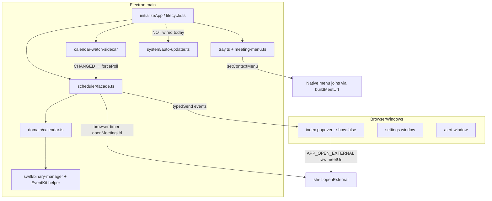
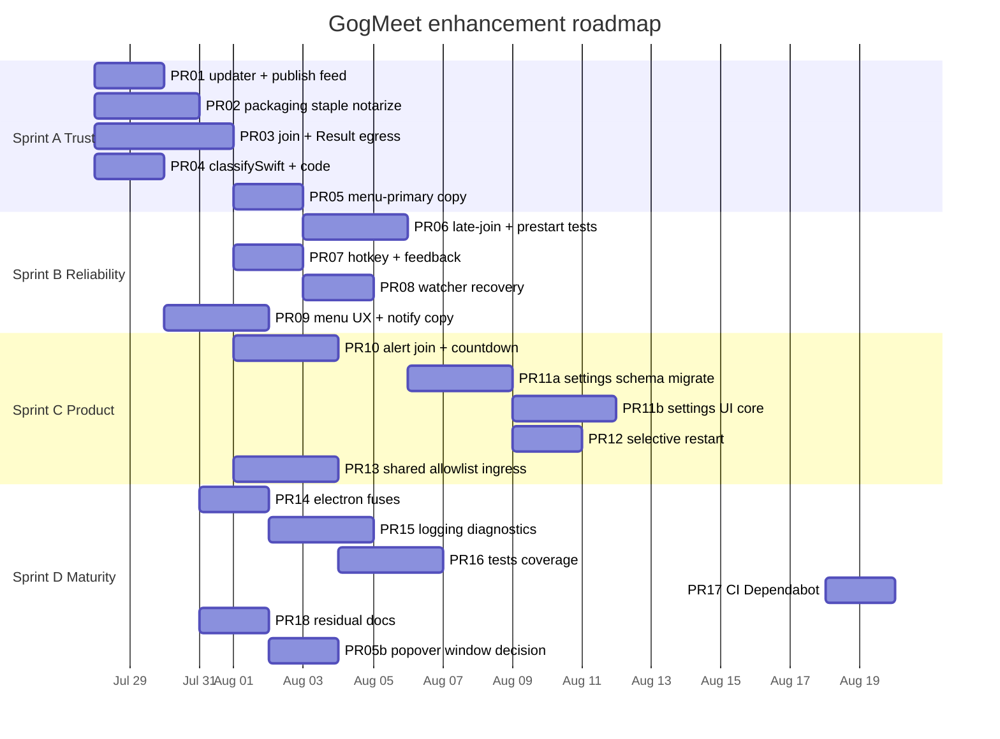
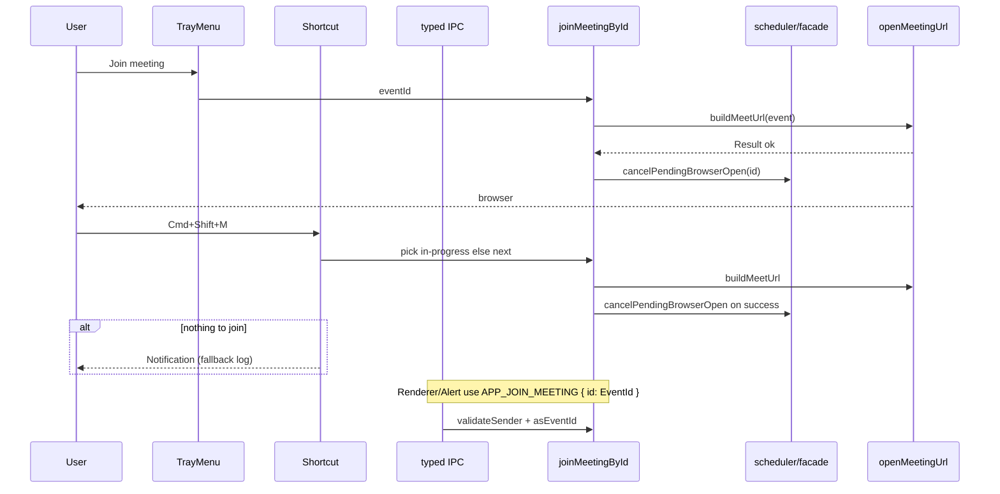
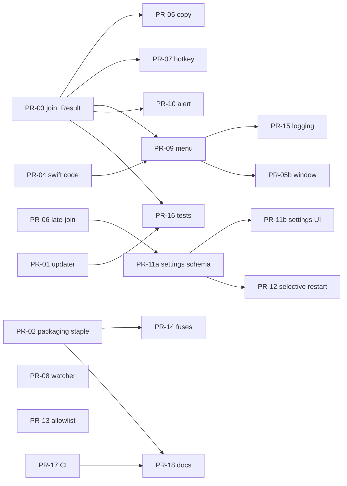

# GogMeet Multi-Sprint Enhancement Development Plan

| Field | Value |
| --- | --- |
| **Title** | GogMeet Multi-Sprint Enhancement Development Plan |
| **Author** | TBD (engineering) |
| **Date** | 2026-07-25 |
| **Status** | **Historical** (revision 5) — see `docs/STATUS.md` for shipped vs open |
| **Branch context** | Was `general-enhancements`; product now on `develop` / `main` |
| **Workspace** | Historical path; current workspace is the GogMeet repo root |
| **App version at analysis** | `1.16.0` (stale — do not treat claims below as live 1.18+ bugs) |

> **Banner:** Large parts of this plan (updater wiring, join-by-id, allowlist, late-join, settings v3, Google Windows MVP, etc.) are **already shipped**. Use `docs/STATUS.md` and root `AGENTS.md` for current truth. Keep this file as decision history and residual backlog only.

---

## Overview

GogMeet is a mature macOS tray app (Electron 43 + TypeScript + Swift EventKit helper) that already implements most of its advertised product surface: calendar polling, auto-open with identity params, full-screen alerts, native tray menu, countdown title, global hotkey, and settings. A thorough codebase review found that several **advertised or partially-built features are unwired**, a few **correctness/security gaps** remain at trust boundaries, and a set of **reliability/UX upgrades** would materially reduce missed meetings.

This document is **not** a greenfield redesign. It is an incremental multi-PR plan that:

1. Wires existing modules that already exist and are tested (`initAutoUpdater`, `classifySwiftError`, `validateMeetUrl`, popover renderer).
2. Adds small, typed IPC contracts where join parity and structured errors require them.
3. Extends settings/schema carefully with migrations (split across small PRs).
4. Sequences work so user-visible correctness and release integrity land before product depth and engineering maturity.

Work is organized into **Sprint A–D**, mapped to concrete, independently mergeable PRs at the bottom.

---

## Background & Motivation

### Current architecture (preserved)



### Verified pain points (analysis claims confirmed in tree)

| # | Finding | Evidence |
| --- | --- | --- |
| 1 | Auto-updater never starts | `initAutoUpdater()` in `src/main/system/auto-updater.ts` is tested (`tests/main/auto-updater.test.ts`) but **not imported/called** from `lifecycle.ts` or `index.ts`. README line 18 claims updates work. Live `package.json` / `electron-builder.yml` have **no** `publish` block — feed completeness is part of A1 acceptance. |
| 2 | Popover never shown | `createWindow()` builds a popover-styled window with `show: false`; `tray.on("click")` only calls `forcePoll()`. Native `setContextMenu` is the real UI. |
| 3 | Join URL parity broken | Popover Join uses `data-url` + `APP_OPEN_EXTERNAL` (raw `meetUrl`). Tray/menu/shortcut/scheduler use `buildMeetUrl()` (`authuser` / `uname`). |
| 4 | Structured Swift errors unused in prod | `classifySwiftError()` exists; `runSwiftHelper()` rethrows raw `execFile` errors; `getCalendarEventsResult` only maps `instanceof SwiftHelperError` — which production never constructs. UI gets opaque strings. |
| 5 | Packaging drift | Live `electron-builder.yml`: `hardenedRuntime: false`, `notarize: false`, `afterSign: build/notarize.cjs`. Notarize hook reads `APPLE_APP_PASSWORD`; release workflow requires `APPLE_APP_SPECIFIC_PASSWORD`. Hook does **not** staple; official `verify:macos-release` runs `xcrun stapler validate` on the app. Root `AGENTS.md` and `build/AGENTS.md` describe aspirational builder-owned notarize and “only afterPack”. |
| 6 | Post-start / late open miss (not pre-start) | Pre-start catch-up already works: when `openAtMs < now < startMs`, `effectiveDelay = Math.max(0, delayMs)` schedules immediate open on poll/resume. The real gaps: (a) browser-timer callback does `if (Date.now() >= startMs) return` **without opening and without marking fired**; (b) `handleInProgressEvent` cancels pending opens once start has passed; (c) no optional late-join grace after start. |
| 7 | Hotkey ignores in-progress | `shortcuts.ts` filters `startDate > now` only — in-progress meetings are skipped. No user feedback when nothing to join. |
| 8 | Notification copy | Hardcoded body `"Starting now"` even when opening N minutes early. |
| 9 | Settings restart hammer | `SETTINGS_SET` always `restartScheduler()` even for non-timing keys. |
| 10 | Dual allowlists | Preload hardcodes hostnames; main has prefix-based `MEETING_URL_ALLOWLIST` in `url-validation.ts`. Drift risk. |
| 11 | Manual join does not suppress auto-open | Menu/shortcut/renderer join open the URL but never call `cancelPendingBrowserOpen` → scheduled browser timer can open a second tab. |

### Why now

Shipping without wiring the updater and fixing packaging/env/stapling mismatch means **official releases and auto-update are unreliable** despite user-facing claims. Join parity, mark-opened-on-join, and structured calendar errors are small, high-confidence fixes that improve daily UX. Reliability work (late-join policy, hotkey, watcher recovery) directly reduces missed meetings — the product’s core promise.

---

## Goals & Non-Goals

### Goals

- Make advertised behavior true: auto-updates in packaged builds (with verified update feed), accurate settings/README copy, join paths equivalent.
- Official releases notarized **and stapled** so `bun run verify:macos-release` passes.
- Never double-open after any manual join path; never miss pre-start auto-open across sleep (regression-guarded); optional late-join after start.
- Structured calendar failures surface as permission / no-calendars / runtime in menu (and popover if kept).
- Preserve architecture constraints (facade-only scheduler, typed IPC, branded URLs, meeting egress via allowlist, Bun/Vitest).
- Ship as small vertical slices: each PR reviewable, mergeable, test-covered.

### Non-Goals

- Windows/Linux ports.
- Full multi-locale product (i18n extraction only as late P2).
- Rewriting the scheduler state machine or replacing EventKit with Google Calendar API.
- Replacing native tray menu with a full Electron UI redesign.
- Precompiled Swift binary in Sprint A–C (P2 expansion only).
- Teams/Webex providers in Sprint A–C (P2 expansion only).
- Changing the macOS-only EventKit permission model.
- **Calendar name multi-select filter in first settings ship** (deferred — needs calendar-list IPC; see Settings plan).

---

## Product Decision: Popover vs Menu-Only

### Current behavior

On macOS, `tray.setContextMenu(...)` makes the **native menu the primary activation UI**. Left-click opens that menu. The separate `tray.on("click")` handler only triggers `forcePoll()`. The BrowserWindow in `index.ts` remains loaded (`show: false`) as:

- Scheduler push target for `CALENDAR_EVENTS_UPDATED`
- Height IPC target
- Historical “popover” product surface (fully implemented renderer, heavily tested)

README and settings copy still say “tray popover.”

### Options

| Option | Description | Pros | Cons |
| --- | --- | --- | --- |
| **A — Restore tray-anchored popover** | Left-click shows BrowserWindow; right-click menu. | Matches old README; richer UI. | Two UIs; macOS click/menu exclusivity; higher QA. |
| **B — Menu-only + remove hidden window** | Native menu sole list UI; stop creating meeting BrowserWindow. | Lowest memory; matches reality. | Requires scheduler push retarget / drop; larger cleanup PR. |
| **C — Menu-only UX indefinitely (chosen)** | Menu is the only user-facing list; keep or remove hidden window as push host in PR-05b (default keep). PR-19 popover restore is **not** on the default roadmap. | Matches product decision; no dual UI. | Idle hidden window cost until PR-05b if kept. |

### Final product decision: **Menu-only indefinitely** (refined Option C)

**User decision (final):** The product UX is **menu-only indefinitely**. Do **not** plan popover restore as a default roadmap item. Optional PR-19 exists only if product later requests a popover; it is **out of the default multi-sprint plan**.

**Hidden BrowserWindow (implementation, not UX):** Keep the hidden meeting `BrowserWindow` through Sprint C as the sole `state.win` push target for `CALENDAR_EVENTS_UPDATED` / height IPC. **PR-05b (Sprint D)** decides keep-as-push-host vs remove-dead-list-UI: either is valid; **default recommendation remains keep** (lowest risk — no user-facing popover either way). Do not half-remove mid-sprint. Menu remains the only user-facing meeting list.

### Implementation implications

**Menu-only (all sprints):**

- Update README + settings description (“menu bar menu” not “popover”).
- Enhance `meeting-menu.ts` for Refresh / errors / copy link (Sprint B).
- No default work to restore left-click popover; no dual-UI maintenance.

**Out of default plan (PR-19 only if product later requests):**

- Would require right-click menu + left-click show window; EventId join only. Not scheduled.

---

## Proposed Design

### Sprint roadmap (A–D)



| Sprint | Theme | Primary outcomes |
| --- | --- | --- |
| **A** | Fix trust & advertised features | Updater wired + feed acceptance; packaging/notarize/**staple**; join parity + Result egress + mark-opened; structured Swift `code`; menu-primary copy |
| **B** | Never miss a meeting | Pre-start catch-up regression tests; late-join policy; smarter hotkey; watcher recovery; accurate notifications; menu reliability UX |
| **C** | Product depth | Alert Join; settings schema/UI split; selective restart; shared allowlist + parse ingress |
| **D** | Maturity | Fuses; logging/diagnostics; coverage; CI; residual docs; hidden window keep-or-remove (menu-only UX already final) |

### Architecture target (after Sprint A–C)



---

## Per-Work-Item Detail

### A1 — Wire auto-updater + verify update feed

**Problem / current behavior**  
`initAutoUpdater()` configures `electron-updater` but is never called. README claims updates work. There is **no** `publish` block in `package.json` / `electron-builder.yml` (only `repository` / `homepage`). electron-updater *may* infer GitHub from `repository`, but that is not an acceptance criterion until proven.

**Proposed change**  
1. Call `initAutoUpdater()` from `initializeApp()` via `tryRun("initAutoUpdater", ...)` after non-critical startup (e.g. after shortcuts/auto-launch).  
2. Add explicit GitHub publish config for electron-builder / electron-updater, e.g. in `electron-builder.yml` or `package.json`:

```yaml
# electron-builder.yml (or package.json build.publish)
publish:
  provider: github
  owner: iWorkforces
  repo: GogMeet
```

3. Confirm release workflow uploads assets that produce `latest-mac.yml` (electron-updater generic/GitHub provider expectation). If the release action already uploads DMG/ZIP via `softprops/action-gh-release`, document that `electron-updater` GitHub provider resolves latest release assets — **or** add electron-builder `publish` on tag builds.

**Acceptance criteria (tightened)**  
- Packaged app calls `checkForUpdates` once after startup delay; unpackaged no-op.  
- Lifecycle test asserts `initAutoUpdater` invoked once.  
- **Either:** (a) a test release produces a consumable update feed (`latest-mac.yml` or GitHub provider-compatible release assets) and a packaged build logs a successful update check against it, **or** (b) README is **caveated** (“updates when published via GitHub Releases with electron-updater metadata”) until (a) is proven — **do not claim “updates work” without (a).** Prefer completing (a) in PR-01 or a tiny PR-01b on the first release after packaging fix.

**Touch points**  
- `src/main/app/lifecycle.ts`, `tests/main/lifecycle.test.ts`  
- `electron-builder.yml` and/or `package.json` publish  
- `README.md` (claim accuracy)

**Risks**  
- Low for wiring; medium for feed completeness — mitigate with explicit publish config + release checklist item.

---

### A2 — Release packaging integrity (notarize + staple)

**Problem / current behavior**  
- `hardenedRuntime: false`, `notarize: false`, `afterSign: build/notarize.cjs`.  
- Hook reads `APPLE_APP_PASSWORD`; CI provides `APPLE_APP_SPECIFIC_PASSWORD` → silent skip.  
- Hook calls `@electron/notarize` only — **no staple**.  
- `scripts/macos-release-verifier-native.mjs` runs `xcrun stapler validate` on the contained `.app` → official release fails without staple.  
- `build/AGENTS.md` forbids custom afterSign and claims builder owns notarize — contradicts live YAML.

**Chosen path (Key Decision — single notarize owner)**  

> **Keep custom `afterSign: build/notarize.cjs` as the sole notarization owner.** Do **not** enable electron-builder `mac.notarize: true` (avoid dual notarize). After successful notarytool submission/wait, **staple** the app before the hook returns so DMG/ZIP packaging embeds a stapled ticket.

**End-to-end algorithm in `build/notarize.cjs`:**

```js
// Pseudocode — production hook
1. if platform !== darwin → return
2. Resolve credentials:
   appleId = APPLE_ID
   teamId = APPLE_TEAM_ID
   password = APPLE_APP_SPECIFIC_PASSWORD || APPLE_APP_PASSWORD  // prefer specific; log deprecation if legacy only
3. if missing any → warn + return (local package without secrets still works)
4. appPath = `${appOutDir}/${productFilename}.app`
5. await notarize({ tool: "notarytool", appPath, appleId, appleIdPassword: password, teamId, ... })
   // Fix bundleId to appId: com.ocworkforces.gogmeet (do not derive from productFilename casing games)
6. Staple:
   execFileSync("xcrun", ["stapler", "staple", appPath], { stdio: "inherit" })
7. Optional verify:
   execFileSync("xcrun", ["stapler", "validate", appPath], { stdio: "inherit" })
```

**YAML / docs changes**  
- `hardenedRuntime: true`  
- Keep `mac.notarize: false` (custom hook owns it)  
- Keep `afterSign: build/notarize.cjs`  
- Keep `gatekeeperAssess: false`, DMG `sign: false` if still intentional  
- **Rewrite `build/AGENTS.md`:** afterSign is the notarize+staple owner; afterPack remains optimization-only; remove “Do not add custom afterSign”; list required env `APPLE_APP_SPECIFIC_PASSWORD`  
- Sync root `AGENTS.md` packaging bullets in **this PR** (PR-02 is the packaging truth pass; PR-18 is residual only)

**Entitlements**  
- Keep calendar + apple-events.  
- Document why `allow-jit` remains for Electron.  
- `allow-unsigned-executable-memory`: re-validate against Electron 43 + hardened runtime on `package:dir` smoke; remove only if app launches without it (note: current `build/AGENTS.md` already says not to add it, but live plist has it — PR-02 reconciles: either justify keep with comment in plist/AGENTS or remove after smoke).

**Acceptance criteria**  
- With full secrets: notarize runs (not skipped for env name).  
- Staple succeeds; `xcrun stapler validate` on built `.app` succeeds.  
- `bun run verify:macos-release` passes on official CI artifacts (includes stapler validate).  
- Without secrets: package still succeeds; hook logs skip clearly.  
- Docs (`build/AGENTS.md`, root packaging section) match live YAML.

**Touch points**  
- `electron-builder.yml`, `build/notarize.cjs`, entitlements as needed  
- `build/AGENTS.md`, root `AGENTS.md` packaging section  
- `.github/workflows/release.yml` (ensure env name matches; optional export alias)

**Risks**  
- **High** if hardened runtime breaks without entitlements — mitigate `package:dir` smoke arm64 before main.  
- Staple must run **before** DMG/ZIP creation (afterSign timing is correct for that).

---

### A3 — Join-by-eventId + `openMeetingUrl` Result migration (single owner)

**Problem**  
- Popover Join uses raw URL without `buildMeetUrl`.  
- Manual joins never cancel pending auto-open → double tab.  
- `openMeetingUrl` returns `void` and swallows errors; `APP_OPEN_EXTERNAL` bypasses it with direct `shell.openExternal`.

**PR-03 is the sole owner** of: join-by-id IPC, `joinMeetingById`, `openMeetingUrl` → `Result`, and `APP_OPEN_EXTERNAL` delegation. **PR-13 does not touch Result.**

#### Production call sites of `openMeetingUrl` / meeting egress (must update)

| Site | File | Change |
| --- | --- | --- |
| Menu join | `src/main/menu/meeting-menu.ts` | Use `joinMeetingById` (not raw build+open) |
| Hotkey | `src/main/system/shortcuts.ts` | Use join helper / picker + joinMeetingById |
| Browser timer | `src/main/scheduler/browser-timer.ts` | `await openMeetingUrl` + log `Result`; already marks fired before open |
| APP_OPEN_EXTERNAL | `src/main/ipc-handlers/app.ts` | **Delegate to `openMeetingUrl`**; return Result |
| (new) APP_JOIN_MEETING | app handlers | `joinMeetingById` |
| (new) joinMeetingById | `src/main/utils/join-meeting.ts` | build + open + mark opened |

#### Test mocks to update

- Any test that expects `openMeetingUrl` to resolve `undefined` without Result shape  
- `tests/main/meet-url.test.ts`, `meeting-menu.test.ts`, `shortcuts.test.ts`, `scheduler-browser-timer.test.ts`, `ipc-handlers-app.test.ts`, `preload.test.ts`

#### `joinMeetingById` (authoritative behavior)

```ts
// src/main/utils/join-meeting.ts
function calendarErrMessage(c: CalendarResult | null): string {
  if (c === null) return "No calendar data available";
  if (!isCalendarOk(c)) return c.error;
  return "Unknown calendar error";
}

export async function joinMeetingById(id: EventId): Promise<Result<void, string>> {
  let calendar: CalendarResult | null = getLastKnownEvents();

  const find = (c: CalendarResult): MeetingEvent | undefined =>
    isCalendarOk(c) ? c.events.find((e) => e.id === id) : undefined;

  let event = calendar !== null ? find(calendar) : undefined;

  // Fallback once: null/err cache OR ok cache missing id OR empty meetUrl
  const needsFetch =
    calendar === null ||
    !isCalendarOk(calendar) ||
    event === undefined ||
    !event.meetUrl;

  if (needsFetch) {
    calendar = await getCalendarEventsResult(); // max one Swift call; 15s timeout
    event = isCalendarOk(calendar) ? find(calendar) : undefined;
  }

  // Null-safe: never call isCalendarOk on null
  if (calendar === null) return err(calendarErrMessage(null));
  if (!isCalendarOk(calendar)) return err(calendar.error);
  if (!event) return err("Meeting not found");

  const url = buildMeetUrl(event);
  if (!url) return err("No joinable meeting URL");

  const opened = await openMeetingUrl(url);
  if (!opened.ok) return opened;

  // ALL join paths: suppress pending auto-open / mark fired (facade only)
  cancelPendingBrowserOpen(id);
  return ok(undefined);
}
```

**Hotkey path:** resolve target via pure picker → `joinMeetingById(target.id)` (gets mark-opened free). Prefer cache for picker list; do not force Swift on every hotkey unless join needs fallback.

**Renderer:** `data-event-id` only (no `data-url`). Preload brands with `asEventId`.

**APP_OPEN_EXTERNAL:** After join-by-id lands, meeting joins **must not** use this channel. Keep channel for any residual allowlisted URL open from renderer, implemented as:

```ts
// ipc-handlers/app.ts
if (!validateSender(event)) return err("Unauthorized");
const branded = /* re-validate MeetUrl from payload */;
if (!branded.ok) return err(branded.error);
return openMeetingUrl(branded.value);
// Note: open-external does NOT cancelPendingBrowserOpen (no event id).
// Deprecate renderer meeting use; only join-meeting for meetings.
```

**Preload Result for bad brand:**

```ts
openExternal(url: string): Promise<Result<void, string>> {
  const branded = brandMeetUrl(url);
  if (branded === null) return Promise.resolve(err("Invalid or disallowed URL"));
  return ipcRenderer.invoke(IPC_CHANNELS.APP_OPEN_EXTERNAL, { url: branded });
}
joinMeeting(rawId: string): Promise<Result<void, string>> {
  const id = asEventId(rawId);
  if (!id.ok) return Promise.resolve(err(id.error));
  return ipcRenderer.invoke(IPC_CHANNELS.APP_JOIN_MEETING, { id: id.value });
}
```

**Main re-brands** `asEventId` / meet URL again inside handlers (never trust preload).

**Acceptance criteria**  
- Menu, hotkey, renderer join all apply `buildMeetUrl` and call `cancelPendingBrowserOpen` on success.  
- No double browser tab when auto-open was scheduled.  
- Id missing from ok cache triggers exactly one fallback fetch.  
- `APP_OPEN_EXTERNAL` uses `openMeetingUrl` only.  
- All listed call sites and tests compile against `Result`.

**Risks**  
- PR size: keep production LOC focused; if needed split **PR-03a** (openMeetingUrl Result + APP_OPEN_EXTERNAL delegate + tests) then **PR-03b** (join-by-id + renderer/menu/shortcut). Prefer single PR-03 if reviewable; **do not** leave Result half-migrated across PR-13.

---

### A4 — Production `classifySwiftError` + required structured `code`

**Problem**  
Structured exit codes never reach `CalendarResult`.

**Proposed change**  
1. In `runSwiftHelper`: on exec failure, if numeric exit ∈ {2,3,4} → `throw classifySwiftError(err)` **immediately** (no unlink/recompile).  
2. Other failures → existing recompile-once; final failure `throw classifySwiftError(retryErr)`.  
3. `getCalendarEventsResult` already maps `SwiftHelperError` via `toAppError()` — extend err shape:

```ts
export type CalendarErrorCode =
  | "permission-denied"
  | "no-calendars"
  | "swift-error"
  | "unknown";

export interface CalendarResultErr {
  kind: "err";
  error: string; // formatAppError / human message (back-compat)
  code: CalendarErrorCode; // REQUIRED in PR-04 — PR-09 depends on this
}
```

Map `SwiftHelperError.kind` → `code` in `domain/calendar.ts` (no string parsing). Non-Swift errors → `code: "unknown"`.

**Tests**  
- Exit 2: no unlink/recompile; `code === "permission-denied"`.  
- Exit 3/4 similarly.  
- Corrupt binary path still recompiles once.

**Acceptance criteria**  
- PR-09 can branch on `code` without parsing English.  
- Structured field always present on err results.

---

### A5 — Menu-primary copy

**Proposed change**  
README, settings description, comments: “menu bar menu” / “meeting list.” Do not claim left-click popover. Updater README text must match A1 acceptance (true feed or caveated).

**PR-05b (Sprint D)** — Hidden push-host window keep vs remove (menu-only UX is already final; see Key Decisions). Not mixed into A5 docs-only PR.

---

### B1 / PR-06 — Pre-start catch-up regression + late-join policy

**Reframe (not a broad new “catch-up” feature)**  

| Behavior | Status | Work |
| --- | --- | --- |
| `openAtMs < now < startMs` → delay 0 open on schedule/poll/resume | **Already implemented** via `Math.max(0, delayMs)` + `restartScheduler` on resume | **Regression tests only** with fake timers + resume |
| Timer fires at/after `startMs` → silent return, not marked fired | Bug / gap | Mark fired when past grace; within grace proceed to open |
| Optional open after start within grace | **New** | `lateJoinGraceMinutes` (default **0** = off) |
| Resume/poll when `startMs <= now` | **Blocks late-join today** | `handleInProgressEvent` cancels browser timers and `continue`s — **must change** (below) |

#### Why schedule-path change is required

Today (`src/main/scheduler/index.ts`):

```ts
// scheduleEvents loop:
if (handleInProgressEvent(...)) continue; // startMs <= now → cancel browser timers, start countdown, NEVER open
```

`handleInProgressEvent` always returns `true` for in-progress meetings after cancelling `cancelBrowserTimer`. On wake, `restartScheduler` → poll → `scheduleEvents` rebuilds state; any pre-sleep timer is gone. **Late-join with grace > 0 cannot work if only the browser-timer callback is patched** — the schedule path never arms a post-start open.

#### `firedEvents` vs `cancelledEvents` (do not confuse)

| Map/Set | Owner | Meaning | Use for late-join / auto-open? |
| --- | --- | --- | --- |
| **`firedEvents`** | browser-timer / `cancelPendingBrowserOpen` | Browser open already done **or** user dismissed alert (suppress further auto-open) | **Yes — sole suppression signal** |
| **`alertFiredEvents`** | alert-timer | Full-screen alert already shown | No (alert path only) |
| **`cancelledEvents`** | `title-countdown.ts` via `cancelTitleCountdown` | Title-countdown **interval** was cancelled so it must not re-register / must release sleep blockers cleanly | **Never** for open policy |

Live code: `cancelTitleCountdown` → `state.cancelledEvents.add(eventId)`. AGENTS: “`cancelledEvents` prevents title timers from re-registering after dismissal.” User suppress of browser auto-open is **only** `firedEvents` (set by timer fire and by facade `cancelPendingBrowserOpen`).

**Anti-pattern:** treating `cancelledEvents` as “user cancelled auto-open.” That breaks late-join: in-progress path **always** calls `cancelTitleCountdown`, which adds the id to `cancelledEvents`, so a **second poll** would wrongly treat the event as non-eligible and `cancelBrowserTimer` the pending delay-0 open.

#### Shared eligibility helper

```ts
// Prefer pure helper in scheduler — used by schedule path AND browser-timer callback
// Gate ONLY on: not all-day, meetUrl, time window, grace, !firedEvents.
// Do NOT read cancelledEvents (title-countdown bookkeeping only).
// autoOpenEnabled: checked by caller before arming (PR-11a); PR-06 assumes true.
function isLateJoinEligible(
  event: MeetingEvent,
  startMs: number,
  endMs: number,
  now: number,
  graceMs: number,
  s: SchedulerState,
): boolean {
  if (event.isAllDay || !event.meetUrl) return false;
  if (s.firedEvents.has(event.id)) return false; // opened or user-suppressed via cancelPendingBrowserOpen
  if (endMs <= now) return false; // meeting over
  if (graceMs <= 0) return false; // feature off
  // Within [startMs, startMs + graceMs)
  return startMs <= now && now < startMs + graceMs;
}
```

Until settings v2 ships, `graceMs` comes from a module constant `DEFAULT_LATE_JOIN_GRACE_MS = 0`, overridable in tests. **PR-11a** replaces the constant with `getSettings().lateJoinGraceMinutes * 60_000` (same helper). When wiring `autoOpenEnabled`, the schedule path must also refuse to arm if `!settings.autoOpenEnabled` (eligibility for time window may still be true; arming is gated).

#### Schedule-path algorithm (authoritative)

```ts
// Inside scheduleEvents / handleInProgressEvent, for each non-all-day event:
const graceMs = getLateJoinGraceMs(); // PR-06: const 0; PR-11a: settings
const autoOpen = settings.autoOpenEnabled !== false; // PR-06: treat as true

if (startMs <= now) {
  if (endMs <= now) {
    handleEndedOrSkip(event, ...);
    continue;
  }

  // Meeting still in progress (startMs <= now < endMs)
  const lateJoin =
    autoOpen && isLateJoinEligible(event, startMs, endMs, now, graceMs, state);
  // lateJoin true ⇒ preserve any existing browser timer OR arm delay-0 once
  // lateJoin false ⇒ cancel browser timer (past grace / already fired / no URL / grace 0)

  handleInProgressEvent(..., { lateJoin });
  continue;
}
```

**Refactor of `handleInProgressEvent` (ordered steps):**

```ts
function handleInProgressEvent(...): boolean {
  if (startMs > now) return false;
  if (endMs <= now) return true; // ended

  const graceMs = getLateJoinGraceMs();
  const lateJoin =
    autoOpenEnabled &&
    isLateJoinEligible(event, startMs, endMs, now, graceMs, s);

  // Also treat "already have a pending browser timer while still in grace window
  // and not fired" as preserve-timer — covers re-poll after arming delay-0.
  const hasPendingBrowserOpen = s.timers.has(event.id);
  const preserveBrowserTimer =
    lateJoin || (hasPendingBrowserOpen && !s.firedEvents.has(event.id) && graceMs > 0 &&
      startMs <= now && now < startMs + graceMs && !!event.meetUrl && !event.isAllDay);

  // Cancel browser timer ONLY when we are not preserving a late-join open
  if (!preserveBrowserTimer) {
    cancelBrowserTimer(event.id, s.timers);
  }
  cancelAlertTimer(event.id, s.alertTimers);
  // Title countdown cancel is OK — it mutates cancelledEvents for TITLE path only.
  // That must NOT affect preserveBrowserTimer / isLateJoinEligible on the next poll.
  cancelTitleCountdown(event.id, s.titleTimers, s.countdownIntervals, s.clearTimers);

  if (lateJoin && !s.timers.has(event.id)) {
    // Arm once; re-poll while timer pending hits preserveBrowserTimer above
    scheduleBrowserTimer(
      event,
      /*delay*/ 0,
      startMs /*openAtMs*/,
      startMs,
      endMs,
      s.timers,
      s.firedEvents,
      s.scheduledEventData,
    );
  }

  // In-meeting countdown (unchanged)
  activeIds.add(event.id);
  ...
  return true;
}
```

**Re-poll invariant:** After poll 1 arms delay-0 late-join, poll 2 (before timer fires) must **not** call `cancelBrowserTimer` for that id. Eligibility still true via `!firedEvents` (not `cancelledEvents`). `cancelTitleCountdown` may add to `cancelledEvents`; that is irrelevant to open policy.

#### Browser-timer callback (still required)

```ts
// Replace bare `if (Date.now() >= startMs) return;`
const now = Date.now();
const graceMs = getLateJoinGraceMs();
if (now >= startMs + graceMs) {
  firedEvents.set(event.id, endMs + FIRED_EVENT_TTL_MS);
  return; // too late — no open, prevent reschedule storms
}
// now < startMs (early fire) OR within grace after start → notify + open
// (existing open path; firedEvents set after open as today)
```

#### Interaction matrix

| Case | Result |
| --- | --- |
| Resume, `openAtMs < now < startMs` | Existing delay-0 path (future branch) — regression test |
| Resume, `startMs` 60s ago, grace 2m, not fired, has URL | `handleInProgressEvent` arms delay-0 open once + in-progress countdown |
| Same, grace 0 | No open; countdown only (today's behavior) |
| Same, already in `firedEvents` (manual join / prior open) | No open |
| **Re-poll after arming delay-0, timer not yet fired** | **Preserve browser timer; open still fires once** (not cancelled by title `cancelledEvents`) |
| Timer callback fires at `now >= startMs + grace` | Mark fired, no open |
| `autoOpenEnabled: false` (after PR-11a) | Neither late-join nor normal schedule arms browser timer |

**Acceptance criteria (PR-06)**  
- **Regression:** pre-start missed open window still opens once after resume/poll (`openAtMs < now < startMs`).  
- **Grace 0:** resume with `startMs` in the past → **no** browser open; in-progress countdown still starts.  
- **Grace 2m + within window on schedule/resume path:** `startMs` 60s ago, not fired → **exactly one** open; in-progress countdown still starts.  
- **Re-poll safety:** arm delay-0 late-join on poll 1; call `scheduleEvents` again before timer fires → timer **still fires once** (not cancelled).  
- **Already fired / manual join:** no second open after resume.  
- **Post-grace timer callback:** marks fired, no open, no infinite reschedule.  
- **`isLateJoinEligible` never reads `cancelledEvents`.**  
- Unit tests use fake timers + injectible grace; do **not** rely only on a pre-armed timer surviving `restartScheduler`.

---

### B2 / PR-07 — Hotkey in-progress first + feedback

**Picker** (pure, preferably `src/shared/utils/pick-join-target.ts`):

```ts
function pickJoinTarget(events: MeetingEvent[], now = Date.now()): MeetingEvent | null {
  const candidates = events.filter((e) => !e.isAllDay && !!e.meetUrl && new Date(e.endDate) > now);
  const inProgress = candidates
    .filter((e) => new Date(e.startDate) <= now)
    .sort((a, b) => new Date(a.startDate).getTime() - new Date(b.startDate).getTime());
  if (inProgress[0]) return inProgress[0];
  return (
    candidates
      .filter((e) => new Date(e.startDate) > now)
      .sort((a, b) => new Date(a.startDate).getTime() - new Date(b.startDate).getTime())[0] ?? null
  );
}
```

**Feedback chain (Key Decision for hotkey UX)**  

| Condition | Primary | Fallback |
| --- | --- | --- |
| Permission / calendar err | Notification: “Calendar access required” | If notifications unsupported/denied → **log only** (no modal) |
| No joinable meeting | Notification: “No meeting to join” | log only |
| Open Result err | Notification with short error | log only |
| Catastrophic (shortcut registration failure at startup) | existing log | — |

**Reserve `dialog.showErrorBox` for startup hard-fail and empty-URL edge only if Notification path unavailable and error is user-blocking** — default hotkey path is Notification → log, **not** modal.

Join via `joinMeetingById` (mark-opened included).

---

### B3 / PR-08 — Swift watch recovery

Unchanged intent: cooldown restart after MAX_RETRIES; wait for permission; revive on resume / permission grant via `restartCalendarWatcher()`.

---

### B4 / PR-09 — Notification copy + menu UX

**Notification body** at fire time from open lead: e.g. `Starting in ${n} min` vs `Starting now`.

**Menu items**

| Item | Behavior |
| --- | --- |
| Refresh | `forcePoll()` |
| Join next | `pickJoinTarget` + `joinMeetingById` |
| Error/permission row | Branch on last poll `CalendarResultErr.code` (from PR-04). Permission: label + action **Open System Settings** via `openSystemSettings(pane)` below — **not** `openMeetingUrl`. |
| Copy meeting link | **Main-process only** `clipboard.writeText(buildMeetUrl(event))` — **no IPC**. Submenu or secondary item per event. |
| Settings / About / Quit | existing |

Cache last calendar status on main (facade or module-level updated from `poll.ts`) for menu rebuild — no new push channel required for menu-primary.

#### `openSystemSettings` (non-meeting egress)

Mirror `notification.ts`: small allowlisted URL map + **fallback** to bare System Settings root. Calendar privacy deep links differ across macOS versions; treat pane URLs as best-effort.

```ts
// src/main/utils/system-settings.ts
const SYSTEM_SETTINGS_ROOT = "x-apple.systempreferences:";

/** Best-effort pane URLs — may no-op on some macOS versions; always fall back. */
const PANE_URLS = {
  notifications: [
    "x-apple.systempreferences:com.apple.preference.notifications",
  ],
  calendars: [
    // Ventura+ style / legacy preference pane candidates (try in order)
    "x-apple.systempreferences:com.apple.preference.security?Privacy_Calendars",
    "x-apple.systempreferences:com.apple.settings.PrivacySecurity.extension?Privacy_Calendars",
  ],
} as const;

export async function openSystemSettings(
  pane: "calendars" | "notifications",
): Promise<void> {
  const candidates = PANE_URLS[pane];
  for (const url of candidates) {
    try {
      await shell.openExternal(url);
      return;
    } catch {
      // try next candidate
    }
  }
  await shell.openExternal(SYSTEM_SETTINGS_ROOT).catch((err) => {
    console.error("[system-settings] Failed to open System Settings:", err);
  });
}
```

- **Tests:** mock `shell.openExternal`; assert only allowlisted `x-apple.systempreferences:` strings are attempted; assert fallback invoked when all pane opens reject. **No** live OS integration test.

**Dependencies:** PR-04 for `code`; PR-03 for `joinMeetingById`. **Not** blocked on PR-07 (can duplicate one-line picker import).

---

### C0 / PR-10 — Alert Join + countdown (Sprint C, was B5)

Moved fully to Sprint C to match PR plan.

- `AlertPayload` adds `autoOpenAt?: IsoUtc` (no meetUrl — already true).  
- Join button → `app.joinMeeting(id)` → mark-opened.  
- Dismiss still cancels pending open (existing).  
- Join success also mark-opened (idempotent with dismiss cancel).

---

### C1 — Settings schema (split PRs)

See **Settings Schema Migration Plan** for field list, algorithms, and PR-11a/11b/11c split.

**Quiet hours policy (closed — Key Decision):**  
Suppress **window alert + native notifications only**. **Auto-open continues** during quiet hours so meetings still launch. Menu/hotkey joins always available.

**`calendarFilter`:** **Deferred out of v2 first ship** (PR-11a/11b). Revisit as PR-11c only if product prioritizes; requires calendar-name list source (Swift one-shot names or `EKEventStore` calendars query) — not “unique names from last events.”

---

### C2 / PR-12 — Selective scheduler restart

See **TIMING_KEYS** and settings behavior matrix under Settings Schema Migration Plan.  
`launchAtLogin` → `syncAutoLaunch` only; `showTomorrowMeetings` → menu refresh + SETTINGS_CHANGED, no full restart.

---

### C3 / PR-13 — Shared allowlist + ingress validation only

**Not** Result migration (owned by PR-03).

**Shared module** `src/shared/meet-url-allowlist.ts`:

```ts
export const MEET_ALLOWED_HOSTNAMES = [
  "meet.google.com",
  "calendar.google.com",
  "accounts.google.com",
  "zoom.us",
  "calendly.com",
] as const;

export const MEET_ALLOWED_HOSTNAME_SUFFIXES = [".zoom.us"] as const;
```

**Main migration:** `url-validation.ts` stops owning parallel prefix constants as source of truth. Either:

- Derive hostnames from shared module only, **or**  
- Export optional display prefixes as `https://${host}/` helpers for tests that currently import `MEETING_URL_ALLOWLIST`.

Update tests that assert on prefix strings. Preload imports shared hostnames/suffixes (already imports other `shared/` modules — feasible with rslib preload bundle).

**Ingress:** `parseMeetUrlField` uses `validateMeetUrl` (hostname allowlist), not structural `asMeetUrl` alone. Non-allowlisted → `undefined` URL (non-fatal).

---

### D1 / PR-15 — Central electron-log + diagnostics

**Log setup**  
- `src/main/utils/log.ts` wraps `electron-log`.  
- File transport: electron-log default macOS path `~/Library/Logs/GogMeet/main.log` (or `app.getPath('logs')`).  
- Configure once at process start in `index.ts` before lifecycle.  
- Migrate high-value modules first: lifecycle, scheduler, calendar, binary-manager, shortcuts, meet-url.

**Diagnostics export**  
- Menu: **Export Diagnostics…**  
- `dialog.showSaveDialog` → write a **directory or `.zip`**. Prefer **no new dependency**: write a folder `GogMeet-diagnostics-<timestamp>/` with files, or use `zip` CLI via `execFile` if present; document choice in PR (default: folder of files is enough).  
- **Manifest contents:**  
  - `app-version.txt` — version, electron, OS  
  - `main.log` copy (last N MB, e.g. 2MB tail)  
  - `settings.json` with redaction  
  - `status.json` — last calendar `code`, onBattery, packaged flag  
- **Redaction rules (final):**  
  - **Include** event titles and times.  
  - **Redact** emails (`userEmail`) and URL query params (`authuser`, `uname`, similar identity params).  
  - Raw meet URLs in logs/export → host+path only (strip query/fragment).  
- **Redaction unit tests** must cover the above (titles preserved; emails and query params removed).

---

### D2–D4 — Tests, CI, docs

As before, with PR-18 residual after PR-02 packaging truth.

### PR-14 — Electron fuses (detail)

Flip in `build/after-pack.cjs` via `@electron/fuses` `flipFuses(electronBinary, …)` after pack, **or** electron-builder `fuses` config if supported for Electron 43 — prefer after-pack for explicit control.

**Minimal safe set (Electron 43 — verify against electron fuses docs at implement time):**

| Fuse | Value | Rationale |
| --- | --- | --- |
| `RunAsNode` | **disable** | Prevent ELECTRON_RUN_AS_NODE |
| `EnableNodeOptionsEnvironmentVariable` | **disable** | Block NODE_OPTIONS inject |
| `EnableNodeCliInspectArguments` | **disable** | Block inspect CLI |
| `EnableEmbeddedAsarIntegrityValidation` | enable if compatible | ASAR integrity |
| `OnlyLoadAppFromAsar` | **prefer leave disabled** | App **asarUnpack**s Swift source (`src/main/googlemeet-events.swift`) so `swiftc` can read it outside the asar. Enabling this fuse can break unpacked helper compile/run depending on Electron version. Only enable after explicit smoke proves binary-manager still works. |

**Acceptance:**  
- `package:dir` app launches, tray appears, calendar poll works.  
- **Swift path:** after fuses, confirm helper still compiles/runs from unpacked path (binary-manager / `ensureBinary` smoke on packaged app). If unpack breaks, keep `OnlyLoadAppFromAsar` **off**.  
- Document final fuse list in `build/AGENTS.md` including the Swift asarUnpack constraint.

---

## Settings Schema Migration Plan

### Current schema (v1)

```ts
interface AppSettings {
  schemaVersion: number; // 1
  openBeforeMinutes: number; // historically clamped 1–5
  launchAtLogin: boolean;
  showTomorrowMeetings: boolean;
  windowAlert: boolean;
}
```

### Target schema (v2 — first ship, no calendarFilter)

```ts
export const SETTINGS_SCHEMA_VERSION = 2 as const;

/** Expanded range (user decision): 0 = at meeting start; default remains 1 */
export const OPEN_BEFORE_MINUTES_MIN = 0;
export const OPEN_BEFORE_MINUTES_MAX = 10;

export interface AppSettings {
  schemaVersion: number; // 2
  openBeforeMinutes: number; // clamp 0–10; default 1
  launchAtLogin: boolean;
  showTomorrowMeetings: boolean;
  windowAlert: boolean;
  autoOpenEnabled: boolean; // default true
  alertLeadSeconds: number; // default 60; clamp 0–300
  nativeNotifications: boolean; // default true
  lateJoinGraceMinutes: number; // default 0; clamp 0–15
  quietHoursEnabled: boolean; // default false
  quietHoursStart: string; // "HH:mm" default "22:00"
  quietHoursEnd: string; // "HH:mm" default "07:00"
}
```

`calendarFilter` is **not** in v2 first ship (deferred).

**`openBeforeMinutes` semantics:**  
- Default remains **1** (no change to first-run behavior).  
- **0** means open at meeting start (`openAtMs = startMs`; `delayMs = max(0, startMs - now)`).  
- Load path clamps v1 files that stored 1–5 into the new 0–10 range without changing valid stored values.
### Quiet hours algorithm (midnight wrap)

```ts
/** Returns true if local `date` falls inside quiet hours (supports start > end wrap). */
export function isInQuietHours(
  date: Date,
  startHHmm: string,
  endHHmm: string,
): boolean {
  const toMinutes = (s: string): number | null => {
    const m = /^([01]\d|2[0-3]):([0-5]\d)$/.exec(s);
    if (!m) return null;
    return Number(m[1]) * 60 + Number(m[2]);
  };
  const start = toMinutes(startHHmm);
  const end = toMinutes(endHHmm);
  if (start === null || end === null) return false;
  const now = date.getHours() * 60 + date.getMinutes();
  if (start === end) return false; // treat as disabled window
  if (start < end) {
    // e.g. 09:00–17:00
    return now >= start && now < end;
  }
  // Wrap e.g. 22:00–07:00: quiet if now >= 22:00 OR now < 07:00
  return now >= start || now < end;
}
```

**Policy:** if quiet hours active → skip window alert show and skip `Notification` in browser-timer; **still** run `openMeetingUrl` when auto-open enabled.

### Settings → runtime behavior matrix

| Setting | Default | Affects | Module(s) | When false / active |
| --- | --- | --- | --- | --- |
| `openBeforeMinutes` | 1 (range **0–10**) | Browser open lead + alert offset base | `scheduler/index.ts` (`getOpenBeforeMs`) | 0 = open at start; still `max(0, delay)` |
| `autoOpenEnabled` | **true** | Whether browser auto-open is armed | `scheduleFutureTimers`, late-join arm in `handleInProgressEvent` | **Skip** `scheduleBrowserTimer` entirely (including late-join). Alerts still allowed if `windowAlert`. Manual join/hotkey unaffected. |
| `windowAlert` | true | Full-screen alert window | `scheduleFutureTimers` → `scheduleAlertTimer` | Skip scheduling alerts |
| `alertLeadSeconds` | 60 | Alert fire time relative to browser open | `alert-timer.ts` (replace hard-coded `ALERT_OFFSET_MS`) | `alertDelay = max(0, browserDelay - alertLeadSeconds*1000)` |
| `nativeNotifications` | **true** | OS Notification at browser-open fire | `browser-timer.ts` | Skip `new Notification(...).show()`; still open URL if auto-open |
| `lateJoinGraceMinutes` | **0** | Post-start auto-open window | `getLateJoinGraceMs()`, `handleInProgressEvent`, browser-timer callback | 0 = no late-join (today). >0 enables schedule-path late-join (PR-06 algorithm) |
| `quietHoursEnabled` + start/end | false | UI noise only | `scheduleFutureTimers` / alert show path; `browser-timer` Notification | When `isInQuietHours(now)`: skip **alert show** + **Notification**; **still auto-open** if `autoOpenEnabled` |
| `launchAtLogin` | false | Login item | `auto-launch.ts` only | No scheduler impact |
| `showTomorrowMeetings` | true | Menu (and popover if kept) list filter | menu / renderer | No timer impact |

**Interaction examples**

| autoOpen | windowAlert | nativeNotif | quiet hours | Result at open time |
| --- | --- | --- | --- | --- |
| true | true | true | off | Alert (lead) + Notification + browser open |
| true | true | true | **on** | No alert, no Notification, **browser still opens** |
| true | false | true | off | Notification + browser open |
| true | true | false | off | Alert + browser open, no Notification |
| **false** | true | true | off | Alert only (no browser timer / no late-join open) |
| **false** | false | true | off | Nothing automatic (manual join still works) |

### Consumer wiring ownership (**PR-11a owns all v2 scheduler consumers**)

PR-11a is **not** schema-only. It must wire every v2 field into runtime so defaults preserve current behavior and 11b toggles are live on merge.

| Field | Wiring in PR-11a | Unit test AC |
| --- | --- | --- |
| `autoOpenEnabled` | `scheduleFutureTimers`: if false, skip `scheduleBrowserTimer`. Late-join arm also gated. | false → no `openMeetingUrl` from schedule/late-join |
| `alertLeadSeconds` | `alert-timer.ts` reads settings (or passed-in ms) instead of `ALERT_OFFSET_MS` constant | 120 → alert fires 120s before browser open |
| `nativeNotifications` | `browser-timer.ts` gates `Notification` | false → open URL, no Notification ctor |
| `lateJoinGraceMinutes` | Replace PR-06 `getLateJoinGraceMs()` constant with `settings.lateJoinGraceMinutes * 60_000` | grace 2 → resume in-progress within window opens once |
| quiet hours | Before show alert / show Notification: if enabled && `isInQuietHours` → skip those; never skip open for quiet alone | quiet on → no alert/notification, open still happens |
| `openBeforeMinutes` / `windowAlert` | already consumed — re-verify after type expand | existing tests still pass |

PR-06 may land first with `getLateJoinGraceMs() => 0` (or test inject). PR-11a swaps implementation to settings.

### TIMING_KEYS (PR-12)

```ts
/** Keys that require restartScheduler() to reschedule timers / re-evaluate gates */
const TIMING_KEYS = new Set<keyof AppSettings>([
  "openBeforeMinutes",
  "windowAlert",
  "autoOpenEnabled",
  "alertLeadSeconds",
  "lateJoinGraceMinutes",
  "quietHoursEnabled",
  "quietHoursStart",
  "quietHoursEnd",
  "nativeNotifications", // affects browser-timer notification path at fire; restart keeps behavior consistent after change
]);

function settingsRequireSchedulerRestart(partial: Partial<AppSettings>): boolean {
  return (Object.keys(partial) as (keyof AppSettings)[]).some((k) => TIMING_KEYS.has(k));
}
```

**Non-timing (no restart):** `launchAtLogin` → `syncAutoLaunch` only; `showTomorrowMeetings` → SETTINGS_CHANGED + menu refresh / `forcePoll` optional; `schemaVersion` never from renderer.

### `updateSettings` whitelist & validation

```ts
// Only apply known keys; ignore schemaVersion from renderer (always write SETTINGS_SCHEMA_VERSION on save)
if (typeof partial.openBeforeMinutes === "number")
  merged.openBeforeMinutes = clamp(partial.openBeforeMinutes, OPEN_BEFORE_MINUTES_MIN, OPEN_BEFORE_MINUTES_MAX); // 0–10
if (typeof partial.launchAtLogin === "boolean") ...
// ... same for booleans: autoOpenEnabled, windowAlert, showTomorrowMeetings,
//     nativeNotifications, quietHoursEnabled
if (typeof partial.alertLeadSeconds === "number")
  merged.alertLeadSeconds = clamp(partial.alertLeadSeconds, 0, 300);
if (typeof partial.lateJoinGraceMinutes === "number")
  merged.lateJoinGraceMinutes = clamp(partial.lateJoinGraceMinutes, 0, 15);
if (typeof partial.quietHoursStart === "string" && isHHmm(partial.quietHoursStart))
  merged.quietHoursStart = partial.quietHoursStart;
// else ignore invalid
// never: merged.schemaVersion = partial.schemaVersion
merged.schemaVersion = SETTINGS_SCHEMA_VERSION;
```

### Migration persistence (firm decision)

**On successful `loadSettings` that upgrades from v1 (or missing version) to v2 defaults: rewrite `settings.json` immediately** (`await saveSettings(settingsCache)`), so disk always reflects `schemaVersion: 2` after first launch. Failures to rewrite log warning but keep in-memory v2 cache.

### PR split

| PR | Scope |
| --- | --- |
| **PR-11a** | Types, DEFAULT_SETTINGS, load/migrate/rewrite, updateSettings whitelist, pure quiet-hours helper, **`openBeforeMinutes` clamp 0–10** (default 1), **and full scheduler/alert/browser-timer consumer wiring** (table above) + unit tests per field (including open-before 0 and 10). No settings UI. |
| **PR-11b** | Settings UI only for wired fields; open-before select **0–10** with label **“At start”** for 0 and “N minutes” otherwise; copy must state quiet hours do not block auto-open. |
| **PR-11c (optional/later)** | calendarFilter + calendar names IPC — only if product prioritizes |

**PR-12** selective restart after 11a using `TIMING_KEYS` above.

---

## IPC Contract Changes

### New invoke channels

| Channel | Request | Response | Notes |
| --- | --- | --- | --- |
| `app:join-meeting` | `{ id: EventId }` | `Result<void, string>` | Main `asEventId`; `joinMeetingById` |

**No** `app:copy-meeting-link` IPC — clipboard stays main-only in menu (PR-09).

### Modified channels

| Channel | Change |
| --- | --- |
| `app:open-external` | Response → `Result<void, string>`; implementation **delegates to `openMeetingUrl`**; not used for meeting joins after PR-03 |
| `calendar:get-events` | `CalendarResultErr` gains required `code` |
| `settings:get` / `set` | AppSettings v2 fields (11a+) |

### Optional push

Not required for menu-primary. Popover push `CALENDAR_EVENTS_UPDATED` remains while hidden window kept.

### Preload surface (branding both sides)

```ts
app: {
  openExternal(url: string): Promise<Result<void, string>>; // brandMeetUrl → err if null
  joinMeeting(rawId: string): Promise<Result<void, string>>; // asEventId → invoke
  getVersion(): Promise<string>;
}
// Main handlers: re-run asEventId / validateMeetUrl before acting
```

---

## API / Interface Changes (critical snippets)

### `openMeetingUrl` Result

```ts
export async function openMeetingUrl(url: string): Promise<Result<void, string>> {
  if (!isAllowedMeetUrl(url)) {
    log.error("[meet-url] Blocked disallowed URL:", url);
    return err("URL not allowlisted");
  }
  try {
    await shell.openExternal(url);
    return ok(undefined);
  } catch (e) {
    const message = e instanceof Error ? e.message : "Failed to open URL";
    log.error("[meet-url] Failed to open URL:", url, e);
    return err(message);
  }
}
```

### Facade mark-opened

Existing `cancelPendingBrowserOpen(id)` is the API join uses. Optionally alias `markMeetingOpened = cancelPendingBrowserOpen` for readability — same implementation (cancel timer + set firedEvents).

---

## Data Model Changes

- Settings v2 additive; rewrite-on-migrate.  
- `CalendarResultErr.code` required.  
- `AlertPayload.autoOpenAt?: IsoUtc`.  
- Fired-event maps: join success + late-join + post-grace skip all mark fired.

---

## Alternatives Considered

### 1) Full popover restore as Sprint A flagship / default roadmap
**Rejected for default plan.** Product chose **menu-only indefinitely**. PR-19 remains optional only if product later requests a popover; not scheduled in Sprints A–D.

### 2) Google Calendar REST instead of EventKit
Out of scope.

### 3) Collapse CalendarResult into generic Result
Rejected — additive `code` only.

### 4) Built-in electron-builder notarize vs afterSign+staple
**Chosen: afterSign + notarytool + xcrun stapler staple** as sole path. Reject dual-enable of `mac.notarize: true`. Migrating fully to builder notarize is a future option only if afterSign maintenance cost rises — not in this plan.

### 5) Always re-fetch calendar on every join
Rejected for hotkey latency. **Middle ground chosen:** re-fetch once when id missing from ok cache or meetUrl empty.

### 6) Manual DMG-only distribution vs full auto-update
| Model | Pros | Cons |
| --- | --- | --- |
| Manual DMG only | Simple release | README false if claims auto-update |
| Full auto-update (chosen goal) | Matches product claim | Needs publish feed + signed releases |

A1 must not claim success without feed proof; packaging A2 is prerequisite for trustworthy update artifacts.

### 7) Keep `APP_OPEN_EXTERNAL` for meetings vs retire after join-by-id
**Chosen:** Retire renderer meeting joins from `APP_OPEN_EXTERNAL`; keep channel for allowlisted URL open only, implemented via `openMeetingUrl`. Prefer join-by-id for all meeting entry points.

---

## Security & Privacy Considerations

| Threat | Mitigation |
| --- | --- |
| Renderer opens arbitrary URL | Allowlist + join-by-id |
| Allowlist drift | Shared hostname module |
| Meet URL spoof at parse | `validateMeetUrl` at ingress |
| Meeting URL in alert | Omit meetUrl; join by id |
| Double-open / tab spam | mark-opened on every successful join |
| Logs leaking emails | Diagnostics redaction tests |
| Auto-updater supply chain | GitHub Releases + signing + notarize + staple |
| System Settings from menu | Exact `x-apple.systempreferences:` allowlist helper — never meeting open path |
| Electron node integration | Sandbox + fuses in D |

Non-meeting `openExternal` inventory:

- `notification.ts` / menu calendar settings — System Settings URLs  
- `about-window.ts` — repository exact match  
- `meet-url.ts` / join — allowlisted meetings only  

---

## Observability

| Area | Approach |
| --- | --- |
| Logging | PR-15 central electron-log → `~/Library/Logs/GogMeet` |
| Updater | Existing log lines |
| Calendar | Structured `code` + consecutive error counter |
| Support | Diagnostics export manifest (PR-15) |

Latency: hotkey from cache &lt; 100ms to openExternal; join fallback ≤ one 15s Swift timeout.

---

## Rollout Plan

1. PR train on `general-enhancements` → `develop`.  
2. Settings defaults preserve current behavior.  
3. PR-02 before any release tag needing notarization/staple.  
4. A1 feed proof before uncaveated README update claim.  
5. Rollback by PR revert; settings rewrite-on-migrate is forward-only (v2 readers tolerate missing keys via defaults).

---

## Risks (summary)

| Risk | Severity | Mitigation |
| --- | --- | --- |
| Hardened runtime breaks helper | High | package:dir smoke; entitlements |
| Notarize without staple | High | Explicit staple + verify:macos-release AC |
| Double-open after join | High | cancelPendingBrowserOpen in joinMeetingById |
| Result migration half-done | Medium | Single owner PR-03 |
| Settings PR too large | Medium | 11a/11b split; defer calendarFilter |
| Shared allowlist test churn | Low | Update prefix-based tests |
| Idle hidden popover window | Low | PR-05b explicit keep/remove |

---

## Key Decisions

1. **Menu-only UI indefinitely (final)** — Native tray menu is the sole user-facing meeting list. Enhance the menu; **do not** plan popover restore on the default roadmap. Optional PR-19 only if product later requests it (out of Sprints A–D default plan).  
2. **Hidden BrowserWindow is not UX** — Keep through Sprint C as `state.win` push host. **PR-05b** (Sprint D) chooses permanent keep-as-push-host vs remove list-UI window; **default recommendation: keep** (lowest risk). Either way, users only see the menu.  
3. **Join-by-EventId** for all renderer/alert joins; menu/hotkey use same `joinMeetingById`.  
4. **Successful join always marks opened** via facade `cancelPendingBrowserOpen` — prevents double-tab for menu, hotkey, IPC, and alert. Dismiss-only also cancels (existing).  
5. **Wire existing `initAutoUpdater`** + explicit GitHub publish config; README update claim only after feed proof.  
6. **`classifySwiftError` before recompile** for exits 2/3/4; **required** `CalendarResultErr.code` in PR-04.  
7. **Notarize path: custom afterSign only** — notarytool notarize + **`xcrun stapler staple`** + validate; `mac.notarize: false`; env `APPLE_APP_SPECIFIC_PASSWORD` (legacy fallback). PR-02 is packaging truth (including `build/AGENTS.md`).  
8. **`openMeetingUrl` Result + APP_OPEN_EXTERNAL delegate owned solely by PR-03**; PR-13 is allowlist/ingress only.  
9. **Join fallback fetch once** when cache null/err/missing id/empty meetUrl.  
10. **PR-06 reframed:** regression-test pre-start catch-up; implement late-join (default grace 0) on **both** browser-timer callback **and** `handleInProgressEvent` / `scheduleEvents` (resume path); mark fired on post-grace skip. Late-join / auto-open suppression uses **`firedEvents` only** — never title-countdown `cancelledEvents`. Re-poll must preserve pending late-join browser timers.  
11. **Quiet hours:** suppress alert + notifications only; **auto-open continues**. Midnight wrap via minutes-from-midnight algorithm above.  
12. **Settings v2 first ship** without `calendarFilter`; rewrite settings.json on migrate at load; ignore renderer `schemaVersion`. Split PR-11a/11b. **PR-11a owns all consumer wiring** (not UI-only schema); 11b is UI only.  
13. **`TIMING_KEYS` for PR-12:** `openBeforeMinutes`, `windowAlert`, `autoOpenEnabled`, `alertLeadSeconds`, `lateJoinGraceMinutes`, `quietHoursEnabled`, `quietHoursStart`, `quietHoursEnd`, `nativeNotifications`. Non-timing: `launchAtLogin`, `showTomorrowMeetings`.  
14. **`openBeforeMinutes` range 0–10 (final)** — `OPEN_BEFORE_MINUTES_MIN = 0`, `MAX = 10`; default remains **1**. **0** means open at meeting start. Settings UI: options 0–10 with **“At start”** for 0.  
15. **Shared allowlist = hostnames + suffixes only** in `src/shared`; main adapts former prefix exports.  
16. **Hotkey feedback:** Notification → log-only; no modal for empty/permission on hotkey path.  
17. **Scheduler external API remains `facade.ts` only.**  
18. **No greenfield calendar backend.**  
19. **Copy link is main clipboard only** — no copy IPC.  
20. **`OnlyLoadAppFromAsar` fuse default off** until Swift asarUnpack + binary-manager smoke passes.  
21. **Diagnostics export (final):** include event **titles** and times; **redact** emails and URL query params (`authuser`/`uname`); meet URLs as host+path only. PR-15 redaction tests must assert titles kept.  
22. **P2** Teams/Webex, precompiled Swift, i18n stay out of A–C. Popover restore is not a P2 default either — only on explicit product request (PR-19).

---

## Open Questions

*None remaining.* All former product forks were resolved by the user and folded into **Key Decisions** (revision 5):

| Former question | Resolution |
| --- | --- |
| Menu-only vs popover restore | **Menu-only indefinitely**; PR-19 not on default roadmap (KD #1) |
| `openBeforeMinutes` range | **0–10**, default 1, 0 = at start (KD #14) |
| Diagnostics titles | **Include titles**; redact emails + URL query params (KD #21) |
| PR-05b window keep/remove | Engineering choice; **default keep** push host; UX remains menu-only (KD #2) |

---

## References

- `src/main/app/lifecycle.ts`, `src/main/system/auto-updater.ts`, `src/main/tray.ts`, `src/main/menu/meeting-menu.ts`  
- `src/main/utils/meet-url.ts`, `src/main/utils/url-validation.ts`, `src/main/ipc-handlers/app.ts`  
- `src/main/domain/calendar.ts`, `src/main/swift/event-validator.ts`, `src/main/swift/binary-manager.ts`  
- `src/main/scheduler/*`, `src/shared/ipc-channels.ts`, `src/shared/settings.ts`, `src/preload/index.ts`  
- `electron-builder.yml`, `build/notarize.cjs`, `build/after-pack.cjs`, `build/AGENTS.md`, `build/entitlements.mac.plist`  
- `scripts/verify-macos-release.mjs`, `scripts/macos-release-verifier-native.mjs` (`stapler validate`)  
- `.github/workflows/pr-check.yml`, `.github/workflows/release.yml`  
- `README.md`, root `AGENTS.md`

---

## PR Plan

Each PR independently reviewable. Prefer ≤ ~400 LOC production change; PR-03 may split 03a/03b if needed.

### PR-01 — Wire auto-updater + publish feed config

- **Title:** `fix: call initAutoUpdater and configure GitHub update publish metadata`
- **Files:** `src/main/app/lifecycle.ts`, `tests/main/lifecycle.test.ts`, `electron-builder.yml` and/or `package.json` publish, README updater wording
- **Dependencies:** none (parallel to PR-02)
- **Description:** Invoke `initAutoUpdater` via tryRun; add GitHub publish provider config; lifecycle test; README claim only if feed path documented/proven, else temporary caveat.
- **Test plan:** lifecycle + auto-updater unit tests; checklist item for post-release `latest-mac.yml` / GitHub provider check.

### PR-02 — Packaging: hardened runtime, notarize env, staple

- **Title:** `fix: notarize with APPLE_APP_SPECIFIC_PASSWORD and staple app for verify:macos-release`
- **Files:** `electron-builder.yml`, `build/notarize.cjs`, entitlements if needed, `build/AGENTS.md`, root `AGENTS.md` packaging section
- **Dependencies:** none
- **Description:** Single path afterSign notarytool + staple + validate; hardenedRuntime true; mac.notarize false; reconcile build AGENTS (afterSign is owner); env name alignment.
- **Test plan:** package without secrets (skip path); with secrets, `verify:macos-release` including stapler validate.

### PR-03 — Join-by-id + openMeetingUrl Result + APP_OPEN_EXTERNAL delegate

- **Title:** `feat: join by event id, Result-based openMeetingUrl, mark opened on join`
- **Files:** `src/shared/ipc-channels.ts`, `src/preload/index.ts`, `src/main/utils/meet-url.ts`, `src/main/utils/join-meeting.ts` (new), `src/main/ipc-handlers/app.ts`, `src/main/menu/meeting-menu.ts`, `src/main/system/shortcuts.ts`, `src/main/scheduler/browser-timer.ts`, renderer body/delegation, all listed tests
- **Dependencies:** none (parallel A); **blocks** PR-07, PR-09 join actions, PR-10
- **Description:** Sole Result migration owner; joinMeetingById with fallback fetch + cancelPendingBrowserOpen; renderer data-event-id; APP_OPEN_EXTERNAL → openMeetingUrl.
- **Optional split:** PR-03a Result+delegate+tests; PR-03b join IPC+UI wiring.
- **Test plan:** meet-url, join helper, ipc-app, menu, shortcuts, browser-timer, preload, main-ui.

### PR-04 — Swift classify + required CalendarResult.code

- **Title:** `fix: classify Swift exit codes and return CalendarResult error codes`
- **Files:** `src/main/swift/binary-manager.ts`, `src/main/domain/calendar.ts`, `src/shared/calendar-result.ts`, tests
- **Dependencies:** none; **blocks** PR-09 error rows
- **Description:** No recompile on 2/3/4; required `code` field; map from SwiftHelperError.kind.
- **Test plan:** exit 2 asserts no unlink/recompile; calendar result code assertions.

### PR-05 — Menu-primary user-facing copy

- **Title:** `docs: describe menu-primary UX in README and settings`
- **Files:** `README.md`, `src/renderer/settings/index.ts`, comments
- **Dependencies:** soft — after PR-01/03 for accurate join/update wording
- **Description:** Remove false popover claims; align update wording with A1.
- **Test plan:** settings tests if copy asserted.

### PR-05b — Hidden meeting BrowserWindow keep or remove (Sprint D)

- **Title:** `chore: resolve hidden meeting BrowserWindow lifecycle`
- **Files:** `src/main/index.ts`, scheduler push paths, possibly delete dead renderer entry usage docs
- **Dependencies:** menu UX complete (PR-09); product UX is menu-only (KD #1)
- **Description:** Choose keep-as-push-host (default, lowest risk) or remove window and dead list-UI IPC paths. Not a popover restore. Users never rely on this window.
- **Test plan:** app still runs menu-only; no crash on poll push if win null.

### PR-06 — Pre-start regression tests + late-join policy

- **Title:** `fix: late-join policy and pre-start catch-up regression coverage`
- **Files:** `src/main/scheduler/index.ts` (`handleInProgressEvent` / `scheduleEvents`), `browser-timer.ts`, scheduler tests
- **Dependencies:** none strictly; aligns with PR-03 mark-opened; grace source becomes settings in PR-11a
- **Description:** (1) Regression tests for existing pre-start delay-0 path across resume. (2) **Change schedule path:** when in-progress and late-join eligible (`!firedEvents`, grace window, meetUrl — **not** `cancelledEvents`), arm delay-0 open; preserve that timer on re-poll even after `cancelTitleCountdown`. (3) Shared `isLateJoinEligible` / `getLateJoinGraceMs()` (const 0 until 11a). (4) Callback marks fired past grace.
- **Test plan:** fake timers — pre-start after wake; resume/poll startMs 60s ago + grace 2m → one open + countdown; **re-poll before timer fires still opens once**; grace 0 → no open; fired/manual join no duplicate; callback past grace marks fired; unit test that `cancelledEvents` membership does not block eligibility.

### PR-07 — Hotkey in-progress + notification feedback

- **Title:** `feat: hotkey prefers in-progress meetings with non-modal feedback`
- **Files:** `src/main/system/shortcuts.ts`, `src/shared/utils/pick-join-target.ts` (or main utils), tests
- **Dependencies:** **PR-03**
- **Description:** Picker; joinMeetingById; Notification → log fallback chain.
- **Test plan:** shortcuts unit tests.

### PR-08 — Calendar watcher recovery

- **Title:** `fix: recover calendar watch sidecar after retries and permission grant`
- **Files:** `calendar-watch-sidecar.ts`, `calendar-watcher.ts`, lifecycle resume, tests
- **Dependencies:** none
- **Description:** Cooldown after MAX_RETRIES; permission wait; resume revive.
- **Test plan:** sidecar unit tests.

### PR-09 — Notification copy + tray menu UX

- **Title:** `feat: accurate open notifications and tray menu refresh/join/error/copy`
- **Files:** `browser-timer.ts`, `meeting-menu.ts`, `tray.ts`, `src/main/utils/system-settings.ts`, status cache, tests
- **Dependencies:** **PR-04** (codes), **PR-03** (joinMeetingById). Not blocked on PR-07.
- **Description:** Dynamic notification body; Refresh; Join next; error rows via `code`; Copy link via clipboard; `openSystemSettings(pane)` with allowlisted `x-apple.systempreferences:` candidates + root fallback (mirror notification.ts).
- **Test plan:** meeting-menu, browser-timer, tray tests; mock shell.openExternal for system-settings allowlist/fallback.

### PR-10 — Alert Join + countdown (Sprint C)

- **Title:** `feat: alert window join action and auto-open countdown`
- **Files:** `src/shared/alert.ts`, `alert-window.ts`, `src/renderer/alert/*`, tests
- **Dependencies:** **PR-03**
- **Description:** Join via app.joinMeeting; autoOpenAt countdown; mark-opened on join.
- **Test plan:** alert renderer + window tests.

### PR-11a — Settings schema v2 + scheduler consumer wiring (no UI)

- **Title:** `feat: settings schema v2, migrate/rewrite, and wire scheduler consumers`
- **Files:** `src/shared/settings.ts`, `src/main/domain/settings.ts`, quiet-hours helper, `scheduler/index.ts`, `alert-timer.ts`, `browser-timer.ts`, late-join grace reader, tests
- **Dependencies:** PR-06 preferred first (late-join schedule algorithm); can land together if needed
- **Description:** New fields + defaults; rewrite-on-migrate; clamp/validate; **`openBeforeMinutes` 0–10** (default 1; 0 = at start); no calendarFilter; ignore renderer schemaVersion. **Must wire** `autoOpenEnabled`, `alertLeadSeconds`, `nativeNotifications`, `lateJoinGraceMinutes`, quiet hours into scheduler/alert/browser-timer per behavior matrix (not schema-only).
- **Test plan:** v1→v2 rewrite; clamp including open-before 0 and 10; quiet midnight wrap; **per-field gate tests** (autoOpen off → no open; nativeNotifications off → no Notification; quiet on → open without alert/notification; alertLeadSeconds; grace from settings; openBefore 0 → openAtMs = startMs).

### PR-11b — Settings UI for v2 core fields

- **Title:** `feat: settings UI for auto-open, alert lead, notifications, late-join, quiet hours`
- **Files:** `src/renderer/settings/*`, CSS, settings tests
- **Dependencies:** **PR-11a**
- **Description:** Controls + accurate copy (quiet hours do not block auto-open). Open-before select **0–10** with **“At start”** for 0 and “N minutes” / “1 minute” labels.
- **Test plan:** renderer settings tests (including option 0 label and clamp display).

### PR-11c — (Optional later) calendar filter

- **Title:** `feat: calendar filter setting with calendar name source`
- **Dependencies:** calendar names API design; product priority
- **Description:** Out of v2 first ship.

### PR-12 — Selective scheduler restart

- **Title:** `perf: restart scheduler only for timing-related settings`
- **Files:** `src/main/ipc-handlers/settings.ts`, tests
- **Dependencies:** **PR-11a** (key set)
- **Description:** Use documented `TIMING_KEYS` (`openBeforeMinutes`, `windowAlert`, `autoOpenEnabled`, `alertLeadSeconds`, `lateJoinGraceMinutes`, `quietHoursEnabled`, `quietHoursStart`, `quietHoursEnd`, `nativeNotifications`). `launchAtLogin` / `showTomorrowMeetings` bypass restart.
- **Test plan:** ipc-handlers-settings tests — timing key restarts; launchAtLogin does not.

### PR-13 — Shared meet allowlist + parse ingress

- **Title:** `security: shared meet hostname allowlist and validateMeetUrl at ingress`
- **Files:** `src/shared/meet-url-allowlist.ts`, `url-validation.ts`, `preload/index.ts`, `event-field-parser.ts`, tests
- **Dependencies:** none required on Result (PR-03 independent); can parallel after A start
- **Description:** Hostnames+suffixes shared; main drops prefix-as-source-of-truth; parser validateMeetUrl; **no** openMeetingUrl signature changes.
- **Test plan:** url-validation, event-parser, preload; update MEETING_URL_ALLOWLIST assertions.

### PR-14 — Electron fuses

- **Title:** `security: enable Electron fuses for packaged builds`
- **Files:** `build/after-pack.cjs`, `build/AGENTS.md`
- **Dependencies:** **PR-02** preferred
- **Description:** Minimal safe fuse set (RunAsNode/NodeOptions/Inspect off). **Default `OnlyLoadAppFromAsar` off** unless smoke proves Swift `asarUnpack` + binary-manager still work.
- **Test plan:** package:dir launches; tray + calendar poll; **ensureBinary / helper compile from unpacked Swift path**.

### PR-15 — Central logging + diagnostics export

- **Title:** `feat: central electron-log and diagnostics export`
- **Files:** `src/main/utils/log.ts`, `index.ts` bootstrap, key modules, menu item, redaction helper + tests
- **Dependencies:** PR-09 for menu hook
- **Description:** File logs path; export folder/manifest. Redaction: keep event titles/times; strip emails and URL query params; URLs host+path only.
- **Test plan:** redaction unit tests assert titles retained and emails/query params removed; manual export smoke.

### PR-16 — Coverage thresholds + gap fill

- **Title:** `test: coverage thresholds and gap fill`
- **Files:** `vitest.workspace.ts`, tests
- **Dependencies:** feature PRs 01, 03, 06, 10, 13
- **Test plan:** `bun run test:coverage`.

### PR-17 — CI lint scope + Dependabot

- **Title:** `ci: lint tests/scripts and enable Dependabot`
- **Files:** package.json scripts, pr-check.yml, dependabot.yml
- **Dependencies:** none
- **Test plan:** CI green.

### PR-18 — Residual docs only

- **Title:** `docs: residual AGENTS/README sync after packaging and CI PRs`
- **Files:** remaining AGENTS/README drift
- **Dependencies:** PR-02, PR-17
- **Description:** No packaging policy changes (owned by PR-02).
- **Test plan:** doc review.

### Optional P2 (not default roadmap)

| PR | Title | Notes |
| --- | --- | --- |
| PR-19 | Optional popover restore | **Only if product later requests**; not scheduled under menu-only indefinitely |
| PR-20 | Teams/Webex | Expansion |
| PR-21 | Precompiled Swift helper | Expansion |
| PR-22 | i18n extraction | Expansion |

### Dependency graph



### Suggested sprint assignment

| Sprint | PRs |
| --- | --- |
| **A — Trust** | PR-01, PR-02, PR-03, PR-04, PR-05 |
| **B — Reliability** | PR-06, PR-07, PR-08, PR-09 |
| **C — Product** | PR-10, PR-11a, PR-11b, PR-12, PR-13 |
| **D — Maturity** | PR-14, PR-15, PR-16, PR-17, PR-18, PR-05b |

---

*End of design document (revision 5 — Approved; user decisions incorporated).*
