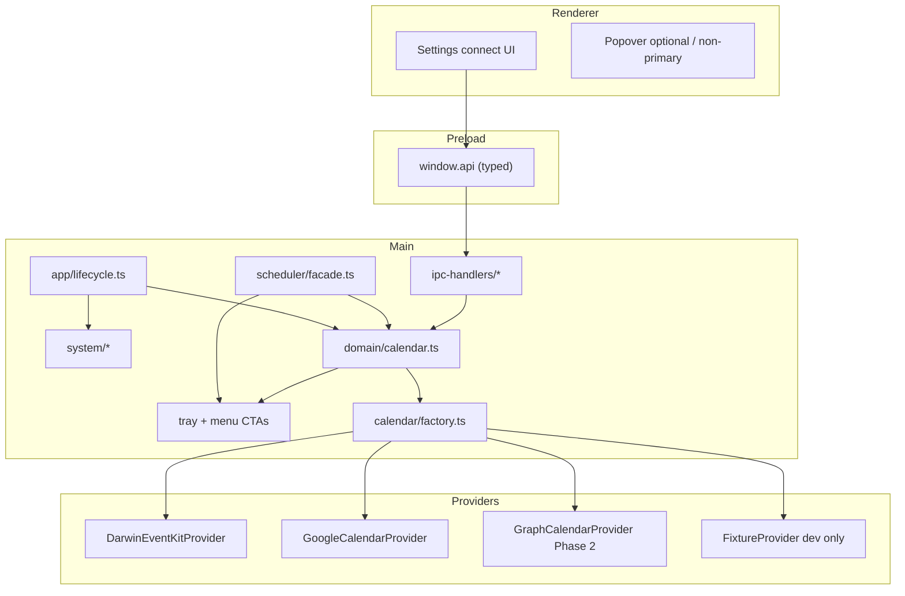
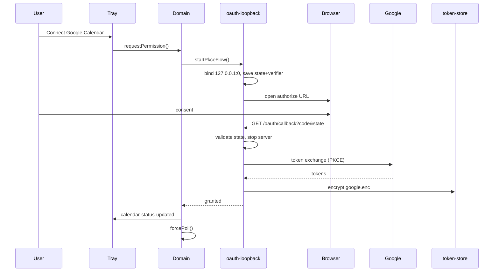
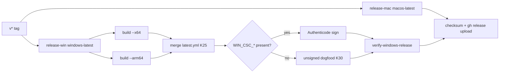

# Windows Platform Support for GogMeet (arm64 + x64)

| Field | Value |
| --- | --- |
| **Author** | TBD |
| **Date** | 2026-07-26 |
| **Status** | Draft (rev 5 — single PR, multi-wave delivery) |
| **Branch** | `develop` |
| **Workspace** | `/Users/mac/Documents/techx/GogMeet` |
| **Related version** | `1.16.0` (current `package.json`) |

---

## Overview

GogMeet is a tray-resident Electron app that surfaces upcoming Meet/Zoom/Calendly meetings from the system calendar, auto-opens browser join links, and optionally shows a pre-meeting alert window. Today it is **macOS-only**: calendar access is implemented exclusively through a Swift EventKit helper (`src/main/googlemeet-events.swift`), packaging targets only DMG/ZIP, CI runs solely on `macos-latest`, and shell integration assumes Dock/menu-bar APIs (`app.dock`, `tray.setTitle`, vibrancy, template icons, `LSUIElement`).

This document is the implementation plan to ship **Windows support for both arm64 and x64**. Windows Phase 1 is **not** EventKit feature parity: it is a **Google Calendar–backed** tray meeting reminder with the same scheduler, auto-open, alert, and join UX. macOS keeps full multi-account EventKit aggregation.

Deliverables:

1. A calendar **provider abstraction** that keeps EventKit on Darwin and adds a Google Calendar provider (and later Graph) on Windows.
2. Platform-gated tray, window chrome, notifications, and system integration—with **tray menu as the primary OAuth/permission surface** on Windows (the BrowserWindow popover is not activation-primary today).
3. electron-builder NSIS + portable packaging with **separate per-arch** installers, Authenticode signing.
4. GitHub Actions matrix for PR and release (mac + win).
5. Auto-update for NSIS installs (portable excluded), after publish feeds are verified.

The largest product risk is calendar access and honest account coverage. Packaging without a working provider and tray CTAs produces an empty shell.

---

## Background & Motivation

### Current product shape (verified in tree)

| Capability | Implementation | macOS coupling |
| --- | --- | --- |
| Calendar fetch | `domain/calendar.ts` → `swift/binary-manager.ts` → EventKit Swift helper | Hard |
| Permission probe | `osascript` AppleScript in `calendar.ts` | Hard |
| Change watch | Swift `--watch` + `EKEventStoreChanged` via `calendar-watch-sidecar.ts` | Hard |
| Event model | JSON Lines 9-string arrays → `parseEvents()` → `MeetingEvent` | Protocol portable; producer not |
| Scheduler | `scheduler/facade.ts`, poll 2m AC / 4m battery, auto-open, alerts | Mostly portable |
| Tray | `tray.ts` + `menu/meeting-menu.ts`; `tray.setTitle` countdown | Medium |
| Primary meeting UI | Native context menu; main window created `show: false` and never shown from tray click | Portable with UX tweaks |
| Poll failure → tray | `meeting-list-updated` only on success; tray can stick on “Loading…” | Must fix on Windows for OAuth errors |
| Popover window | Created in `index.ts` (`vibrancy`, `transparent`, `skipTaskbar`, `frame: false`) | Medium chrome |
| Alert | `setAlwaysOnTop(..., "screen-saver")`, `setVisibleOnAllWorkspaces` | Medium |
| Packaging | `electron-builder.yml` mac DMG/ZIP only; stub `nsis: perMachine: true` | Hard |
| CI/release | `.github/workflows/{pr-check,release}.yml` macos-only | Hard |
| Shortcut | `CmdOrCtrl+Shift+M` already cross-platform | Portable |
| Auto-launch | `app.setLoginItemSettings` | Portable with Windows caveats (below) |
| Auto-updater | `system/auto-updater.ts` present; **not wired into `lifecycle.ts`**; no `publish` in yml | Incomplete |

### Pain points blocking Windows

1. **No OS platform boundary.** Almost no `process.platform` guards in `src/`. Note: `src/main/utils/platform.ts` means **meeting** platform (Meet vs Zoom), not OS—new OS helpers live under `src/main/platform/os.ts`.
2. **Calendar is a leaf with no interface.** Static imports pull Swift from `domain/calendar.ts` and `lifecycle.ts` (`ensureBinary`).
3. **Packaging hooks assume `.app` layout.** `build/after-pack.cjs` is not Darwin-gated (unlike `build/notarize.cjs`, which already returns early for non-darwin).
4. **Icons.** Generator produces `.icns` via `iconutil` only; Windows needs `.ico`.
5. **CI cannot validate Windows.**
6. **Tray does not surface calendar errors.** Poll failures never emit `meeting-list-updated`, so menu/error CTAs must be designed explicitly for Windows OAuth.

### Why do this now

- Electron `^43` and electron-builder `^26` support Windows arm64 (`electron-builder --win --arm64`), including cross-compile of the Electron binary from x64 Windows hosts.
- GitHub Actions: **`windows-latest` only** for Windows CI/release (repo is **private** — do not rely on free `windows-11-arm`). Arm64 artifacts via electron-builder `--arm64` cross-compile on x64 runners (no native addons).
- Scheduler/renderer are already mostly portable.

### Note on Agents.md vs live yml (mac)

Live `electron-builder.yml` currently has `hardenedRuntime: false` and `notarize: false` while some AGENTS prose describes hardened/notarize true for official releases. Windows signing narrative must follow **electron-builder + release workflow secrets**, not stale Agents claims. Pre-existing mac secret-name drift: `build/notarize.cjs` reads `APPLE_APP_PASSWORD` while `release.yml` sets `APPLE_APP_SPECIFIC_PASSWORD`—out of scope to fix here, but Windows must not copy the wrong names.

---

## Goals & Non-Goals

### Goals

1. Ship installable GogMeet for **Windows 10 version 1809+ and Windows 11**, **x64 and arm64** (separate NSIS + portable artifacts per arch).
2. Preserve macOS EventKit behavior and release pipeline; Windows is additive.
3. Introduce a **calendar provider interface** so Windows and Darwin share `MeetingEvent`, scheduler, IPC, and renderer contracts.
4. Deliver a **usable Windows MVP for Google Calendar users**: connect account, list meetings, auto-open URLs, alert window, tray menu, global shortcut, launch-at-login, auto-update (NSIS).
5. Update PR CI (mac + windows-latest) and release matrix (signed mac + signed per-arch win artifacts + combined checksums).
6. Keep security model: sandboxed renderers, allowlisted meeting URL egress, no Node in renderer.
7. Surface connect/reconnect/error **in the native tray menu and Settings**, without relying on the hidden BrowserWindow popover.

### Supported accounts (Windows MVP) — explicit

| Account type | Windows Phase 1 | Notes |
| --- | --- | --- |
| Google Calendar (personal/Workspace) | ✅ Supported | Default and only production provider |
| Outlook / Microsoft 365 / Exchange | ❌ Not in MVP | Phase 2 Graph; tray empty-state guides users |
| iCloud / CalDAV / local Windows Calendar only | ❌ Not in MVP | Phase 3 optional WinRT helper |
| ICS/webcal URL | ❌ Not production | Optional **dev/test** fixture provider only |

**Do not claim EventKit multi-source parity for Windows Phase 1.** Marketing and README must say “Connect Google Calendar.”

### Non-Goals (v1 Windows)

- Linux support.
- Replacing the macOS EventKit path with cloud APIs.
- macOS opt-in Google provider in MVP (**implementer default: no**—EventKit only on Darwin until a later PR).
- Full Microsoft Teams *hosting* integration; Teams join host allowlist is a separate product decision.
- Windows Store / MSIX distribution.
- Universal mac binary.
- Parity of translucent vibrancy aesthetics with macOS.
- EventKit-class multi-account local aggregation on Windows.
- Real-time calendar change watch latency parity (Windows MVP is poll-only).
- Auto-update for portable builds.
- Changing the product into a full calendar client.

---

## macOS vs Windows parity table

| Capability | macOS (today / preserved) | Windows MVP | Symbol |
| --- | --- | --- | --- |
| Calendar sources | All EventKit accounts | **Google Calendar only** | ❌ parity |
| Permission model | OS Calendar TCC + AppleScript probe | Google OAuth PKCE | ⚠️ different |
| Change notifications | Swift `--watch` / `EKEventStoreChanged` (debounce → `forcePoll`) | Poll 2m/4m + resume/unlock only | ⚠️ degraded |
| Offline without prior sync | Local EventKit | Empty / connect CTA | ⚠️ degraded |
| Offline after successful sync | Local EventKit | Last-good cache file | ⚠️ partial |
| Meeting list UI | Native tray context menu | Same + error/connect menu items | ✅ |
| Countdown next to icon | `tray.setTitle` | `tray.setToolTip` (length-capped) | ⚠️ less visible |
| BrowserWindow popover activation | Not primary (hidden) | Still not primary | ✅ same |
| Auto-open Meet/Zoom/Calendly | Yes | Yes (from Google events) | ✅ |
| Alert window | Yes (screen-saver level) | Yes (always-on-top fallback) | ⚠️ chrome differs |
| Global shortcut | `CmdOrCtrl+Shift+M` | Same | ✅ |
| Launch at login | Login items | `setLoginItemSettings` (per-user NSIS caveats) | ⚠️ |
| Auto-update | electron-updater present, unwired | NSIS + GitHub feed after smoke | ⚠️ enable carefully |
| Dock / taskbar identity | LSUIElement, dock hide | skipTaskbar tray utility | ⚠️ different shell |
| Vibrancy / transparent popover | Yes | Solid chrome | ⚠️ aesthetic |

---

## Proposed Design

### High-level architecture



**Invariant:** External callers (`scheduler/poll.ts`, `ipc-handlers/calendar.ts`, `system/shortcuts.ts`) continue to call `domain/calendar.ts`. They never import a provider implementation.

### Target directory layout (additive)

```text
src/main/
├── platform/
│   ├── os.ts                    # isDarwin / isWin32 — NOT utils/platform.ts (meeting hosts)
│   └── paths.ts                 # userData calendar-auth / cache helpers
├── calendar/
│   ├── provider.ts
│   ├── factory.ts               # resolve + resetCalendarProvider(); Darwin clamp
│   ├── url-extract.ts
│   ├── clean-description.ts     # relocated from swift/event-field-parser (K24)
│   ├── providers/
│   │   ├── darwin-eventkit.ts
│   │   ├── google-calendar.ts
│   │   ├── graph-calendar.ts    # Phase 2
│   │   └── fixture-calendar.ts  # dev/test only (!packaged && env)
│   └── auth/
│       ├── token-store.ts       # clientId + authSchemaVersion required
│       ├── oauth-loopback.ts
│       └── google-oauth.ts
├── domain/
│   ├── calendar.ts              # facade
│   └── calendar-watcher.ts      # provider.startWatch or no-op
├── swift/                       # EventKit only; pure helpers moved out
```

No barrels. Import concrete files with `.js` specifiers.

---

## 1. Calendar backend strategy for Windows

### Options evaluation

| Option | Offline | Multi-calendar | Change notify | Auth | Meet/Zoom/Calendly | Effort | Risk |
| --- | --- | --- | --- | --- | --- | --- | --- |
| **A. WinRT AppointmentStore** | Yes | If accounts in Windows Calendar | Limited | OS capability | Depends on sync | High | High (MSIX/restricted) |
| **B. Microsoft Graph** | Partial | Outlook/M365 | Delta/webhooks | Entra OAuth | Good for Outlook | Medium | Tenant consent |
| **C. Google Calendar API** | Partial (cache) | Selected Google calendars | Poll / syncToken | OAuth PKCE | Strong for Meet | Medium | Token + OAuth verify |
| **D. ICS / webcal** | Cached feed | Manual | Poll | Secret URL | Partial | Low | UX + secrets |
| **E. Hybrid** | Varies | Best | Varies | Multiple | Full | High | Scope |

### Recommendation (phased)

#### Phase 1 — Windows MVP: **Google Calendar API only** (not EventKit parity)

**Rationale**

- Pure TypeScript; no WinRT/MSIX; no `swiftc` on Windows CI.
- Product name and Meet `authuser` align with Google-heavy workflows.
- Honest trade-off: Outlook-only users are **unsupported until Phase 2**; UI must say so.

**Protocol strategy**

- Cloud providers map **directly** to `MeetingEvent[]`.
- Do **not** force Google through Swift JSON Lines.
- Extract URL regex to `calendar/url-extract.ts`.
- Keep `parseEvents()` for Darwin helper output (and fixture interchange if useful).

### Tray-first permission & empty-state matrix (Windows)

The BrowserWindow popover currently owns “Calendar Access Needed” copy in `renderer/rendering/body.ts`, but the window stays `show: false` and tray click only `forcePoll()`. **Windows MVP must not rely on the popover for education.**

| State | Tray menu content | Settings | Lifecycle behavior |
| --- | --- | --- | --- |
| `not-determined` (no tokens) | Disabled “No calendar connected”; enabled **“Connect Google Calendar…”**; Settings; About; Quit | Connect section + explainer | **Do not** auto-open browser OAuth on startup |
| OAuth in progress | “Connecting…” disabled item | Spinner / cancel | Single in-flight OAuth; menu refresh |
| `granted`, events loading | “Loading…” then meetings | Connected as email | Normal poll |
| `granted`, empty window | “No upcoming meetings” | Connected | Success path |
| `granted`, no calendars (API empty) | “No calendars found” + Reconnect | Help text | Map to structured error string |
| `denied` / revoked | **“Reconnect Google Calendar…”** + short error label | Reconnect / Disconnect | Tokens cleared |
| Network error, **has cache** | Show cached meetings; footer-style disabled “Offline — last updated …” if feasible in menu | Banner | Return ok+events from cache; log warn |
| Network error, **no cache** | “Can’t reach Google Calendar” + Retry (forcePoll) + Reconnect | Same | `CalendarResult` err; **still update tray** |
| Outlook-only user (no Google) | Connect Google + disabled “Outlook support coming in a later version” | Same messaging | No silent empty success |

**Tray must update on auth/error states**, not only on successful polls:

- Introduce `mainBus.emit("calendar-status-updated", status)` **or** always emit `meeting-list-updated` with a side channel for errors.
- Recommended: extend tray subscription to a small `CalendarUiState` from domain (`{ permission, lastError, events }`) so menu rebuilds when OAuth fails.

**First-run OAuth policy (locked implementer default):**

- **Settings-driven + tray “Connect…” only.** Lifecycle does **not** call `requestCalendarPermission()` automatically on Windows when `not-determined` (unlike macOS EventKit prompt path).
- Rationale: opening a system browser with no context is hostile; tray CTA is the primary UI.

**Cold-start acceptance criterion:** install → tray icon → open menu → see Connect CTA without ever showing the BrowserWindow popover.

### OAuth design (normative)

**GCP client configuration (locked — K28)**

- **Project:** OCWorkforces **existing** GCP project — add a **Desktop OAuth client** for GogMeet (do **not** create a new dedicated GCP project).
- Type: **Desktop** OAuth client.
- Prefer **public client + PKCE** (no client secret). If GCP still issues a desktop client secret, treat it as **non-confidential** (embedded is not a security boundary)—document in repo secrets policy; rotate client ID via build-time define `GOOGLE_OAUTH_CLIENT_ID`.
- **Client ID:** build-time define / env at package time, not runtime user config file.
- Scopes: `https://www.googleapis.com/auth/calendar.readonly`, `openid`, `email`.
- Consent screen / branding: use existing OCWorkforces GCP support contact; OAuth testing mode with allowlisted test users for dogfood until any production verification is completed.

**Redirect:** **loopback only for MVP** (`http://127.0.0.1:<port>/oauth/callback`). Do **not** use `gogmeet://` custom scheme in MVP (hijack risk).

**Token file (single path):**

```text
{userData}/calendar-auth/google.enc
```

Payload (required fields marked ★) encrypted with `safeStorage.encryptString`:

```ts
interface GoogleTokenFileV1 {
  authSchemaVersion: 1; // ★ always present; bump + wipe on incompatible change
  clientId: string;     // ★ GOOGLE_OAUTH_CLIENT_ID used when tokens were issued
  accessToken: string;
  refreshToken: string;
  expiryMs: number;
  email?: string;
  scope?: string;
}
```

**On load:** if file missing fields, `authSchemaVersion !== 1`, or `clientId !== GOOGLE_OAUTH_CLIENT_ID` → delete file, treat as `not-determined`, force Reconnect. Refresh-failure wipe remains secondary.

If `safeStorage.isEncryptionAvailable()` is false: **fail closed** for production (refuse to store tokens; show error). Dev may set `GOGMEET_ALLOW_PLAINTEXT_TOKENS=1` for CI only.

**In-memory OAuth session (not on disk longer than flow):** `codeVerifier`, `state`, `loopbackPort`, `startedAt`, `abortController`.



**Loopback lifecycle rules**

| Rule | Spec |
| --- | --- |
| Bind | `127.0.0.1` only (not `0.0.0.0`) |
| Port | Ephemeral `0` |
| Timeout | **5 minutes** then abort, destroy server, return `denied` or `not-determined` |
| Cancel | User chooses Cancel in a small main-process dialog **or** second Connect while in progress is rejected/coalesced |
| Concurrency | Mutex: one OAuth flow app-wide |
| Abandon browser | Timeout path; no zombie server |
| `redirect_uri` | Exact registered loopback path; reject open redirects |
| Second instance | **`app.requestSingleInstanceLock()`** required on Windows (and recommended all platforms). Second instance focuses existing; forwards optional deep link. Without this, two loopback servers race |

**Refresh**

- Single-flight mutex (`refreshPromise`) shared by all `getEvents` callers.
- On 401: refresh once; retry request once; if refresh fails permanently → delete tokens → `permission-denied` / reconnect CTA.
- Proactive refresh if `expiryMs - now < 60_000` before fetch.

**Disconnect**

- Tray + Settings: **Disconnect Google Calendar**.
- Calls `provider.disconnect()`: delete `google.enc`, clear memory cache, `resetCalendarProvider()`, optional `shell.openExternal` to Google Account permissions (user-confirmed dialog).
- Does not require Google revoke API success to clear local tokens.

### Fetch semantics (production-complete MVP)

- Range: **local today 00:00 → +2 days** (match Swift).
- `calendarList.list`: paginate with `nextPageToken` until exhausted; use calendars with `selected === true` (fallback: primary only if list empty of selected).
- `events.list` per calendar:
  - `singleEvents=true`
  - `orderBy=startTime`
  - `timeMin` / `timeMax` RFC3339
  - **`conferenceDataVersion=1`**
  - Paginate `nextPageToken` until exhausted (cap safety: e.g. max 50 pages then log and stop).
- Skip `status === 'cancelled'`; skip self declined (`attendees` where `self && responseStatus === 'declined'`).
- URL extraction order (match Swift): Zoom → Meet → Calendly from `hangoutLink`, `conferenceData.entryPoints[].uri`, `location`, `description` (after shared `cleanDescription` — see pure-helper relocation below).
- **Event ids always namespaced:** `asEventId(\`${calendarId}:${event.id}\`)` — never bare `event.id`.
- `userEmail`: OAuth userinfo email, else self attendee email.
- Timed events: `start.dateTime` / `end.dateTime` → `Date` → `toISOString()` → `asIsoUtc`.
- All-day: `start.date` / `end.date` (Google end exclusive) → interpret as local calendar dates, convert to IsoUtc bounds consistent with existing all-day handling tests; document exclusive end adjustment (end − 1 day for display duration if needed to match EventKit-style inclusive days—mirror existing parser expectations in tests).
- **Partial multi-calendar failure:** if ≥1 calendar succeeds, return **ok** with merged events and log failed calendar ids; if all fail, return **err** (network/auth as appropriate). 403 on a single calendar: skip that calendar, continue.
- **Quota / backoff:** on HTTP 429, honor `Retry-After` when present; else exponential backoff capped at 30s for that request; surface err after retries exhausted.
- **HTML notes:** run through shared `cleanDescription` at `src/main/calendar/clean-description.ts` (moved out of `swift/`; Outlook border + tag strip parity with today’s `event-field-parser.ts`).

### Change notifications

| Mechanism | Phase |
| --- | --- |
| Poll 2m AC / 4m battery + forcePoll on resume/unlock | MVP |
| syncToken incremental | Post-MVP optimization |
| Google push | Out of scope (needs public webhook) |

`calendar-watcher.ts`:

```ts
export function startCalendarWatcher(): void {
  if (started) return;
  started = true;
  void getActiveCalendarProvider().then((p) => {
    p.startWatch?.(() => { void forcePoll(); });
  });
}
```

Google: `startWatch` omitted/no-op. Darwin: existing sidecar, loaded only from Darwin provider (no static swift import in watcher).

### Offline

- Persist `{ savedAt, events: MeetingEvent[] }` encrypted with **`safeStorage.encryptString`** to `{userData}/calendar-cache.enc` (K29 — **not** plaintext JSON). Same fail-closed rule as tokens if encryption unavailable in production.
- On read: decrypt → parse JSON; corrupt/unreadable cache → treat as empty (log warn), do not crash.
- Disconnect / token wipe **also deletes** `calendar-cache.enc`.
- Network failure with tokens + cache → return cached events (ok) + tray “offline” hint.
- Never invent events if never synced.
- On uninstall, Windows removes `%APPDATA%/GogMeet` for per-user installs (document retention).

### Multi-calendar

- Default: all `selected` Google calendars.
- Settings multi-select: v1.1.

#### Phase 2 — Microsoft Graph

Outlook/M365 via Entra public client + PKCE; `calendarView`; delta queries; settings account picker. Elevates Outlook empty-state from “coming later” to supported.

#### Phase 3 — optional WinRT helper

Prebuilt native helper, JSON Lines protocol, only if product requires local multi-account without OAuth.

#### Dev/test escape hatch (not production)

**`FixtureCalendarProvider` enablement (locked — K23):**

```text
fixture active  ⇔  !app.isPackaged  AND  GOGMEET_CALENDAR_FIXTURE is a non-empty path
```

- **Never** honor `GOGMEET_CALENDAR_FIXTURE` in packaged builds (even if an attacker sets the env var).
- Unpackaged without the env var → normal factory path (stub/Google), **not** an implicit empty fixture.
- Never advertised in production UI.

Use for CI and eng dogfood while OAuth consent screen is in testing mode (Google allows limited test users without full verification). Production dogfood: OAuth **testing** mode with allowlisted Google accounts (≤100 test users) on the **OCWorkforces existing GCP project** Desktop client (K28).

### Shared domain facade

Preserve exports:

```ts
export async function getCalendarEventsResult(): Promise<CalendarResult>;
export async function requestCalendarPermission(): Promise<CalendarPermission>;
export async function getCalendarPermissionStatus(): Promise<CalendarPermission>;
export function invalidateCalendarPermissionCache(): void;
// New for tray CTAs
export async function disconnectCalendar(): Promise<void>;
export function getCalendarUiState(): CalendarUiState; // sync snapshot for menu
```

Windows: `requestCalendarPermission()` starts OAuth only when invoked from tray/Settings—not from lifecycle auto path.

### Provider interface

```ts
export interface CalendarProvider {
  readonly id: "darwin-eventkit" | "google-calendar" | "microsoft-graph" | "fixture";
  getEvents(): Promise<CalendarResult>;
  getPermissionStatus(): Promise<CalendarPermission>;
  requestPermission(): Promise<CalendarPermission>;
  startWatch?(onChange: () => void): void;
  stopWatch?(): void;
  disconnect?(): Promise<void>;
  warmup?(): Promise<void>;
}
```

### Error taxonomy (single neutral set)

Avoid long-lived dual `swift-*` + `calendar-*` without consumers.

1. Introduce **neutral** kinds used in new code and formatters:
   - `calendar-permission-denied`
   - `calendar-no-calendars`
   - `calendar-auth`
   - `calendar-network`
   - `calendar-runtime`
2. Darwin/Swift adapters **map exit codes → neutral kinds** at the provider boundary via `toAppError()`.
3. Keep `swift-*` as **deprecated aliases** in `formatAppError` for one release (map to same strings) so old tests don’t break; remove aliases in a follow-up PR after call sites updated.
4. `CalendarResult.err.error` remains a **user-facing string** from `formatAppError` so tray/menu need not branch on kinds; structured kinds are for logs and tests.

### URL extraction

```ts
export function extractMeetingUrl(...texts: Array<string | undefined>): string | undefined;
```

Priority Zoom → Meet → Calendly. Egress allowlist unchanged. Teams hosts out of scope until product expands allowlist.

---

## 2. Platform abstraction architecture

### Principles

1. One app, platform adapters—not a fork.
2. Gate at factory/lifecycle.
3. **No static imports of `swift/*` from lifecycle or win32 code paths.**
4. No barrels; typed IPC; scheduler via facade only.
5. Name carefully: **`src/main/platform/os.ts`** for OS; **`src/main/utils/platform.ts`** remains meeting-host detection—do not merge or rename casually (blast radius).

### OS helpers

```ts
// src/main/platform/os.ts
export function isDarwin(): boolean { return process.platform === "darwin"; }
export function isWin32(): boolean { return process.platform === "win32"; }
```

### Current `swift/*` importers that must move behind factory / dynamic import

| Importer (production) | Today | Target |
| --- | --- | --- |
| `domain/calendar.ts` | static `runSwiftHelper`, parser, validator | facade → factory → Darwin provider only |
| `domain/calendar-watcher.ts` | static `calendar-watch-sidecar` | provider `startWatch` / no-op |
| `app/lifecycle.ts` | static `ensureBinary` | `provider.warmup?.()` only |
| `domain/settings.ts` | static `isObjectRecord` from `swift/guards.js` | move guard to `src/shared/` or `src/main/utils/type-guards.ts` |
| `swift/event-parser.ts` | uses `cleanDescription` in `event-field-parser.ts` | import relocated pure helper |
| `swift/*` internal graph | binary-manager, compiler, cache, sidecar | unchanged leaf (EventKit only) |

#### Pure helpers must leave `swift/` (K13 + K24)

K13 forbids non-Darwin production code from importing `swift/*`. Today pure utilities live under `swift/` and would force Google/settings to violate K13:

| Helper (live tree) | Current path | Relocate to |
| --- | --- | --- |
| `cleanDescription` | `swift/event-field-parser.ts` | `src/main/calendar/clean-description.ts` |
| Field/timestamp helpers reused outside EventKit wire parse | `swift/event-field-parser.ts` | Prefer `src/main/calendar/` if shared; else keep EventKit-only pieces in swift |
| `isObjectRecord` / generic guards | `swift/guards.js` | `src/shared/type-guards.ts` or `src/main/utils/type-guards.ts` |

**Wave 2 (or Wave 3) must move these** before the Google provider (Wave 4) or a sentrux rule lands. After relocation:

- `swift/` = EventKit compile/run/JSON-Lines parse only.
- Darwin provider + `event-parser` import `calendar/clean-description.js`.
- Google provider imports the same pure module—**never** `swift/*`.
- `domain/settings.ts` imports shared type-guards—**never** `swift/*`.

Tests under `tests/main/swift*` and calendar tests may still import swift modules directly (node environment). Production main bundle must not load Swift compiler paths on win32.

### Lifecycle changes

Order preserved:

1. `provider.warmup?.()` (Swift ensureBinary on Darwin only; Google token soft-refresh optional)
2. Register IPC
3. Load settings; **permission:** on Darwin keep existing probe/request; on Windows **only read status**—do not auto OAuth
4. Tray (menu shows Connect if needed)
5. Scheduler callbacks
6. `startScheduler` + `startCalendarWatcher` (no-op watch on Google)
7. Power, shortcuts, notifications (platform deep-link), auto-launch
8. Auto-updater only when enabled conditions met (see §7)

**Single-instance:** early in `index.ts` before windows:

```ts
const gotLock = app.requestSingleInstanceLock();
if (!gotLock) app.quit();
app.on("second-instance", () => { /* focus / ignore */ });
```

### Cache paths (corrected)

Existing Swift binary cache already uses `join(os.tmpdir(), "googlemeet")`—not a hard-coded `/tmp` string. Portable on Windows if a helper were ever run; Google provider does not use it.

| Platform | Helper binary cache | Auth / event cache |
| --- | --- | --- |
| Darwin | `{tmpdir}/googlemeet` (existing) | userData settings |
| Windows | N/A for Google | `{userData}/calendar-auth/google.enc`, `{userData}/calendar-cache.enc` (safeStorage) |

### Import graph

```text
domain/calendar.ts → calendar/factory.ts → providers/* (dynamic where platform-specific)
domain/settings.ts → shared/type-guards (NOT swift/guards)
providers/darwin-eventkit.ts → swift/* + calendar/clean-description
providers/google-calendar.ts → calendar/auth/* + calendar/clean-description + calendar/url-extract  (no swift)
swift/event-parser.ts → calendar/clean-description (re-export path after move)
scheduler/*, ipc-handlers/*, shortcuts → domain/calendar only
lifecycle → domain/calendar + factory warmup (no swift static import)
```

Optional `.sentrux` rule (after pure-helper move): forbid `from "../swift/` or `from "../../main/swift/` outside `calendar/providers/darwin-eventkit.ts` and `src/main/swift/**`.

---

## 3. Tray / notification area / popover UX on Windows

### Current macOS behavior (verified)

- Context menu installed immediately; meetings refreshed on `meeting-list-updated`.
- `tray.on("click")` → `forcePoll()` only; does **not** show BrowserWindow.
- Countdown: `tray.setTitle` only; tooltip static `"GogMeet"`.
- Menu hard-codes `Cmd+Q`.

### Windows targets

| Interaction | Behavior |
| --- | --- |
| Left-click | `popUpContextMenu(menu)` + optional `forcePoll` (coalesced) |
| Right-click | Same menu |
| Countdown | `setToolTip` only |
| Icons | 16×16 / 32×32 PNGs; no templates; theme swap when possible |
| Taskbar | `skipTaskbar: true` on utility windows |
| Quit | `CommandOrControl+Q` or omit accelerator |

### Tooltip rules

- Format: `GogMeet — {title} in {n} mins` / in-meeting variant / idle `GogMeet`.
- **Max length 63 characters** (Windows notification-area practical limit); truncate title with ellipsis.
- Update at most once per minute (existing countdown interval)—no extra flicker timers.
- When clearing countdown, reset tooltip to `GogMeet` (or offline suffix if applicable).

### Tray menu state machine (normative)

States: `Disconnected | Connecting | Ready | Empty | Error | OfflineCached`.

Transitions driven by `CalendarUiState` + last poll. Connect/Reconnect/Disconnect items call domain APIs. Meeting rows reuse `buildMeetingMenuTemplate` when `Ready` / `OfflineCached`.

### BrowserWindow popover

Non-primary on both platforms for MVP. Keep push channel for future; do not block on tray-anchored popover positioning.

---

## 4. Window chrome

| Surface | Darwin | Windows |
| --- | --- | --- |
| Popover vibrancy/transparent | Keep | Omit vibrancy; prefer opaque |
| Alert always-on-top | `screen-saver` level | `setAlwaysOnTop(true)`; skip workspaces API |
| Settings | vibrancy + dock toggle | opaque; no dock |
| Notifications deep-link | `x-apple.systempreferences:...` | **`ms-settings:notifications`** (MVP default) |

### Notifications (`system/notification.ts`)

- Platform-gate URI and copy: “System Settings” vs “Windows Settings”.
- MVP: still one-shot dialog; on Windows button opens `ms-settings:notifications`.
- If `Notification.isSupported()` is false, skip silently (existing).
- Tests: skip Darwin URI expectations on win32 CI.

### Shared chrome helper

`platformWindowChrome(kind)` + universal `SECURE_WEB_PREFERENCES`.

---

## 5. Packaging

### Per-arch artifacts (locked — K15)

electron-builder NSIS **multi-arch in one invocation** can produce a **single dual-arch installer**, which conflicts with `GogMeet-${version}-${arch}.exe` inventory.

**Normative release build:**

```bash
electron-builder --win nsis portable --x64
electron-builder --win nsis portable --arm64
```

Two separate steps (or two CI jobs), **never** `--x64 --arm64` in one NSIS invocation for official artifacts.

### `latest.yml` multi-arch merge (locked — K25)

Sequential `electron-builder --publish` / publish-per-arch runs commonly **overwrite** `latest.yml` so only the last arch remains. That breaks auto-update for the other arch.

**Normative release path (option a — single win package job, merge before upload):**

1. One `release-win` job on `windows-latest` (not two independent publish uploads).
2. Build artifacts only (no live GitHub publish overwrite mid-job):
   ```bash
   electron-builder --win nsis portable --x64   # writes dist/*-x64.exe (+ optional per-arch yml)
   electron-builder --win nsis portable --arm64
   ```
3. **Merge step** (`scripts/merge-windows-latest-yml.mjs` or inline in release job):
   - Inputs: any `latest*.yml` fragments electron-builder wrote, plus the four binaries on disk.
   - Output: a single `dist/latest.yml` whose `files` (or equivalent provider path list) includes **both** NSIS artifacts (`GogMeet-V-x64.exe` and `GogMeet-V-arm64.exe`) with correct `sha512`, `size`, and arch metadata electron-updater expects for Windows multi-arch GitHub releases.
   - Portable exes are **not** listed in `latest.yml`.
   - If builder emits blockmaps for differential updates, merge/retain both arches’ blockmaps the same way.
4. Upload NSIS + portable + merged `latest.yml` (+ blockmaps) to the GitHub Release in one shot (softprops or `gh release upload`).
5. Do **not** call electron-builder’s auto-publish twice against the same tag without the merge step.

**Verifier (`verify-windows-release.mjs`) must assert:**

- Four binaries present (K15 inventory).
- `latest.yml` exists when `REQUIRE_UPDATER_YML=1` (official release).
- YAML `files` (or parsed provider entries) reference **both** `x64` and `arm64` NSIS names for this version; fail if only one arch is listed.

**Dogfood gate for PR8/PR9:** install x64 NSIS and arm64 NSIS (or emulated) against a test release and confirm each arch resolves an update path from the merged feed before enabling production auto-download.

### `electron-builder.yml` sketch

```yaml
win:
  target:
    - nsis
    - portable
  icon: build/icon.ico
  signingHashAlgorithms: [sha256]
  # artifactName global: ${productName}-${version}-${arch}.${ext}

nsis:
  oneClick: false
  perMachine: false   # Key Decision K7 — per-user default
  allowToChangeInstallationDirectory: true
  createDesktopShortcut: false
  createStartMenuShortcut: true
  shortcutName: GogMeet
  # differentialPackage: true after dogfood

portable:
  artifactName: "${productName}-${version}-${arch}-portable.${ext}"

publish:
  provider: github
  owner: OCWorkforces
  repo: GogMeet
  releaseType: release
```

### Official Windows artifact list (version V)

```text
GogMeet-V-x64.exe
GogMeet-V-arm64.exe
GogMeet-V-x64-portable.exe
GogMeet-V-arm64-portable.exe
latest.yml          # MERGED — both NSIS arches (see K25); not last-write-wins
# plus mac assets and SHA256SUMS.txt
```

Verifier expects **four** Windows binaries (two NSIS + two portable), fails on dual-arch single exe naming, and (when updater required) a `latest.yml` that lists **both** NSIS arches.

### Scripts

```json
{
  "package": "bun run build && electron-builder --mac",
  "package:mac": "bun run build && electron-builder --mac",
  "package:win": "bun run build && electron-builder --win",
  "package:win:x64": "bun run build && electron-builder --win nsis portable --x64",
  "package:win:arm64": "bun run build && electron-builder --win nsis portable --arm64",
  "package:win:dir": "bun run build && electron-builder --win --dir",
  "verify:macos-release": "node scripts/verify-macos-release.mjs",
  "verify:windows-release": "node scripts/verify-windows-release.mjs"
}
```

### after-pack

Gate on `context.electronPlatformName === "darwin"` (required). `afterSign`/`notarize.cjs` already Darwin-gated.

### Icons

| Output | How |
| --- | --- |
| `build/icon.icns` | mac `iconutil` (existing) |
| `build/icon.ico` | sharp multi-size on any OS |
| Tray 16/32 | Windows notification area |

### Code signing (phased — K9 / K30)

| Phase | Policy |
| --- | --- |
| **Dogfood / internal** | **Unsigned NSIS + portable allowed** (and default until cert arrives). Release job does **not** fail if `WIN_CSC_*` absent. SmartScreen warnings expected; document for testers. |
| **Official public** | Authenticode required: **`WIN_CSC_LINK` + `WIN_CSC_KEY_PASSWORD`** mapped to electron-builder `CSC_LINK` / `CSC_KEY_PASSWORD` **only in the Windows release job env** (do not mix Apple cert material). Timestamp RFC3161 when signing. EV preferred when procured. |
| Local | `package:win` always works without secrets (mirror mac local policy). |

Release job signing logic:

```text
if WIN_CSC_LINK and WIN_CSC_KEY_PASSWORD are non-empty:
  export CSC_LINK / CSC_KEY_PASSWORD and sign
else:
  build unsigned; log "[release] Windows Authenticode secrets absent — unsigned dogfood artifacts"
  do not set REQUIRE_WIN_SIGN
```

### Verifier MVP

1. Inventory four Windows artifacts for version.
2. PE machine type matches arch.
3. `REQUIRE_WIN_SIGN=1` → Authenticode valid (**only** for official signed releases; dogfood omits this flag).
4. `REQUIRE_UPDATER_YML=1` → `latest.yml` present and lists **both** x64 and arm64 NSIS artifacts (K25).
5. No full silent-install smoke in v1.

---

## 6. CI/CD

### PR check (outline)

```yaml
jobs:
  check:
    strategy:
      fail-fast: false
      matrix:
        os: [macos-latest, windows-latest]
    runs-on: ${{ matrix.os }}
    steps:
      - uses: actions/checkout@…  # fetch-depth: 0
      - uses: oven-sh/setup-bun@…
      - run: bun install --frozen-lockfile
      - run: bun run lint
      - run: bun run format:check
      - run: bun run typecheck
      - run: bun run build
      - run: bun run test:coverage
      # changed-files via node/bun script (not bash-only)
  validate-node:
    runs-on: macos-latest  # icns + icon drift
```

**Hard dependency:** Windows matrix job lands only after provider factory + Darwin isolation (Wave 2) and platform test skips exist—so CI does not execute real `osascript`/Swift.

**Private repo (K31):** CI and release use **`windows-latest` only**. Do **not** schedule `windows-11-arm`. Arm64 Electron binaries are produced with `electron-builder --win … --arm64` on the x64 runner (no native node addons in this app).

### Release



**Single `release-win` job** on `windows-latest`: sequential per-arch **package** steps (K15), optional Authenticode when secrets present (K30), **merge `latest.yml`** (K25), verify (both NSIS arches in yml; sign check only if `REQUIRE_WIN_SIGN=1`), then upload. Do **not** run two independent publish jobs that each overwrite the channel file. Never depends on `windows-11-arm`.

### Secrets inventory

| Secret / env | Use |
| --- | --- |
| `CSC_LINK`, `CSC_KEY_PASSWORD` | mac job (existing Apple identity) |
| `APPLE_ID`, `APPLE_TEAM_ID`, `APPLE_APP_SPECIFIC_PASSWORD` | mac notarization **as used by release.yml**; note notarize.cjs legacy `APPLE_APP_PASSWORD` name drift |
| `WIN_CSC_LINK`, `WIN_CSC_KEY_PASSWORD` | **Optional** for dogfood; required only for official signed Windows releases → export as `CSC_*` for builder |
| `GOOGLE_OAUTH_CLIENT_ID` | bake into Windows builds (from OCWorkforces GCP Desktop client) |
| `GITHUB_TOKEN` | release upload + electron-builder publish |

---

## 7. Auto-update

### Verified current state

- `initAutoUpdater()` in `system/auto-updater.ts`, gated on `app.isPackaged`, **not called** from lifecycle.
- No `publish` block in `electron-builder.yml` today.

### Design

| Item | Choice |
| --- | --- |
| Provider | GitHub (`electron-updater` GitHub provider) |
| Channel files | **Merged** `latest.yml` (Windows NSIS both arches — K25), `latest-mac.yml` (mac) |
| Enable when | `app.isPackaged` **and** not portable **and** publish config present |
| Portable detection | See `isPortableInstall()` below (normative) |
| Auth | Public repo: unauthenticated checks; on rate-limit log and retry next launch—no user-facing spam |
| Failure mode | Missing `latest.yml`: log once, no throw, no dialog every launch |
| Phased enable | **Implementer default:** ship publish config + lifecycle wire with `autoDownload: true` only after dogfood proves **merged** feed updates **both** arches; mac ZIP path verified in same dogfood or immediately after—do not enable noisy checks in dev |

### `isPortableInstall()` (normative — K26)

electron-builder **portable** target sets environment variables on the running process when launched via the portable wrapper:

```ts
/** True when this process is the electron-builder portable build. */
export function isPortableInstall(): boolean {
  // electron-builder portable launcher (documented env)
  if (typeof process.env["PORTABLE_EXECUTABLE_DIR"] === "string"
      && process.env["PORTABLE_EXECUTABLE_DIR"].length > 0) {
    return true;
  }
  if (typeof process.env["PORTABLE_EXECUTABLE_FILE"] === "string"
      && process.env["PORTABLE_EXECUTABLE_FILE"].length > 0) {
    return true;
  }
  // Optional belt-and-suspenders: project flag if we ever ship a custom portable stub
  if (process.env["GOGMEET_PORTABLE"] === "1") {
    return true;
  }
  return false;
}
```

- **NSIS installs** must not set these env vars → updates enabled.
- Unit tests in PR8: assert true when either `PORTABLE_EXECUTABLE_*` is set; false when unset (simulated NSIS).
- Do **not** use heuristics like “exe lives next to a data folder” alone—too fragile.

### Runtime sketch

```ts
export function initAutoUpdater(): void {
  if (!app.isPackaged) return;
  if (isPortableInstall()) {
    log.info("[auto-updater] Portable install — updates disabled");
    return;
  }
  autoUpdater.autoDownload = true;
  autoUpdater.autoInstallOnAppQuit = true;
  // error handler: log only
  setTimeout(() => { void autoUpdater.checkForUpdates().catch(…); }, 5000);
}
```

### Required release assets for updates

Both NSIS exes + **merged** `latest.yml` (and blockmaps if differential enabled later) on the GitHub Release. Portable exe **not** referenced by `latest.yml`. See §5 K25 merge step.

---

## 8. Testing strategy

| Area | Approach |
| --- | --- |
| Google provider | Mock `fetch`; pagination; conferenceData; partial calendar failure |
| url-extract | Port Swift cases |
| OAuth loopback | Mock HTTP server; state mismatch; timeout; mutex |
| token-store | Mock safeStorage; encryption unavailable path |
| Tray menu states | Unit-test menu template builder against `CalendarUiState` |
| Platform skips | `describe.skipIf` for real EventKit/osascript |
| Fixture provider | CI uses fixture—no live Google |

### Manual QA (Windows)

1. Cold start → tray Connect CTA (no popover).
2. OAuth success → meetings within one poll.
3. OAuth cancel / timeout → menu Recoverable state.
4. Disconnect clears tokens.
5. Outlook-only user sees “Outlook coming later” + Connect Google.
6. Offline with cache shows meetings.
7. Auto-open, alert dismiss cancels open, Ctrl+Shift+M.
8. Launch at login (per-user NSIS).
9. Auto-update NSIS n-1 → n; portable does not update.
10. x64 and arm64 installers.

---

## 9. Security & Privacy Considerations

| Threat | Mitigation |
| --- | --- |
| OAuth token theft | DPAPI via safeStorage; fail closed if unavailable; never log tokens |
| Custom URL scheme hijack | **Loopback only** in MVP |
| Loopback CSRF | PKCE + state; bind 127.0.0.1; exact redirect path |
| Open redirect | Fixed callback path; reject unexpected hosts |
| Plaintext token fallback | Disallowed in production |
| calendar-cache PII | Encrypt with safeStorage to `calendar-cache.enc` (K29); minimize fields; wiped on disconnect/uninstall |
| Meeting URL egress | Existing allowlist |
| Installer trojan | SHA256SUMS always; Authenticode when cert ready (unsigned dogfood internal-only) |
| Second instance OAuth race | `requestSingleInstanceLock` |
| Privilege | Per-user NSIS default |

---

## 10. Observability

| Signal | Mechanism |
| --- | --- |
| Provider + poll | `[calendar:google]` / `[calendar:eventkit]` logs |
| OAuth | error codes only |
| Updater | existing electron-log; single log if portable/disabled |
| Telemetry | None (no remote feature flags) |

### OAuth client compromise response (no remote flags)

1. Rotate Google OAuth client ID in the **OCWorkforces GCP** Desktop client (or create a replacement client in the same project).
2. Ship emergency release with new `GOOGLE_OAUTH_CLIENT_ID` build define.
3. On token load (every launch / first use): if `clientId !== GOOGLE_OAUTH_CLIENT_ID` or `authSchemaVersion` unsupported → **wipe** `google.enc` and show Reconnect (fields are **required** on write — see token schema in §1).
4. If refresh fails permanently → wipe and Reconnect (secondary path).
5. Incompatible schema changes: bump `authSchemaVersion` and wipe older files.

There is **no** in-app remote kill switch.

---

## 11. Rollout Plan

| Phase | Deliverable | Gate |
| --- | --- | --- |
| P0 | OS helpers, chrome gates, after-pack, single-instance, notification URI gate | mac green; win boots without Swift throw |
| P1 | CalendarProvider + Darwin wrap + win32 stub provider | mac identical; win clean boot menu |
| P2a–c | Auth, Google fetch, tray/settings CTA | Windows Google dogfood |
| P3 | Icons, per-arch package scripts, PR Windows CI | CI green |
| P4 | Release pipeline + verifier; **unsigned dogfood NSIS** until cert ready; updater dogfood | Internal NSIS install/update works |
| P5 | README; enable Authenticode when cert ready; Graph optional | Official signed Windows tag |

### Settings migration

`schemaVersion` 1 → 2:

- Add `calendarProvider?: "auto" | "google" | "microsoft"` default `"auto"`.
- Missing field → `auto` (Darwin EventKit, win32 Google).
- No token migration (new platform).

### Auto-launch Windows caveats

- Prefer **per-user** NSIS so `setLoginItemSettings` applies to the installing user without elevation.
- `openAsHidden: false` kept; Windows may still show a brief flash—acceptable.
- Portable: login item points at portable exe path; document that moving the portable folder breaks login item.
- Not using Squirrel.Windows—NSIS only; don’t copy Squirrel-specific update/login docs.

### Risks

| Risk | Sev | Mitigation |
| --- | --- | --- |
| Google-only ≠ EventKit parity | High | Explicit messaging; Graph Phase 2 |
| OAuth verification delay | High | Test users; fixture provider for eng |
| SmartScreen | High | EV when procured; unsigned dogfood expected to warn (K30) |
| Dual-arch NSIS footgun | High | Separate --x64 / --arm64 builds |
| Private-repo arm runners | Medium | Cross-compile arm64 on windows-latest only (K31) |
| mac regression on provider wrap | High | Wave 2 behavior-preserving + full-suite green each wave |
| Updater noise without feed | Medium | Gate enable; portable skip |

---

## API / Interface Changes

### Stable

- `MeetingEvent`, `CalendarResult` shape, most IPC channels, scheduler facade.

### New / changed

- `CalendarProvider` + factory + `resetCalendarProvider()`.
- `disconnectCalendar()`, `CalendarUiState`, tray bus events for errors.
- Settings schema v2 + Connect UI section.
- Prefer extending `requestPermission` / new invoke only if needed; tray can call main-side APIs without new renderer channels for Connect if menu is main-process only (preferred: **main-process menu handlers call domain directly**—no renderer required for Connect).

### package.json / electron-builder

- Per-arch win scripts; `publish`; `win` block; `perMachine: false`.

---

## Data Model Changes

### Settings

| Field | Type | Default |
| --- | --- | --- |
| `schemaVersion` | number | `2` |
| `calendarProvider` | `"auto" \| "google" \| "microsoft"` | `"auto"` |

### On-disk

```text
{userData}/
  settings.json
  calendar-auth/google.enc      # OAuth tokens (safeStorage)
  calendar-cache.enc            # offline events (safeStorage, K29)
  .notification-asked
```

---

## Alternatives Considered

### 1. WinRT-first — rejected for MVP (MSIX/capability friction).

### 2. Graph-only — rejected as sole MVP (misses pure Google users); Phase 2.

### 3. ICS-only production — rejected; **dev fixture allowed**.

### 4. App fork — rejected.

### 5. JSON Lines for cloud — rejected; `MeetingEvent` is the contract.

### 6. Dual-arch single NSIS — rejected for official artifacts (naming/updater/verifier clarity); separate per-arch builds.

---

## Key Decisions

| # | Decision | Rationale |
| --- | --- | --- |
| K1 | **Windows MVP calendar = Google Calendar API only** (not EventKit parity) | Ship workable Meet-centric UX without WinRT; honest coverage limits |
| K2 | **`CalendarProvider` behind `domain/calendar.ts`** | Minimal churn for scheduler/IPC/shortcuts |
| K3 | **Cloud providers emit `MeetingEvent` directly** | JSON Lines is Swift helper wire format only |
| K4 | **Shared TS URL extraction** | One Meet/Zoom/Calendly priority list |
| K5 | **Windows countdown via length-capped tooltip** | `setTitle` is macOS-only |
| K6 | **Native tray menu is primary UI including OAuth CTAs** | Popover is not activation-primary |
| K7 | **NSIS per-user (`perMachine: false`) + portable** | Tray utility; updates without admin; IT can still use portable |
| K8 | **Separate mac/win release jobs; unified GitHub Release** | Secrets/runners differ |
| K9 | **Windows Authenticode via optional `WIN_CSC_*`** — unsigned dogfood first; sign when cert ready | Do not block releases on missing cert; never mix Apple CSC material |
| K10 | **Gate after-pack + chrome by platform** | Prevent win package/runtime failures |
| K11 | **Wire auto-updater only for non-portable packaged builds after feed exists** | Avoid launch error spam; portable unsupported |
| K12 | **Graph Phase 2; WinRT Phase 3** | Don’t block Google MVP |
| K13 | **No static `swift/*` imports outside Darwin provider** | Clean Windows boot |
| K14 | **`icon.ico` via sharp** | CI without iconutil for ICO |
| K15 | **Separate `--x64` and `--arm64` electron-builder invocations** | Distinct artifacts; avoid dual-arch single NSIS ambiguity |
| K16 | **First-run OAuth is tray/Settings-driven, not lifecycle auto** | No surprise browser on startup |
| K17 | **macOS stays EventKit-only in MVP** (factory **clamps** to Darwin; ignore google/microsoft modes) | Avoid dual auth matrix on mac until needed |
| K18 | **Min Windows 10 1809+** | Broad enough; Electron 43 baseline |
| K19 | **Loopback OAuth + single-instance lock + refresh mutex** | Safe desktop OAuth |
| K20 | **Neutral `calendar-*` AppError kinds; map Swift at boundary** | One taxonomy with temporary swift alias formatting |
| K21 | **Always namespace Google event ids `calendarId:eventId`** | Stable uniqueness |
| K22 | **Notification deep-link Windows = `ms-settings:notifications`** | Concrete MVP default |
| K23 | **Fixture only if `!isPackaged` AND `GOGMEET_CALENDAR_FIXTURE` set; never packaged** | Safe eng escape hatch |
| K24 | **Relocate pure helpers (`cleanDescription`, type guards) out of `swift/`** | K13 enforceable without forking cleaners |
| K25 | **Merge `latest.yml` after both arch builds; verifier checks both NSIS arches** | Prevent last-write-wins clobber of updater feed |
| K26 | **`isPortableInstall()` = `PORTABLE_EXECUTABLE_DIR` / `PORTABLE_EXECUTABLE_FILE` / `GOGMEET_PORTABLE=1`** | Concrete portable detection for updater skip |
| K27 | **Token file requires `clientId` + `authSchemaVersion`; mismatch wipes** | Client rotation / compromise recovery |
| K28 | **GCP: OCWorkforces existing project + new Desktop OAuth client for GogMeet** | No new GCP project; reuse org ownership |
| K29 | **Encrypt calendar offline cache with safeStorage (`calendar-cache.enc`) in MVP** | PII (titles/emails) must not sit plaintext in userData |
| K30 | **Unsigned Windows dogfood first; Authenticode only when `WIN_CSC_*` present** | Unblock internal installs before cert procurement |
| K31 | **Private repo: Windows CI/release on `windows-latest` only; arm64 via `--arm64` cross-compile** | No free `windows-11-arm`; no arm-hosted runners |
| K32 | **Single PR delivery with sequential waves (not multi-PR stack)** | One reviewable ship unit; wave commits keep bisect/CI green; Graph/WinRT remain follow-up PRs |

---

## Open Questions

### Resolved (user decisions — rev 4)

| # | Decision |
| --- | --- |
| GCP OAuth | **OCWorkforces existing GCP project**; add Desktop OAuth client for GogMeet (K28) |
| Code signing | **Unsigned dogfood first**; official Authenticode when cert ready (K9/K30) |
| Calendar cache | **Encrypt with safeStorage in MVP** → `calendar-cache.enc` (K29) |
| Repo / arm CI | **Private repo**; `windows-latest` only; arm64 cross-compile (K31) |

### Still open (non-blocking)

1. **EV vs OV Authenticode** when cert is procured (budget/timeline only; pipeline already optional-sign).
2. **Teams join URL allowlist** when Graph ships?

Earlier implementer defaults remain: mac Google opt-in (no), per-user NSIS (yes), min Win 10 1809, separate arch artifacts, first-run OAuth manual, client ID build-time, portable no auto-update, notification URI.

---

## References

### In-repo

- `Agents.md`, `src/main/swift/AGENTS.md`, `googlemeet-events.swift`
- `domain/calendar.ts`, `calendar-watcher.ts`, `app/lifecycle.ts`
- `tray.ts`, `menu/meeting-menu.ts`, `scheduler/poll.ts`
- `electron-builder.yml`, `build/after-pack.cjs`, `build/notarize.cjs`
- `.github/workflows/*`, `scripts/*`
- `src/main/utils/platform.ts` (**meeting** platform, not OS)
- `src/shared/calendar-result.ts`, `errors.ts`, `meeting-event.ts`

### External

- electron-builder Windows ARM64; NSIS multi-arch → single installer behavior
- Google OAuth desktop PKCE; Calendar API `conferenceDataVersion`
- Private-repo Windows arm: cross-compile via electron-builder `--arm64` on `windows-latest`
- Microsoft Graph calendar (Outlook REST retired)

---

## Delivery model — single PR, multi-wave

All Windows Phase 1 work ships as **one pull request** against `develop` (suggested title below). Implementation is sequenced as **waves**: ordered, reviewable commits (or push milestones) on a long-lived feature branch. Each wave must leave the tree **green** (`typecheck`, `test`, `lint`; mac behavior preserved where that wave touches Darwin paths).

| Field | Value |
| --- | --- |
| **Branch** | `feature/windows-platform-support` (or equivalent) |
| **PR title** | `feat: Windows platform support (x64 + arm64) with Google Calendar` |
| **Scope of this PR** | Waves 0–7 (MVP shippable: app + packaging + CI/release + docs) |
| **Out of this PR** | Phase 2 Graph, Phase 3 WinRT (follow-up PRs after merge) |
| **Merge rule** | Prefer squash or a clean wave-tagged history; do not merge mid-wave with red CI |

### Wave gates (definition of done per wave)

Before starting the next wave:

1. `bun run typecheck && bun run test && bun run lint` green locally.
2. macOS regression smoke for any shared path touched (calendar poll, tray, package if packaging wave).
3. Commit message prefixes wave id: `waveN: …` so review and bisect stay tractable.
4. No half-wired public APIs left without tests or stub behavior.

### Wave map

```text
Wave 0  scaffolding / branch hygiene (optional thin)
   │
Wave 1  platform gates + chrome + packaging hooks
   │
Wave 2  CalendarProvider + Darwin + win stub + pure-helper move  ← clean Windows boot
   │
Wave 3  shared URL extraction (+ optional fixture provider)
   │
Wave 4  Google OAuth + fetch + encrypted cache + tray/Settings UX
   │
Wave 5  Windows tray polish
   │
Wave 6  packaging (icon.ico, NSIS/portable per-arch) + CI matrix
   │
Wave 7  auto-updater + release job + verifier + README
   │
   └──► MERGE single PR
         │
         ├─► Follow-up: Microsoft Graph (Phase 2)
         └─► Follow-up: WinRT helper (Phase 3)
```

---

### Wave 0 — Branch setup (optional)

- **Goal:** Long-lived feature branch; no product code required.
- **Work:** Branch from `develop`; optionally land this design doc (`docs/windows-platform-support-design.md`) alone if not already on the branch.
- **Exit:** Branch pushed; PR opened as draft if desired.

---

### Wave 1 — Platform primitives, single-instance, chrome/packaging gates

- **Goal:** Windows process can start without mac-only chrome/packaging crashes; single-instance ready for OAuth later.
- **Files:** `src/main/platform/os.ts`, `src/main/index.ts` (single-instance), windows/*, tray tooltip stub, `system/notification.ts` URI gate (`ms-settings:notifications` on win32), `build/after-pack.cjs` Darwin-only, tests.
- **Depends on:** Wave 0.
- **Exit criteria:**
  - `after-pack` no-ops on non-darwin.
  - Notification deep-link platform-gated.
  - Single-instance lock registered.
  - **Known gap until Wave 2:** calendar still static-imports Swift/osascript on win32 if exercised—prefer rolling Wave 2 immediately after.

---

### Wave 2 — CalendarProvider, Darwin adapter, win32 stub, pure-helper relocation

- **Goal:** **Clean Windows boot** without Swift; mac EventKit path behavior-preserving.
- **Files:** `calendar/provider.ts`, `factory.ts` (Darwin clamp K17), `providers/darwin-eventkit.ts`, `providers/stub-unsupported.ts`, `calendar/clean-description.ts` (from swift), type-guards moved out of `swift/guards`, refactor `domain/calendar.ts`, `calendar-watcher.ts`, `domain/settings.ts`, **remove static `ensureBinary` from lifecycle**, tests + platform `describe.skip` where needed.
- **Depends on:** Wave 1.
- **Exit criteria:**
  - No static `swift/*` imports outside Darwin provider (K13/K24).
  - Windows: stub provider, no `osascript`/Swift spawn.
  - mac: existing calendar tests green; EventKit still used.
  - **Hard gate:** Windows CI (Wave 6) must not land before this wave is complete.

---

### Wave 3 — Shared meeting URL extraction (+ optional fixture)

- **Goal:** One TypeScript Meet → Zoom → Calendly extractor for cloud providers; optional eng fixture.
- **Files:** `calendar/url-extract.ts`, tests; optional fixture provider + `GOGMEET_CALENDAR_FIXTURE` gate (K23).
- **Depends on:** Wave 2 (for co-located clean-description); can be developed in parallel on the same branch after Wave 2 merges into the branch tip.
- **Exit criteria:** Pure unit tests cover priority order and host allowlist alignment; fixture never loads when packaged.

---

### Wave 4 — Google Calendar end-to-end (auth + fetch + UX)

Single wave with three **sub-milestones** (commit series on the same branch; not separate PRs). Land in order 4a → 4b → 4c; each sub-milestone keeps tests green.

#### 4a — OAuth PKCE loopback + token store + refresh mutex

- **Files:** `calendar/auth/*`, unit tests (mock loopback, safeStorage).
- **Exit:** Token file requires `clientId` + `authSchemaVersion` (K27); wipe on mismatch; refresh single-flight; no event mapping yet.

#### 4b — Google Calendar API provider + encrypted offline cache

- **Files:** `providers/google-calendar.ts`, factory win32 selection, neutral `calendar-*` AppError mapping, `calendar-cache.enc` via safeStorage (K29), fetch mocks.
- **Exit:** Pagination, `conferenceDataVersion=1`, always-namespaced ids (K21), partial multi-calendar failure policy; no `swift/*` imports.

#### 4c — Tray + Settings connect UX + poll error menu updates

- **Files:** `tray.ts`, `menu/meeting-menu.ts` (or `menu/calendar-menu.ts`), settings renderer, `CalendarUiState`, bus events; **poll path emits error/UI state so tray is not stuck on “Loading…”**.
- **Exit (MVP acceptance):** Cold start → Connect Google CTA in tray/Settings → OAuth → meetings listed → auto-open/alert still work. Lifecycle does **not** auto-open OAuth (K16).

---

### Wave 5 — Windows tray chrome polish

- **Goal:** Production-quality notification-area UX.
- **Files:** `tray.ts`, icon generator assets (16/32), tests.
- **Depends on:** Wave 1; ideally after Wave 4c for final CTA strings (can stub strings earlier).
- **Exit:** Length-capped tooltip countdown; `popUpContextMenu` / explicit click behavior; theme icons; Quit accelerator Windows-friendly.

---

### Wave 6 — Packaging + PR CI matrix

- **Goal:** Installable per-arch artifacts locally; PR checks on Windows.
- **Files:** `electron-builder.yml` (win NSIS/portable, `perMachine: false`), `package.json` scripts (`package:win:x64`, `package:win:arm64`, …), icon generator → `icon.ico` (K14), `pr-check.yml` matrix (`macos-latest` + `windows-latest` only — K31), Darwin-only test skips, AGENTS notes.
- **Depends on:** Wave 2 (hard for CI); Wave 1 packaging gates.
- **Exit:**
  - Unsigned NSIS/portable build succeeds on Windows (or cross-documented for local).
  - PR workflow green on both OS runners.
  - `validate-node` remains mac-only.

---

### Wave 7 — Auto-updater, release pipeline, docs

- **Goal:** Ship path for dogfood/official Windows releases + honest docs.
- **Files:** `auto-updater.ts` + lifecycle wire (`isPortableInstall` K26), publish config, `release.yml` (mac job unchanged; win job: build x64 → build arm64 → optional sign → merge `latest.yml` K25 → verify → checksums → upload), `scripts/merge-windows-latest-yml.mjs`, `verify-windows-release.mjs`, `README.md`.
- **Depends on:** Wave 6; production `autoDownload` only after merged-feed dogfood.
- **Exit:**
  - Unsigned dogfood release works without `WIN_CSC_*` (K30).
  - Signed path documented when secrets present.
  - README states Google-only Windows; no EventKit parity claim.
  - **PR ready to merge** when this wave + full matrix are green.

---

### Follow-up PRs (after the single Windows MVP PR merges)

| Follow-up | Scope | Notes |
| --- | --- | --- |
| **Graph provider** | Microsoft 365 / Outlook calendars | Phase 2; reuses Wave 4 UX patterns |
| **WinRT local helper** | Optional local Windows Calendar | Phase 3; product go/no-go |

These are intentionally **not** part of the single MVP PR so review and dogfood stay bounded.

---

### Suggested commit series (within the single PR)

```text
wave1: platform os helpers, single-instance, gate mac chrome/after-pack
wave2: CalendarProvider factory; Darwin EventKit; win stub; move pure helpers
wave3: shared Meet/Zoom/Calendly URL extraction (+ optional fixture)
wave4a: Google OAuth PKCE + encrypted token store
wave4b: Google Calendar provider + encrypted offline cache
wave4c: tray/Settings connect UX + poll error states
wave5: Windows tray tooltip, context menu, icons
wave6: icon.ico, per-arch NSIS/portable, windows-latest CI matrix
wave7: updater, release win job + latest.yml merge, verifier, README
```

---

### Review strategy for the large PR

| Practice | Guidance |
| --- | --- |
| **Draft early** | Open draft PR after Wave 2 so CI matrix (once Wave 6 lands) and mac checks run continuously. |
| **Wave-by-wave review** | Reviewers approve per wave commit range rather than one mega-diff at the end. |
| **No mid-wave merge** | Merge only when Waves 0–7 exit criteria are met (or explicitly drop Wave 7 updater if dogfood-only packaging is enough—prefer full Wave 7 for ship). |
| **Mac first regression** | After Wave 2 and Wave 4, run packaged or `bun run dev` smoke on mac before Windows dogfood. |
| **Secrets** | GCP client ID via build-time define; `WIN_CSC_*` optional until cert procured. |

---

## Appendix A — Swift protocol (Darwin)

Exit codes: 0 success, 2 permission denied, 3 no calendars, 4 runtime.

```json
["uid", "title", "startISO", "endISO", "url", "calName", "allDay", "email", "notes"]
```

Today local midnight → +2 days; skip cancelled and self-declined.

## Appendix B — electron-builder win (per-arch)

```yaml
win:
  target: [nsis, portable]
  icon: build/icon.ico
  signingHashAlgorithms: [sha256]

nsis:
  oneClick: false
  perMachine: false
  allowToChangeInstallationDirectory: true
  createDesktopShortcut: false
  createStartMenuShortcut: true
  shortcutName: GogMeet

portable:
  artifactName: "${productName}-${version}-${arch}-portable.${ext}"

publish:
  provider: github
  owner: OCWorkforces
  repo: GogMeet
  releaseType: release
```

Build:

```bash
electron-builder --win nsis portable --x64
electron-builder --win nsis portable --arm64
```

## Appendix C — Factory sketch (with reset + Darwin clamp)

```ts
let cached: CalendarProvider | null = null;

export async function getActiveCalendarProvider(): Promise<CalendarProvider> {
  if (cached) return cached;

  // K23: fixture only when unpackaged AND env path set — never in packaged builds
  const fixturePath = process.env["GOGMEET_CALENDAR_FIXTURE"];
  if (!app.isPackaged && typeof fixturePath === "string" && fixturePath.length > 0) {
    const { createFixtureProvider } = await import("./providers/fixture-calendar.js");
    cached = createFixtureProvider(fixturePath);
    return cached;
  }

  // K17: macOS MVP always EventKit — ignore hand-edited google/microsoft settings
  if (isDarwin()) {
    const { createDarwinEventKitProvider } = await import("./providers/darwin-eventkit.js");
    cached = createDarwinEventKitProvider();
    return cached;
  }

  // Windows (and any non-Darwin): honor settings only here
  const mode = getSettings().calendarProvider ?? "auto";
  if (mode === "microsoft") {
    const { createGraphCalendarProvider } = await import("./providers/graph-calendar.js");
    cached = createGraphCalendarProvider();
    return cached;
  }
  // mode === "google" | "auto" → Google on win32
  if (isWin32()) {
    const { createGoogleCalendarProvider } = await import("./providers/google-calendar.js");
    cached = createGoogleCalendarProvider();
    return cached;
  }

  const { createStubProvider } = await import("./providers/stub-unsupported.js");
  cached = createStubProvider();
  return cached;
}

export function resetCalendarProvider(): void {
  void cached?.stopWatch?.();
  cached = null;
}
```

Call `resetCalendarProvider()` on disconnect and when `calendarProvider` setting changes.

**Settings load clamp (MVP):** on Darwin, if `calendarProvider` is `"google"` or `"microsoft"`, coerce to `"auto"` when saving/loading (log once) so UI and disk stay consistent with K17.

## Appendix D — Google API request sketch

```http
GET https://www.googleapis.com/calendar/v3/users/me/calendarList?maxResults=250
Authorization: Bearer {access}

GET https://www.googleapis.com/calendar/v3/calendars/{calendarId}/events
  ?singleEvents=true
  &orderBy=startTime
  &timeMin={iso}
  &timeMax={iso}
  &conferenceDataVersion=1
  &maxResults=250
  &pageToken={optional}
```

Map each item → `MeetingEvent` with `id = asEventId(`${calendarId}:${item.id}`)`.

## Appendix E — CI matrix outline

See §6 YAML. Release artifact set after K15 + K25:

- mac: 2 dmg + 2 zip (existing)
- win: 2 nsis + 2 portable
- **merged** `latest.yml` (both NSIS arches) / `latest-mac.yml` when publish enabled
- `SHA256SUMS.txt`

Win release job order: package x64 → package arm64 → `merge-windows-latest-yml` → verify → checksum → upload.

---

*End of design document (rev 4 — user decisions locked).*
